# No-Adapter Architecture — Implementation Guide

Reference document: `NO_ADAPTER_ARCHITECTURE.md` (project root)

---

## Scope

**In scope:**
- Remove all `IAdapter` injections from business/application code
- Convert startup bootstrap to DB-only
- Refactor invitation flow to JWT-claim-based identity confirmation
- Remove IAM provider mutations from department, role, and user-role operations
- Remove provider-admin configuration and build dependencies

**Out of scope — do NOT touch these:**
- JWT validation at authentication time (`JwtDecoderConfiguration.java`, `OAuth2SecurityConfiguration.java`)
- M2M endpoints under `/api/m2m/**` — these sync the DB and do not call the IAM provider
- The authorization model in the DB (roles, permissions, departments remain unchanged)
- Replacing or reconfiguring the IAM provider itself

---

## Acceptance Criteria (Definition of Done)

Verify all of the following before marking any task complete:

- [ ] No business/application class injects `IAdapter`
- [ ] Application starts without the IAM provider being reachable
- [ ] Invitation flow creates invites in DB without calling `adapter.resolveUser()`
- [ ] Invitation acceptance reads `sub` and `email` from the JWT — no provider call
- [ ] Department and role CRUD is DB-only — no provider mutation
- [ ] User-role assignment and removal is DB-only — no provider mutation
- [ ] `UserUtils.handleRoleAssignmentsOnStatusChange` makes no provider calls
- [ ] `igrp.keycloak.*` properties removed from `application.properties`
- [ ] `SynchronizationService` removed from project wiring
- [ ] Tests contain no `IAdapter` mocks (`mock(IAdapter.class)` pattern is gone)
- [ ] JWT issuer validation (`spring.security.oauth2.resourceserver.jwt.issuer-uri`) still passes

---

## Failure Strategy

If a step below causes a compilation error or test failure, follow this procedure before proceeding:

1. **Compilation error after removing an adapter call** — check if the variable assigned from the adapter result (e.g. `externalId`) is used further down the method. If yes, replace its value with the equivalent DB field or remove the usage entirely if it was only needed for provider sync.

2. **Test failure after removing an adapter call** — check if the test was asserting provider-side behaviour. If yes, delete that assertion and replace with a DB-state assertion.

3. **`SynchronizationService` removal causes bean wiring error** — remove the injection of `SynchronizationService` from `IgrpPlatformAccessManagementApplication.java` before deleting the class. Delete the class last.

4. **`cv.igrp.framework.auth:keycloak-spring-boot` removal causes missing class errors** — check which classes from that dependency are used in the codebase. Remove each import and the code that used it. Do not keep the dependency just to avoid compile errors — fix the root usage instead.

Do not suppress errors with empty catch blocks or null checks. Fix the root cause.

---

## Troubleshooting and Known Issues

| Error | Reason | Solution |
| :--- | :--- | :--- |
| `Error checking permission: IGRP_DEPARTMENT_CREATE` | JWT `sub` did not match `external_id` in `t_user` table. | Update `t_user.external_id` in DB to match the authenticated JWT's `sub`. |
| Permission denied (even for Super Admin) | User had no `active_role_id` set in the `t_user` table. | Update `t_user.active_role_id` with the ID of the `DEPT_IGRP.superadmin` role. |
| `LazyInitializationException` in Permission check | Accessing `user.getRoles()` in an async thread (Pool-worker) without a session. | Use direct SQL via `JdbcTemplate` for the Super Admin check to avoid Hibernate session issues. |
| `BadSqlGrammarException` (PostgreSQL type mismatch) | Comparing `users_id` (integer) with a parameter sent as String. | Add an explicit cast in the SQL query: `WHERE ru.users_id = CAST(? AS integer)`. |
| Outdated Admin check in `ScopeService` | `isSuperAdmin()` was checking JWT authorities instead of the DB. | Refactor `isSuperAdmin()` to use `JdbcTemplate` to check for the superadmin role in the DB. |

---

## Link Points — What Must Be Removed

Work through these in order. Complete one section fully before moving to the next.

### 1. Startup bootstrap

| File | Lines | Action |
|---|---|---|
| `IgrpPlatformAccessManagementApplication.java` | 27–41 | Remove the `SynchronizationService` call from the startup runner |
| `ConfigurationService.java` | 52–71 | Delete the provider lookup block for superadmin validation |
| `ConfigurationService.java` | 125–238 | Delete all provider create/check calls; retain only the DB insert equivalents |
| `ConfigurationService.java` | 416–436 | Delete the provider role assignment call; retain the DB role assignment |
| `SynchronizationService.java` | entire file | Remove from startup sequence and project wiring, then delete the file |

**Verify:** Start the application with the IAM provider unreachable. Startup must complete without errors.

### 2. Invitation flow

| File | Lines | Action |
|---|---|---|
| `InviteUserCommandHandler.java` | 93–167 | Delete `adapter.resolveUser(email)` block; persist the invite directly to DB |
| `RespondUserInvitationCommandHandler.java` | 77–163 | Delete provider lookup block; extract `sub` from the authenticated JWT and store it as `externalId` |

**New behaviour:** Invite = DB record with email + desired roles. Accept = verify JWT `email` claim matches the invite record, store JWT `sub` as `externalId`. No provider call occurs at any point.

### 3. Department and role CRUD

| File | Lines | Action |
|---|---|---|
| `PostDepartmentCommandHandler.java` | 79–124 | Delete the provider call block for creating department in provider |
| `UpdateDepartmentCommandHandler.java` | 108–123 | Delete the provider call block for renaming department in provider |
| `DeleteDepartmentCommandHandler.java` | 65–107 | Delete the provider call block for deleting department in provider |
| `CreateRoleCommandHandler.java` | 119–134 | Delete the provider call block for creating role in provider |
| `DeleteRoleCommandHandler.java` | 94–106 | Delete the provider call block for deleting role in provider |

### 4. User-role assignment

| File | Lines | Action |
|---|---|---|
| `AddRolesToUserCommandHandler.java` | 108–159 | Delete provider role assignment block and the rollback/compensation block that follows it |
| `RemoveRolesFromUserCommandHandler.java` | 83–135 | Delete provider role unassignment block |
| `UserUtils.java` | 35–124 | Delete provider assign/unassign calls; retain any backup/restore logic that operates only on DB fields |

### 5. Configuration and dependencies

In `application.properties`:
- Delete all `igrp.keycloak.*` properties
- Keep `spring.security.oauth2.resourceserver.jwt.issuer-uri` — required for JWT validation
- Keep `igrp.superadmin.*` as DB seed values only

In `pom.xml` (lines 150–190):
- Delete `cv.igrp.framework.auth:keycloak-spring-boot`
- Keep `cv.igrp.framework.auth:core` if needed for authorities mapping and framework integration — but the code must not use the adapter/admin APIs from it

### 6. Tests

Search for and delete all occurrences of:
```
import cv.igrp.framework.auth.core.adapter.IAdapter;
mock(IAdapter.class)
```
Replace adapter behaviour assertions with DB-only outcome assertions. Use Spring Security test utilities for issuer-based authentication behaviour.

---

## What the Final State Looks Like

Every arrow in this diagram must be gone. If any arrow remains, the task is not complete.

```mermaid
flowchart TB
  Adapter[IAdapter]

  App[IgrpPlatformAccessManagementApplication]
  Config[ConfigurationService]
  Sync[SynchronizationService]
  Invite[InviteUserCommandHandler]
  Respond[RespondUserInvitationCommandHandler]
  DeptCreate[PostDepartmentCommandHandler]
  DeptUpdate[UpdateDepartmentCommandHandler]
  DeptDelete[DeleteDepartmentCommandHandler]
  RoleCreate[CreateRoleCommandHandler]
  RoleDelete[DeleteRoleCommandHandler]
  AddRoles[AddRolesToUserCommandHandler]
  RemoveRoles[RemoveRolesFromUserCommandHandler]
  Utils[UserUtils]

  App --> Config --> Adapter
  App --> Sync --> Adapter
  Invite --> Adapter
  Respond --> Adapter
  DeptCreate --> Adapter
  DeptUpdate --> Adapter
  DeptDelete --> Adapter
  RoleCreate --> Adapter
  RoleDelete --> Adapter
  AddRoles --> Adapter
  RemoveRoles --> Adapter
  Utils --> Adapter
```

