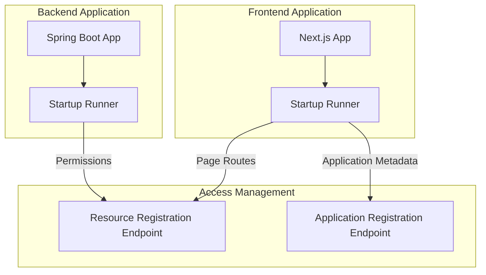

# Comprehensive Analysis: Page and API Resource Detection for Access Management Integration

## Version History

| Version | Author            | Date       | Changes                       |
|---------|-------------------|------------|-------------------------------|
| 1.0.0   | @Marcelo.Monteiro | 2025-09-12 | Page detection alternatives   |
| 1.0.1   | @Marcelo.Monteiro | 2025-10-10 | Page detection logic refactor |
| ...     | ...               | ...        | ...                           |


## 1. Introduction

This document provides a detailed analysis of implementing a provider-agnostic page and API resource detection system for access management integration. The solution aims to replace the current CI/CD-dependent approach with a Docker-based implementation that works across multiple cloud providers (Azure, AWS, etc.).

## 2. Current System Limitations

The existing implementation has several limitations:

1. **CI/CD Platform Dependency**: Tightly coupled with GitLab CI/CD
2. **Provider Lock-in**: Difficult to adapt to different cloud providers
3. **Static Detection**: Relies on file-based metadata rather than runtime detection
4. **Limited Framework Support**: Currently focused on iGRP Studio without support for other frameworks

## 3. Proposed Architecture

### 3.1 High-Level Architecture


### 3.2 Core Components

1. **Startup Runner**: For Next.js and Spring Boot applications, it runs on every application startup to sync the current resources with Access Management API
2. **Resource Registration Endpoint**: Runtime API endpoints to register resource metadata
3. **Application Registration Endpoint**: Runtime API endpoints to register application metadata

## 4. Implementation

### 4.1 Next.js Page Detection Script

**Approach**: This will detect all the `page.tsx` directories, filtering out group, private or other special directories on the result path.
The scan directory is the generated pages directory in iGRP: `src\app\(igrp)\(generated)`. The output file will be a `routes.ts` file in the `src` directory.

```typescript
/**
 * Generates a TypeScript file that exports all Next.js routes found in the "app" directory.
 * Handles special cases like group folders, private folders, encoded names, and dynamic routes.
 */

const fs = require("fs");
const path = require("path");

// Project-specific app directory
const ROOT = process.cwd();
const IGRP_GENERATED_PAGES = path.join("src", "app", "(igrp)", "(generated)");
const PAGES_DIR = path.join(ROOT, IGRP_GENERATED_PAGES);
const OUTPUT_FILE = path.join(ROOT, "src", "routes.ts");

/**
 * Normalize a folder name to a route segment.
 * @param segment folder name
 * @returns null if folder should stop the route (private), otherwise the segment (or null to skip adding)
 */
function normalizeSegment(segment: string): string | null {
   segment = decodeURIComponent(segment);

   if (segment.startsWith("_")) {
      // Private folder → skip entire route
      return null;
   }

   // Remove group folders like (group)
   if (/^\(.+\)$/.test(segment)) return "";

   // Remove other non-route folders (like @component or (..)list)
   if (/^@/.test(segment)) return "";
   if (/^\(.+\.\.\..*\)$/.test(segment)) return "";

   return segment;
}

/**
 * Recursively collect all routes
 */
function collectRoutes(dir: string, baseSegments: string[] = []): string[] {
   const entries = fs.readdirSync(dir, { withFileTypes: true });
   const routes: string[] = [];

   for (const entry of entries) {
      const fullPath = path.join(dir, entry.name);

      if (entry.isDirectory()) {
         const segment = normalizeSegment(entry.name);

         if (segment === null) continue; // private folder → skip entirely

         // Only add segment if it is not an ignored folder
         const newBase = segment ? [...baseSegments, segment] : [...baseSegments];
         routes.push(...collectRoutes(fullPath, newBase));
      } else if (/\.tsx?$/.test(entry.name) || /\.jsx?$/.test(entry.name)) {
         const basename = entry.name.replace(/\.(js|jsx|ts|tsx)$/, "");
         if (basename !== "page") continue;

         let route = "/" + baseSegments.join("/");
         if (route === "") route = "/";
         routes.push(route);
      }
   }

   return routes;
}

/**
 * Write the routes array to a TypeScript file
 */
function generateRoutesFile(): void {
   console.log(`🔍 Scanning directory: ${PAGES_DIR}`);

   if (!fs.existsSync(PAGES_DIR)) {
      console.error(`❌ Directory not found: ${PAGES_DIR}`);
      process.exit(1);
   }

   const routes = collectRoutes(PAGES_DIR).sort();

   const fileContent = `// Auto-generated by iGRP
// Do not edit manually

export const routes = ${JSON.stringify(routes, null, 2)} as const;

export type Route = typeof routes[number];
`;

   fs.writeFileSync(OUTPUT_FILE, fileContent, "utf-8");

   console.log(`✅ Generated ${routes.length} routes`);
   console.log(`📄 Output: ${OUTPUT_FILE}`);
}

generateRoutesFile();
```

The result `routes.ts` file is similar to this:

```typescript
// Auto-generated by iGRP
// Do not edit manually

export const routes = [
  "/",
  "/[...slug]/page-in-slug",
  "/declaracoes",
  "/declaracoes/[id]",
  "/declaracoes/[id]/contas",
  "/declaracoes/[id]/edit",
  "/declaracoes/lancamentos/novo",
  "/declaracoes/novo",
  "/entregas",
  "/page-in-group",
  "/page-in-sub-group",
  "/page1-in-group"
] as const;

export type Route = typeof routes[number];
```

On this project structure:
```css
project/
│
├─ src/
│   ├─ app/
│   │   ├─ (igrp)/
│   │   │   ├─ (generated)/
│   │   │   │   ├─ %5Flog%5F/
│   │   │   │   │   └─ page.tsx
│   │   │   │   ├─ (group)/
│   │   │   │   │   ├─ (subgroup)/
│   │   │   │   │   │   └─ page-in-sub-group/
│   │   │   │   │   │       └─ page.tsx
│   │   │   │   │   ├─ page1-in-group/
│   │   │   │   │   │   └─ page.tsx
│   │   │   │   │   └─ page-in-group/
│   │   │   │   │       └─ page.tsx
│   │   │   │   ├─ @component/
│   │   │   │   │   └─ page.tsx
│   │   │   │   ├─ [...slug]/
│   │   │   │   │   └─ page-in-slug/
│   │   │   │   │       └─ page.tsx
│   │   │   │   ├─ _private/
│   │   │   │   │   └─ page.tsx
│   │   │   │   ├─ declaracoes/
│   │   │   │   │   ├─ [id]/
│   │   │   │   │   │   ├─ contas/
│   │   │   │   │   │   │   └─ page.tsx
│   │   │   │   │   │   ├─ edit/
│   │   │   │   │   │   │   └─ page.tsx
│   │   │   │   │   │   └─ page.tsx
│   │   │   │   │   ├─ components/
│   │   │   │   │   │   └─ declaracaoform.tsx
│   │   │   │   │   ├─ lancamentos/
│   │   │   │   │   │   └─ novo/
│   │   │   │   │   │       └─ page.tsx
│   │   │   │   │   ├─ novo/
│   │   │   │   │   │   └─ page.tsx
│   │   │   │   │   └─ page.tsx
│   │   │   │   ├─ entregas/
│   │   │   │   │   ├─ components/
│   │   │   │   │   │   └─ deliverymodalform.tsx
│   │   │   │   │   └─ page.tsx
│   │   │   │   └─ layout.tsx
│   │   │   └─ ...
│   │   ├─ (myapp)/
│   │   └─ ...
│   ├─ routes.ts  ← generated file here
│   └─ ...
├─ tsconfig.json
└─ package.json
```

The script should be run on every app startup, and then the Access Management API should be called sending the route data:
```typescript
import { handleApiError } from '@/app/(myapp)/lib/api-error-handler';
import { NextResponse } from 'next/server';
import { routes } from '@/routes' // this will import the routes array present in the 'routes.ts' file

export async function GET() {
  try {
    console.log("Routes: ", routes) // this could be an API call passing the routes array in the request body
    return NextResponse.json(routes);
  } catch (error) {
    return handleApiError(error);
  }
}
```

In the POC, to run the script `ts-node` was used. The `package.json` file, should have a script `generate-routes`:

```json
"scripts": {
  "local": "npx run generate-routes && npx env-cmd -f env/.env.local next dev --turbopack", // added the command to generate routes
  "dev": "npx run generate-routes && next dev --turbopack", // added the command to generate routes
  "build": "pnpm format && next build",
  "start": "npx run generate-routes && next start", // added the command to generate routes
  "lint": "next lint",
  "format": "prettier --write .",
  "generate-routes": "ts-node scripts/generate-routes.ts" // this line should be added
}
```

Then the command should be executed in the startup:

```shell
pnpm run generate-routes
```

### 4.2 Spring Boot App Permissions Detection

#### Alternative 1: iGRP Studio App Permissions Settings

**Approach**: In the iGRP Studio, in an App Permissions Settings, the developer will add/update/remove all the necessary permissions for the business logic.

These permissions configuration will be saved at `.igrpstudio/permissions.json`. Then this will be used as the permissions array on the resource creation request body to Access Management API call.

**Implementation Details**:

1. **Loading the Permissions File**
At server startup, the Spring Boot application should read the `.igrpstudio/permissions.json` file located in the user’s home directory or project root. This can be achieved using Spring’s `ResourceLoader` or standard Java file I/O.

Example:

```java
import com.fasterxml.jackson.core.type.TypeReference;
import com.fasterxml.jackson.databind.ObjectMapper;
import org.springframework.stereotype.Component;

import javax.annotation.PostConstruct;
import java.io.File;
import java.io.IOException;
import java.util.List;
import java.util.Map;

@Component
public class PermissionsLoader {

    private final ObjectMapper objectMapper;
    private final AccessManagementClient accessManagementClient; // iGRP AM API client SDK

    public PermissionsLoader(ObjectMapper objectMapper, AccessManagementClient accessManagementClient) {
        this.objectMapper = objectMapper;
        this.accessManagementClient = accessManagementClient;
    }

    @PostConstruct
    public void loadPermissionsAndSync() throws IOException {
        File permissionsFile = new File("/.igrpstudio/permissions.json");
        if (!permissionsFile.exists()) {
            System.out.println("No permissions file found at " + permissionsFile.getAbsolutePath());
            return;
        }

        List<PermissionInfo> permissions = objectMapper.readValue(
            permissionsFile,
                new TypeReference<>() {
                }
        );

        // Call Access Management API for permissions registration
        accessManagementClient.syncPermission(permissions);

        System.out.println("Permissions synchronized with Access Management API");
    }
}
```

2. **Access Management API Call**

   * The client SDK should expose methods like `createPermission`, `updatePermission`, or a combined `createOrUpdatePermission`.
   * Each permission from `permissions.json` is mapped to the API request body as required by the Access Management service.

3. **Spring Boot Startup Integration**

   * By annotating the loader class with `@Component` and the method with `@PostConstruct`, the permissions are automatically loaded and synchronized when the application context is initialized.
   * This ensures that the system always has the latest permissions defined in iGRP Studio when the server starts.

4. **Error Handling & Logging**

   * If the permissions file is missing, log a warning and continue.
   * If the API call fails, log the error and optionally retry or halt startup depending on the criticality of the permissions.

5. **Example JSON Structure**
   The `.igrpstudio/permissions.json` file can have a structure like:

```json
[
  {
    "code": "CREATE_USER",
    "name": "Create User",
    "description": "Permission to create new users",
    "application": "USER_MANAGEMENT"
  },
  {
    "code": "VIEW_REPORTS",
    "name": "View Reports",
    "description": "Permission to view business reports",
    "application": "REPORTS"
  }
]
```

6. On startup from a command-line runner, this service can be invoked:

```java
package cv.igrp.platform.access_management.sync;

import com.fasterxml.jackson.core.type.TypeReference;
import com.fasterxml.jackson.databind.ObjectMapper;
import cv.igrp.framework.auth.core.model.PermissionInfo;
import lombok.extern.slf4j.Slf4j;
import org.springframework.beans.factory.annotation.Value;
import org.springframework.stereotype.Service;
import org.springframework.util.FileSystemUtils;

import javax.annotation.PostConstruct;
import java.io.File;
import java.io.IOException;
import java.nio.file.Files;
import java.util.List;
import java.util.Map;

/**
 * Service responsible for loading the .igrpstudio/permissions.json file and synchronizing
 * its contents with the Access Management API during Spring Boot application startup.
 * <p>
 * This allows developers to define all permissions in iGRP Studio and automatically
 * push them to the Access Management system without manual intervention.
 */
@Slf4j
@Service
public class PermissionsSyncService {

   private final ObjectMapper objectMapper;
   private final AccessManagementClient accessManagementClient;

   /**
    * Path to the permissions configuration file.
    * Default is ${user.home}/.igrpstudio/permissions.json but can be overridden in application properties.
    */
   @Value("${igrpstudio.permissions.file:${user.home}/.igrpstudio/permissions.json}")
   private String permissionsFilePath;

   public PermissionsSyncService(ObjectMapper objectMapper, AccessManagementClient accessManagementClient) {
      this.objectMapper = objectMapper;
      this.accessManagementClient = accessManagementClient;
   }

   /**
    * Loads the permissions configuration file and synchronizes its entries with
    * the Access Management API. This runs automatically on application startup.
    */
   @PostConstruct
   public void synchronizePermissions() {
      File permissionsFile = new File(permissionsFilePath);

      if (!permissionsFile.exists()) {
         log.warn("Permissions file not found: {}", permissionsFile.getAbsolutePath());
         return;
      }

      try {
         byte[] fileBytes = Files.readAllBytes(permissionsFile.toPath());
         List<PermissionInfo> permissions = objectMapper.readValue(
                 fileBytes,
                 new TypeReference<>() {
                 }
         );

         if (permissions.isEmpty()) {
            log.info("Permissions file is empty. Nothing to synchronize.");
            return;
         }

         log.info("Synchronizing {} permissions from {}", permissions.size(), permissionsFile.getAbsolutePath());
         int successCount = 0;
         
         try {
            syncWithRetry(permissions, 3);
            successCount++;
         } catch (Exception e) {
            log.error("Failed to sync permissions", e);
         }

         log.info("Successfully synchronized {}/{} permissions.", successCount, permissions.size());

      } catch (IOException e) {
         log.error("Error reading permissions file: {}", e.getMessage(), e);
      }
   }

   /**
    * Attempts to synchronize a list of permissions with the Access Management API,
    * retrying up to the specified number of times in case of transient errors.
    *
    * @param permissions list of permission definitions from permissions.json
    * @param maxRetries number of retry attempts
    */
   private void syncWithRetry(List<PermissionInfo> permissions, int maxRetries) {
      int attempt = 0;
      while (attempt < maxRetries) {
         try {
            accessManagementClient.syncPermissions(permissions);
            log.debug("Synced permissions");
            return;
         } catch (Exception e) {
            attempt++;
            log.warn("Attempt {}/{} failed for permissions: {}", attempt, maxRetries, e.getMessage());
            if (attempt >= maxRetries) throw e;
            try {
               Thread.sleep(1000L * attempt); // exponential backoff
            } catch (InterruptedException ignored) {
               Thread.currentThread().interrupt();
            }
         }
      }
   }
}
```

The `PermissionsSyncService` is responsible for automatically loading and synchronizing permission definitions stored in the `.igrpstudio/permissions.json` file with the Access Management API at Spring Boot application startup.

This mechanism allows developers to manage application permissions declaratively within iGRP Studio, ensuring that all permission updates are consistently propagated to the Access Management system without requiring manual intervention.

At Spring Boot startup, the `@PostConstruct` annotated method `synchronizePermissions()` is automatically executed.

This method:

1. Checks if the `permissions.json` file exists.

2. Reads and parses its content using Jackson’s ObjectMapper.

3. Maps the content into a list of `PermissionInfo` objects.

4. Sends the list of permissions to the Access Management API through the `AccessManagementClient`.

5. Retries synchronization automatically if temporary errors occur.

If the permissions file does not exist or is empty, the service logs a warning and gracefully continues startup without interruption.

---

**Next Steps**:

* Ensure the Access Management client SDK is configured and authenticated before calling the API.
* This approach allows **developers to manage permissions declaratively** in iGRP Studio while automating the synchronization process at server startup.
* Can be extended to **watch the `.igrpstudio/permissions.json` file** for changes and dynamically update permissions without restarting the server.

### 4.3 Docker Integration Alternatives

#### Alternative 1: Multi-stage Build with Detection Stage

```dockerfile
FROM node:16-alpine AS detector
WORKDIR /app
COPY . .
RUN npm run generate-routes

FROM node:16-alpine AS runtime
COPY --from=detector /app/routes.json /app/routes.json
# ... rest of build process
```

**Pros**:
- Clean separation of concerns
- No runtime dependencies
- Works across cloud providers

**Cons**:
- Build-time detection only
- Doesn't capture runtime changes

#### Alternative 2: Runtime Detection Sidecar

**Approach**: Use sidecar container that detects resources at runtime

**Pros**:
- Real-time detection
- Works with running applications
- Decoupled from application code

**Cons**:
- Complex orchestration
- Additional resource consumption
- Network latency

#### Alternative 3: Hybrid Docker Approach (Recommended)

**Approach**: Combine build-time detection with runtime verification

```dockerfile
# Build-time detection
FROM node:16-alpine AS build-detector
# ... detection logic

# Runtime image
FROM node:16-alpine
COPY --from=build-detector /app/routes.json /app/routes.json
# ... application setup

# Runtime verification script
COPY scripts/verify-resources.sh /app/scripts/
CMD ["/app/scripts/start-with-verification.sh"]
```

**Pros**:
- Comprehensive coverage
- Flexible deployment
- Provider-agnostic

**Cons**:
- Increased complexity
- Additional build steps

## 5. Performance Analysis

### 5.1 Next.js Detection Performance

| Approach | Memory Impact | CPU Impact | Detection Time |
|----------|---------------|------------|----------------|
| Static Analysis | Low | Low | < 1s |
| Runtime API | Medium | Medium | < 100ms |
| Hybrid | Medium | Low-Medium | < 1s |

### 5.2 Spring Boot Detection Performance

| Approach | Memory Impact | CPU Impact | Detection Time |
|----------|---------------|------------|----------------|
| Reflection | Medium | Medium | 100-500ms |
| Annotation Processing | Low | Low | < 100ms |
| Actuator Integration | Low | Low | < 50ms |

### 5.3 Overall System Performance Considerations

1. **Caching Strategies**: Implement caching for detection results
2. **Incremental Detection**: Only detect changed resources
3. **Background Processing**: Perform detection asynchronously
4. **Rate Limiting**: Protect detection endpoints from abuse

## 6. Security Considerations

1. **Authentication**: Secure detection endpoints
2. **Authorization**: Limit access to resource metadata
3. **Data Sanitization**: Prevent information leakage
4. **Input Validation**: Protect against injection attacks

## 7. Test Scenarios

### 7.1 Unit Tests

1. **Next.js CLI Tool Tests**
    - Page detection accuracy
    - Route parameter handling
    - Metadata generation correctness

2. **Spring Boot Scanner Tests**
    - Controller detection
    - Annotation parsing
    - Endpoint mapping

3. **Resource Mapping Tests**
    - Entity conversion accuracy
    - Type mapping validation
    - URL normalization

### 7.2 Integration Tests

1. **Docker Build Tests**
    - Multi-stage build success
    - Artifact passing between stages
    - Provider-agnostic deployment

2. **API Endpoint Tests**
    - Detection endpoint accessibility
    - Response format validation
    - Authentication/authorization

3. **Access Management Integration Tests**
    - Resource registration success
    - Error handling
    - Update scenarios

### 7.3 Performance Tests

1. **Detection Time Tests**
    - Baseline performance measurements
    - Scaling with number of resources
    - Concurrent detection scenarios

2. **Resource Impact Tests**
    - Memory consumption
    - CPU utilization
    - Network overhead

### 7.4 Cross-Provider Tests

1. **AWS Deployment Tests**
2. **Azure Deployment Tests**
3. **GCP Deployment Tests**
4. **On-Premises Deployment Tests**

## 8. Recommended Implementation

Based on the analysis, the recommended approach is:

1. **Next.js**: Hybrid detection (build-time + runtime API)
2. **Spring Boot**: Actuator integration with custom endpoint
3. **Docker**: Multi-stage build with detection stage
4. **Security**: JWT authentication for detection endpoints

This combination provides the best balance of accuracy, performance, and provider flexibility.

## 9. References

1. Next.js Documentation: "https://nextjs.org/docs"
2. Spring Boot Actuator: "https://docs.spring.io/spring-boot/docs/current/reference/html/actuator.html"
3. Docker Multi-stage Builds: "https://docs.docker.com/develop/develop-images/multistage-build/"
4. OWASP Security Guidelines: "https://owasp.org/www-project-top-ten/"
5. REST API Security Best Practices: "Fielding, R. T. (2000). Architectural Styles and the Design of Network-based Software Architectures. Doctoral dissertation, University of California, Irvine."
6. Performance Testing Methodology: "Jain, R. (1991). The Art of Computer Systems Performance Analysis: Techniques for Experimental Design, Measurement, Simulation, and Modeling. Wiley."
7. Cloud Provider Agnostic Design: "Fehling, C., Leymann, F., Retter, R., Schupeck, W., & Arbitter, P. (2014). Cloud Computing Patterns: Fundamentals to Design, Build, and Manage Cloud Applications. Springer."