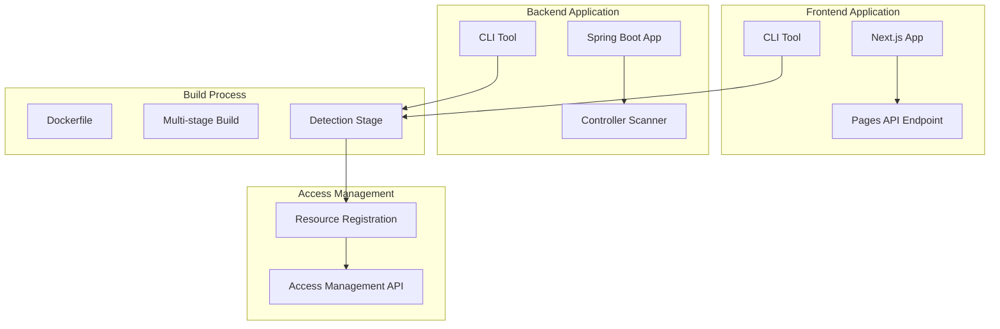

# Comprehensive Analysis: Page and API Resource Detection for Access Management Integration

## Version History

| Version | Author            | Date       | Changes                     |
|---------|-------------------|------------|-----------------------------|
| 1.0.0   | @Marcelo.Monteiro | 2025-09-12 | Page detection alternatives |
| ...     | ...               | ...        | ...                         |


## 1. Introduction

This document provides a detailed analysis of implementing a provider-agnostic page and API resource detection system for access management integration. The solution aims to replace the current CI/CD-dependent approach with a Docker-based implementation that works across multiple cloud providers (Azure, AWS, etc.).

## 2. Current System Limitations

The existing implementation has several limitations:

1. **CI/CD Platform Dependency**: Tightly coupled with GitLab CI/CD
2. **Provider Lock-in**: Difficult to adapt to different cloud providers
3. **Static Detection**: Relies on file-based metadata rather than runtime detection
4. **Limited Framework Support**: Currently focused on iGRP Studio without support for other frameworks

## 3. Proposed Architecture

### 3.1 High-Level Architecture



### 3.2 Core Components

1. **Framework-specific CLI Tools**: For Next.js and Spring Boot applications
2. **Detection Endpoints**: Runtime API endpoints exposing resource metadata
3. **Docker Build Integration**: Multi-stage Docker builds for provider-agnostic deployment
4. **Universal Resource Mapper**: Converts framework-specific metadata to standardized ResourceEntity/ResourceItemEntity format

## 4. Implementation Alternatives

### 4.1 Next.js Page Detection Alternatives

#### Alternative 1: Static Analysis During Build

**Approach**: Use Next.js build hooks to analyze pages directory structure

```javascript
// next.config.js
module.exports = {
  webpack: (config, { buildId, dev, isServer, defaultLoaders, webpack }) => {
    if (!dev) {
      const pages = analyzePages('./pages');
      generateResourceMetadata(pages);
    }
    return config;
  }
}
```

**Pros**:
- No runtime overhead
- Simple implementation
- Works with static exports

**Cons**:
- Doesn't capture dynamic routes fully
- Limited to build-time information
- Doesn't reflect runtime changes

#### Alternative 2: Runtime API Endpoint

**Approach**: Create API endpoint that scans pages directory at runtime

```javascript
// pages/api/resources.js
export default function handler(req, res) {
  const pages = getPageMetadata();
  res.status(200).json(pages);
}
```

**Pros**:
- Captures actual runtime state
- Handles dynamic routes correctly
- Can include runtime metadata

**Cons**:
- Requires server to be running
- Adds minimal runtime overhead
- Security considerations for exposure

#### Alternative 3: Hybrid Approach (Recommended)

**Approach**: Combine build-time analysis with runtime endpoint


**Pros**:
- Benefits of both static and runtime approaches
- Comprehensive coverage
- Flexible deployment options

**Cons**:
- More complex implementation
- Requires coordination between build and runtime

### 4.2 Spring Boot Controller Detection Alternatives

#### Alternative 1: Reflection-based Scanning

**Approach**: Use Spring's reflection utilities to scan controllers

```java
@RestController
@RequestMapping("/api/resources")
public class ResourceDetectionController {
    
    @Autowired
    private ApplicationContext applicationContext;
    
    @GetMapping
    public List<ResourceItemEntity> detectEndpoints() {
        return applicationContext.getBeansWithAnnotation(RestController.class)
            .values().stream()
            .map(this::extractEndpointInfo)
            .collect(Collectors.toList());
    }
}
```

**Pros**:
- Accurate runtime detection
- Captures all configured endpoints
- Works with Spring ecosystem

**Cons**:
- Reflection overhead
- Requires application context
- Potential performance impact

#### Alternative 2: Annotation Processing at Build Time

**Approach**: Use compile-time annotation processing to generate metadata

**Pros**:
- No runtime overhead
- Early detection of issues
- Can generate compile-time metadata

**Cons**:
- Complex implementation
- Limited to compile-time information
- Doesn't capture runtime configurations

#### Alternative 3: Spring Boot Actuator Integration (Recommended)

**Approach**: Extend Spring Boot Actuator to expose endpoint information

```java
@Endpoint(id = "resourceendpoints")
@Component
public class ResourceEndpointDetection {
    
    @ReadOperation
    public Map<String, Object> endpoints() {
        return Collections.unmodifiableMap(this.mappings);
    }
}
```

**Pros**:
- Standard Spring Boot approach
- Low overhead
- Well-integrated with Spring ecosystem
- Production-ready

**Cons**:
- Requires Actuator dependency
- Limited customization options

### 4.3 Docker Integration Alternatives

#### Alternative 1: Multi-stage Build with Detection Stage

```dockerfile
FROM node:16-alpine AS detector
WORKDIR /app
COPY . .
RUN npm run detect-resources > resources.json

FROM node:16-alpine AS runtime
COPY --from=detector /app/resources.json /app/resources.json
# ... rest of build process
```

**Pros**:
- Clean separation of concerns
- No runtime dependencies
- Works across cloud providers

**Cons**:
- Build-time detection only
- Doesn't capture runtime changes

#### Alternative 2: Runtime Detection Sidecar

**Approach**: Use sidecar container that detects resources at runtime

**Pros**:
- Real-time detection
- Works with running applications
- Decoupled from application code

**Cons**:
- Complex orchestration
- Additional resource consumption
- Network latency

#### Alternative 3: Hybrid Docker Approach (Recommended)

**Approach**: Combine build-time detection with runtime verification

```dockerfile
# Build-time detection
FROM node:16-alpine AS build-detector
# ... detection logic

# Runtime image
FROM node:16-alpine
COPY --from=build-detector /app/resources.json /app/resources.json
# ... application setup

# Runtime verification script
COPY scripts/verify-resources.sh /app/scripts/
CMD ["/app/scripts/start-with-verification.sh"]
```

**Pros**:
- Comprehensive coverage
- Flexible deployment
- Provider-agnostic

**Cons**:
- Increased complexity
- Additional build steps

## 5. Performance Analysis

### 5.1 Next.js Detection Performance

| Approach | Memory Impact | CPU Impact | Detection Time |
|----------|---------------|------------|----------------|
| Static Analysis | Low | Low | < 1s |
| Runtime API | Medium | Medium | < 100ms |
| Hybrid | Medium | Low-Medium | < 1s |

### 5.2 Spring Boot Detection Performance

| Approach | Memory Impact | CPU Impact | Detection Time |
|----------|---------------|------------|----------------|
| Reflection | Medium | Medium | 100-500ms |
| Annotation Processing | Low | Low | < 100ms |
| Actuator Integration | Low | Low | < 50ms |

### 5.3 Overall System Performance Considerations

1. **Caching Strategies**: Implement caching for detection results
2. **Incremental Detection**: Only detect changed resources
3. **Background Processing**: Perform detection asynchronously
4. **Rate Limiting**: Protect detection endpoints from abuse

## 6. Security Considerations

1. **Authentication**: Secure detection endpoints
2. **Authorization**: Limit access to resource metadata
3. **Data Sanitization**: Prevent information leakage
4. **Input Validation**: Protect against injection attacks

## 7. Test Scenarios

### 7.1 Unit Tests

1. **Next.js CLI Tool Tests**
    - Page detection accuracy
    - Route parameter handling
    - Metadata generation correctness

2. **Spring Boot Scanner Tests**
    - Controller detection
    - Annotation parsing
    - Endpoint mapping

3. **Resource Mapping Tests**
    - Entity conversion accuracy
    - Type mapping validation
    - URL normalization

### 7.2 Integration Tests

1. **Docker Build Tests**
    - Multi-stage build success
    - Artifact passing between stages
    - Provider-agnostic deployment

2. **API Endpoint Tests**
    - Detection endpoint accessibility
    - Response format validation
    - Authentication/authorization

3. **Access Management Integration Tests**
    - Resource registration success
    - Error handling
    - Update scenarios

### 7.3 Performance Tests

1. **Detection Time Tests**
    - Baseline performance measurements
    - Scaling with number of resources
    - Concurrent detection scenarios

2. **Resource Impact Tests**
    - Memory consumption
    - CPU utilization
    - Network overhead

### 7.4 Cross-Provider Tests

1. **AWS Deployment Tests**
2. **Azure Deployment Tests**
3. **GCP Deployment Tests**
4. **On-Premises Deployment Tests**

## 8. Recommended Implementation

Based on the analysis, the recommended approach is:

1. **Next.js**: Hybrid detection (build-time + runtime API)
2. **Spring Boot**: Actuator integration with custom endpoint
3. **Docker**: Multi-stage build with detection stage
4. **Security**: JWT authentication for detection endpoints

This combination provides the best balance of accuracy, performance, and provider flexibility.

## 9. References

1. Next.js Documentation: "https://nextjs.org/docs"
2. Spring Boot Actuator: "https://docs.spring.io/spring-boot/docs/current/reference/html/actuator.html"
3. Docker Multi-stage Builds: "https://docs.docker.com/develop/develop-images/multistage-build/"
4. OWASP Security Guidelines: "https://owasp.org/www-project-top-ten/"
5. REST API Security Best Practices: "Fielding, R. T. (2000). Architectural Styles and the Design of Network-based Software Architectures. Doctoral dissertation, University of California, Irvine."
6. Performance Testing Methodology: "Jain, R. (1991). The Art of Computer Systems Performance Analysis: Techniques for Experimental Design, Measurement, Simulation, and Modeling. Wiley."
7. Cloud Provider Agnostic Design: "Fehling, C., Leymann, F., Retter, R., Schupeck, W., & Arbitter, P. (2014). Cloud Computing Patterns: Fundamentals to Design, Build, and Manage Cloud Applications. Springer."