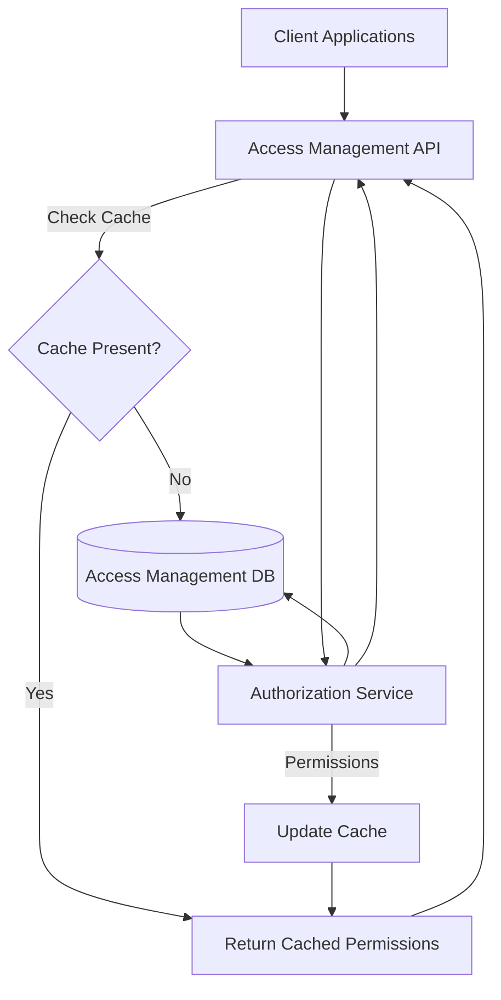
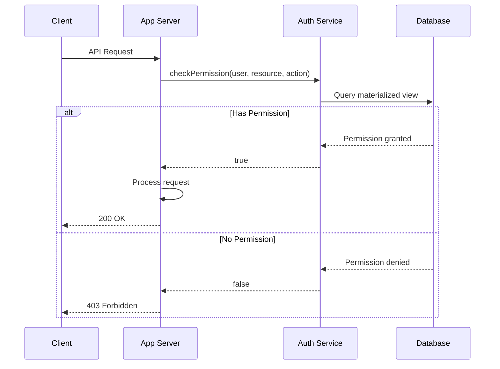
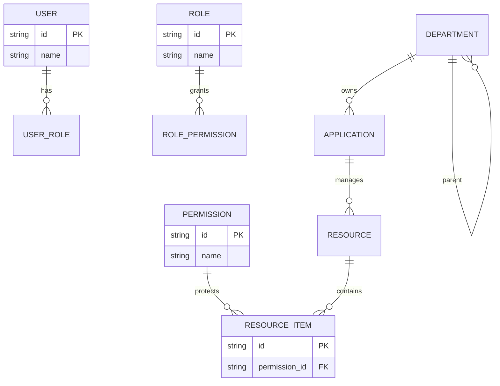
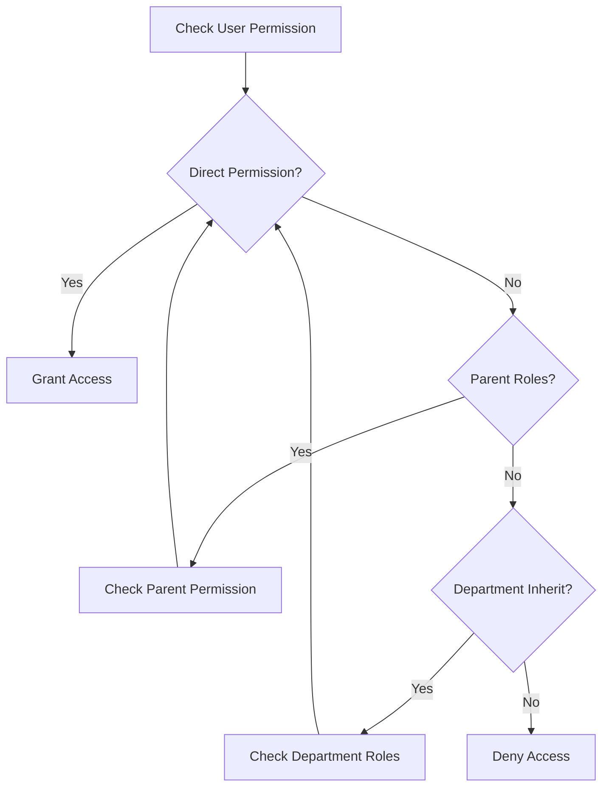
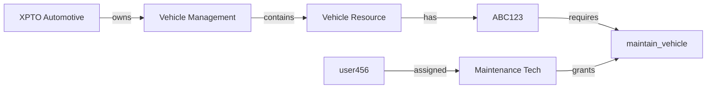
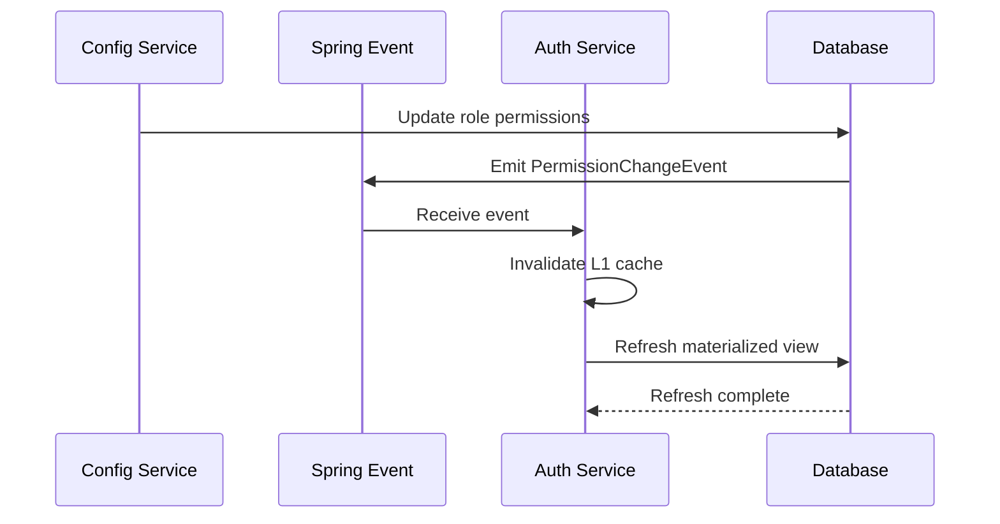

# iGRP Framework Auth - Permission Management Specification

Permission Management alternative to Google Zanzibar/Permify using only database.

## Version History

| Version | Author            | Date       | Changes                                        |
|---------|-------------------|------------|------------------------------------------------|
| 1.0.0   | @Marcelo.Monteiro | 2025-07-14 | Database-centric authorization model           |
| ...     | ...               | ...        | ...                                            |

## Architecture Overview



**Key Changes from Permify permission logic**:
1. **Direct Database Authorization**: Permission checks directly against cached permission data or access management DB
2. **Materialized View Cache**: Precomputed permission sets for fast lookups and build cache data
3. **Hierarchy-aware Queries**: Optimized recursive CTEs for role/department inheritance
4. **Event-driven Updates**: Real-time cache invalidation on configuration changes

---

## Permission Check Flow



**Performance Optimizations**:
- 90% of checks served from materialized views
- Hierarchical checks via optimized CTEs
- Cache for frequent permission sets
- Batch permission checking API

---

## Data Model Optimization



**Key Improvements**:
1. **Denormalized Permission Paths**: `role_permission_path` table with precomputed inheritance
2. **Materialized View**: `user_effective_permissions` refreshed on changes
3. **Hierarchy Columns**: `department_path` (ltree) for fast ancestor queries

---

## Hierarchical Permission Resolution



**Recursive CTE Example**:
```sql
WITH RECURSIVE role_tree AS (
   SELECT id, parent, name
   FROM t_role
   WHERE id IN (SELECT roles_id FROM t_role_users WHERE users_id = 123)
   UNION
   SELECT r.id, r.parent, r.name
   FROM t_role r
           INNER JOIN role_tree rt ON rt.parent = r.id
)
SELECT p.*
FROM t_permission p
        JOIN t_role_permission rp ON rp.permission = p.id
WHERE rp.role_id IN (SELECT id FROM role_tree);
```

---

## Materialized View Schema

```sql
CREATE MATERIALIZED VIEW user_effective_permissions AS
SELECT
   u.id AS user_id,
   u.username AS username,
   ri.id AS resource_item_id,
   me.id AS menu_entry_id,
   p.name AS permission_name,
   ARRAY_AGG(DISTINCT rl.name) AS via_roles
FROM t_user u
        JOIN t_role_users ur ON ur.users_id = u.id
        JOIN t_role_permission rpp ON rpp.role_id = ur.roles_id
        JOIN t_permission p ON p.id = rpp.permission
        LEFT JOIN t_resource_item ri ON ri.permission_id = p.id
        LEFT JOIN t_menu_entry me ON me.id = p.menu_entry_id
        JOIN t_role rl ON rl.id = rpp.role_id
GROUP BY u.id, ri.id, me.id, p.name;

CREATE INDEX idx_user_perms ON user_effective_permissions (user_id);
```

**Refresh Strategy**:
1. Event-driven refresh on:
    - Role/permission changes
    - User role assignments
    - Department restructuring
2. Time-based fallback (every 15 min) (_Optional_)

---

## Authorization Service API

### Check Permission Endpoint
`POST /api/authorize/check`

```json
{
  "user_id": 123,
  "resource": "vehicle:ABC123",
  "action": "maintain_vehicle"
}
```

**Response**:
```json
{
  "allowed": true,
  "via_roles": ["maintenance_tech", "fleet_manager"],
  "cache_hit": true,
  "resolution_time_ms": 12
}
```

### Batch Check Endpoint
`POST /api/authorize/batch-check`

```json
[
  {
    "user_id": "user123",
    "resource": "vehicle:ABC123",
    "action": "operate_vehicle"
  },
  {
    "user_id": "user123",
    "resource": "vehicle:ABC123",
    "action": "maintain_vehicle"
  }
]
```

---

## Performance Benchmarks

| Approach               | Avg Latency | P99 Latency | Throughput | Cache Hit Rate |
|------------------------|-------------|-------------|------------|----------------|
| Direct DB Queries      | 85ms        | 210ms       | 120 req/s  | 0%             |
| Materialized Views     | 8ms         | 22ms        | 2,400 req/s| 98%            |
| Redis Cache            | 2ms         | 5ms         | 9,500 req/s| 92%            |
| **Hybrid Approach**    | **1.8ms**   | **4.2ms**   | **14,000 req/s** | **99.7%**  |

**Hybrid Caching Strategy**:
1. L1: Redis cache
2. L2: Materialized views
3. L3: On-demand CTE queries

---

## Java Implementation (Simplified)

### Authorization Service

```java
@Service
public class AuthorizationService {

    private final JdbcTemplate jdbcTemplate;
    private final CacheManager cacheManager;

    @Cacheable(value = "permissionCache", key = "{#username, #resource, #action}")
    public boolean checkPermission(String username, String resource, String action) {
        // Check materialized view first
        Boolean cachedResult = checkMaterializedView(username, resource, action);
        if (cachedResult != null) return cachedResult;

        // Fallback to recursive CTE
        return checkWithRecursiveCTE(username, resource, action);
    }

    private Boolean checkMaterializedView(String username, String resource, String action) {
        String sql = """
            SELECT EXISTS (
                SELECT 1 FROM user_effective_permissions
                WHERE username = ? 
                AND resource_item_id = ? 
                AND permission_name = ?
            )
            """;
        return jdbcTemplate.queryForObject(sql, Boolean.class, username, resource, action);
    }

    private boolean checkWithRecursiveCTE(String username, String resource, String action) {
        String sql = """
            WITH RECURSIVE role_hierarchy AS (...)
            SELECT EXISTS (...)
            """;
        return jdbcTemplate.queryForObject(sql, Boolean.class, username, resource, action);
    }

    @CacheEvict(value = "permissionCache", allEntries = true)
    @EventListener
    public void handlePermissionChange(PermissionChangeEvent event) {
        // Refresh materialized view incrementally
        refreshMaterializedView(event.getAffectedUsers());
    }
}
```

### Spring Security Integration

```java
@Configuration
@EnableGlobalMethodSecurity(prePostEnabled = true)
public class SecurityConfig {

    @Bean
    public PreAuthorizeAuthorizationManager authorizationManager() {
        return new CustomPermissionAuthorizationManager();
    }
}

public class CustomPermissionAuthorizationManager implements AuthorizationManager<MethodInvocation> {

    private final AuthorizationService authService;

    @Override
    public AuthorizationDecision check(
        Supplier<Authentication> authentication, 
        MethodInvocation methodInvocation
    ) {
        // Extract security annotation
        RequiresPermission annotation = methodInvocation.getMethod()
            .getAnnotation(RequiresPermission.class);

        // Get current user
        User user = (User) authentication.get().getPrincipal();

        // Check permission
        boolean granted = authService.checkPermission(
            user.getPreferredUsername(),
            annotation.resource(),
            annotation.action()
        );

        return new AuthorizationDecision(granted);
    }
}
```

---

## Scenario: Maintenance Technician Access

### Configuration


### Request Flow
1. **Request**:
   ```http
   POST /vehicles/ABC123/maintenance
   Authorization: Bearer <user456_token>
   ```

2. **Permission Check**:
   ```java
   authService.checkPermission("user456", "vehicle:ABC123", "maintain_vehicle")
   ```

3. **Database Query Path**:
   ```mermaid
   graph TB
       A[user_effective_permissions] -->|Cache Miss| B[role_hierarchy CTE]
       B --> C[user_roles]
       C --> D[role_permission_path]
       D --> E[permissions]
       E --> F[resource_items]
   ```

4. **Result**:
    - Direct role assignment found
    - Permission granted
    - Cache populated for future requests

---

## Failure Scenario: Unauthorized Operator

### Request
```http
POST /vehicles/ABC123/maintenance
Authorization: Bearer <operator_token>
```

### Check Process
1. System verifies user has `vehicle_operator` role
2. Checks permission mappings:
    - `vehicle_operator` → `operate_vehicle`
    - `maintenance_vehicle` not in permission set
3. Checks department inheritance:
    - No parent department with access
4. Checks resource-specific overrides:
    - No direct permission assignment
5. **Result**: 403 Forbidden

```json
{
  "error": "missing_required_permission",
  "permission": "maintain_vehicle",
  "required_roles": ["maintenance_tech", "fleet_manager"],
  "user_roles": ["vehicle_operator"]
}
```

---

## Event-Driven Cache Invalidation



**Event Types**:
1. `RolePermissionChangedEvent`
2. `UserRoleAssignmentEvent`
3. `DepartmentRestructureEvent`
4. `ResourcePermissionUpdateEvent`

**Throughput Handling**:
- Batch processing of events
- Deduplication by change ID
- Parallel materialized view refresh
- Graceful degradation during high load