# iGRP Access Management API - Comprehensive Documentation

---

## System Architecture Overview

### Layered Architecture

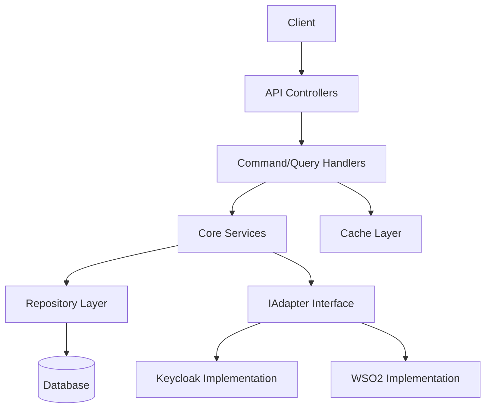

**Explanation:**
- **Client:** Initiates requests to the API.
- **API Controllers:** Handle HTTP requests and route them to the appropriate handlers.
- **Command/Query Handlers:** Implement business logic for commands (mutations) and queries (reads).
- **Core Services:** Encapsulate domain logic and rules.
- **Repository Layer:** Manages persistence and retrieval of entities.
- **Database:** Stores all persistent data.
- **IAdapter Interface:** Abstracts integration with external IAM providers (Keycloak, WSO2).
- **Cache Layer:** Optimizes performance for permission and authorization checks.

---

## Data Workflow & Endpoints

### Global Workflow

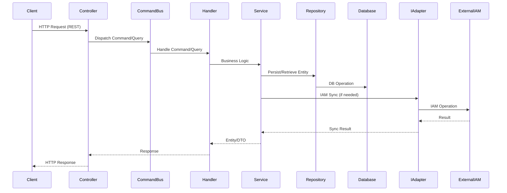

**Explanation:**
- Every endpoint follows a layered dispatch, ensuring separation of concerns and extensibility.
- IAM operations are abstracted via adapters, allowing for easy provider switching.

---

## API Endpoints - Deep Dive

### Endpoint Coverage

All endpoints are documented below, grouped by controller. Each endpoint includes:
- **Method & Path**
- **Purpose**
- **Request/Response Structure**
- **Workflow Diagram**
- **Detailed Explanation**

---

### ApplicationController

#### Endpoints
| Method | Path                                       | Purpose |
|--------|--------------------------------------------|---------|
| POST   | /api/applications                          | Create application |
| PUT    | /api/applications/{code}                   | Create application |
| GET    | /api/applications                          | List applications |
| GET    | /api/applications/{code}                     | Get application by ID |
| GET    | /api/applications/{code}/custom-fields       | Get custom fields |
| POST   | /api/applications/{code}/custom-fields       | Add custom fields |
| DELETE     | /api/applications/{code}/custom-fields | Remove custom fields |
| POST   | /api/applications/by-ids                   | List applications by IDs |
| GET    | /api/applications/by-user/{uid}            | Allowed applications by user |
| GET    | /api/applications/denied/by-user/{uid}     | Denied applications by user |

#### Workflow Example: Create Application
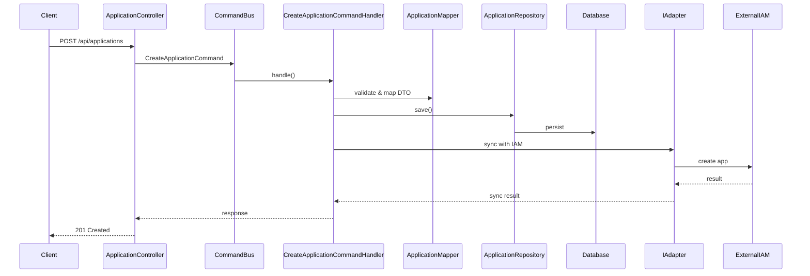

**Explanation:**
- Application creation validates input, persists to DB, and synchronizes with IAM provider.
- Custom fields and batch operations are supported for flexibility.


#### Endpoint: Update Application
| Method | Path | Purpose |
|--------|------|---------|
| PUT    | /api/applications/{code} | Update application |

**Request:**
- Path Parameter: `code` (String)
- Body: Application update DTO (fields to update)

**Response:**
- 200 OK: Updated ApplicationDTO
- 404 Not Found: If application does not exist
- 400 Bad Request: Validation errors

**Workflow Diagram:**
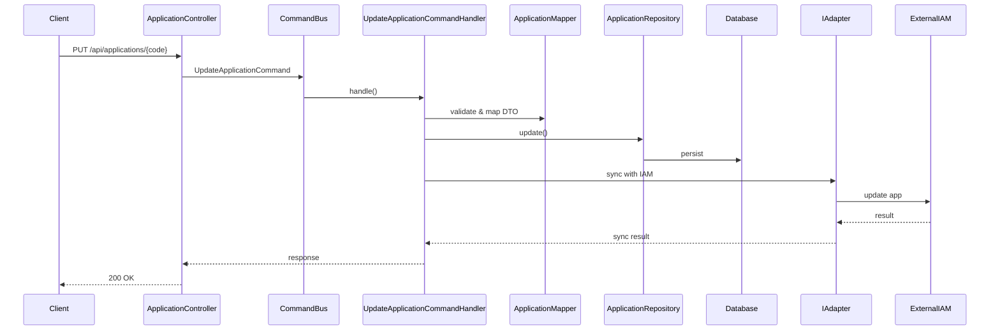

**Explanation:**
- Updates application details and synchronizes changes with the IAM provider.
- Handles validation and error cases gracefully.

**Example Case:**
- Update the name and description of an existing application with code `app123`.

---

#### Endpoint: Delete Application
| Method | Path | Purpose |
|--------|------|---------|
| DELETE | /api/applications/{code} | Delete application |

**Request:**
- Path Parameter: `code` (String)

**Response:**
- 204 No Content: Successfully deleted
- 404 Not Found: If application does not exist

**Workflow Diagram:**
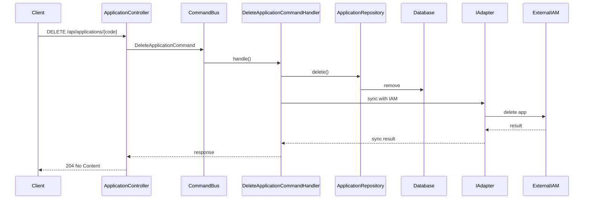

**Explanation:**
- Deletes the application and removes it from the IAM provider.
- Ensures all related entities are handled appropriately.

**Example Case:**
- Delete the application with code `app123`.

---

#### Endpoint: Get Custom Fields for Application
| Method | Path                                   | Purpose |
|--------|----------------------------------------|---------|
| GET    | /api/applications/{code}/custom-fields | Get custom fields for application |

**Request:**
- Path Parameter: `code` (String)

**Response:**
- 200 OK: List of CustomFieldDTO
- 404 Not Found: If application does not exist

**Workflow Diagram:**
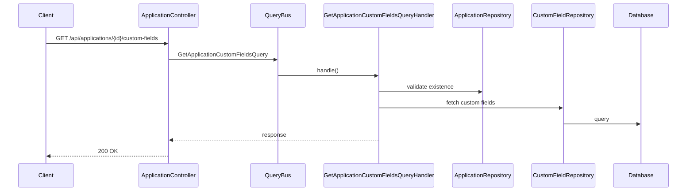

**Explanation:**
- Retrieves all custom fields associated with the specified application.

**Example Case:**
- Get custom fields for application with code `APP_DEMO`.

---

#### Endpoint: Add Custom Fields to Application
| Method | Path                                | Purpose |
|--------|-------------------------------------|---------|
| POST   | /api/applications/{code}/custom-fields | Add custom fields to application |

**Request:**
- Path Parameter: `code` (String)
- Body: List of CustomFieldDTO

**Response:**
- 200 OK: Updated list of CustomFieldDTO
- 404 Not Found: If application does not exist
- 400 Bad Request: Validation errors

**Workflow Diagram:**
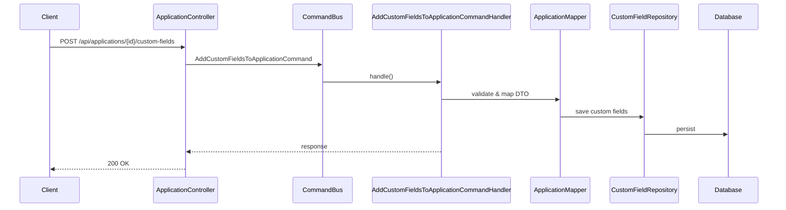

**Explanation:**
- Adds new custom fields to the specified application.
- Handles validation and persistence.

**Example Case:**
- Add a custom field `env=production` to application with code `app42`.

---

#### Endpoint: Remove Custom Fields from Application
| Method | Path                                 | Purpose |
|--------|--------------------------------------|---------|
| DELETE | /api/applications/{code}/custom-fields | Remove custom fields from application |

**Request:**
- Path Parameter: `code` (String)
- Body: List of CustomFieldDTO (fields to remove)

**Response:**
- 200 OK: Updated list of CustomFieldDTO
- 404 Not Found: If application does not exist
- 400 Bad Request: Validation errors

**Workflow Diagram:**
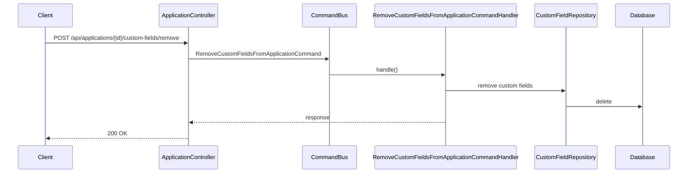

**Explanation:**
- Removes specified custom fields from the application.
- Handles validation and persistence.

**Example Case:**
- Remove the custom field `env=production` from application with code `app42`.

---

#### Endpoint: List Applications by IDs
| Method | Path | Purpose |
|--------|------|---------|
| POST   | /api/applications/by-ids | List applications by IDs |

**Request:**
- Body: List of application IDs (Long)

**Response:**
- 200 OK: List of ApplicationDTO
- 400 Bad Request: Validation errors

**Workflow Diagram:**
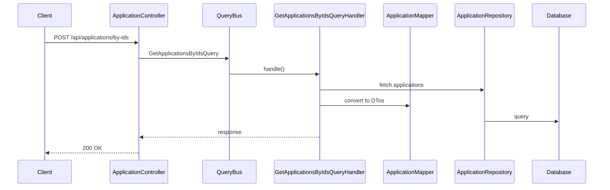

**Explanation:**
- Retrieves applications matching the provided list of IDs.

**Example Case:**
- List applications with IDs `[42, 43, 44]`.

---

#### Endpoint: Allowed Applications by User
| Method | Path | Purpose |
|--------|------|---------|
| GET    | /api/applications/by-user/{uid} | Allowed applications by user |

**Request:**
- Path Parameter: `uid` (String)

**Response:**
- 200 OK: List of ApplicationDTO
- 404 Not Found: If user does not exist

**Workflow Diagram:**
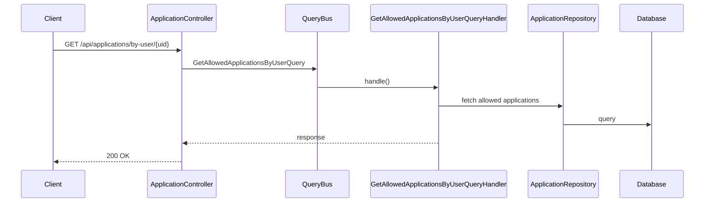

**Explanation:**
- Lists applications the specified user is allowed to access.

**Example Case:**
- Get allowed applications for user `john.doe@igrp.cv`.

---

#### Endpoint: Denied Applications by User
| Method | Path | Purpose |
|--------|------|---------|
| GET    | /api/applications/denied/by-user/{uid} | Denied applications by user |

**Request:**
- Path Parameter: `uid` (String)

**Response:**
- 200 OK: List of ApplicationDTO
- 404 Not Found: If user does not exist

**Workflow Diagram:**
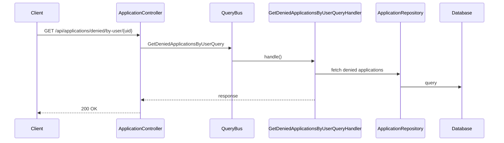

**Explanation:**
- Lists applications the specified user is denied access to.

**Example Case:**
- Get denied applications for user `john.doe@igrp.cv`.

---

### DepartmentController

#### Endpoints
| Method | Path | Purpose |
|--------|------|---------|
| POST   | /api/departments | Create department |
| GET    | /api/departments | List departments |
| GET    | /api/departments/{id} | Get department by ID |
| PUT    | /api/departments/{code} | Update department |
| DELETE | /api/departments/{code} | Delete department |
| POST   | /api/departments/{code}/applications | Add applications to department |
| DELETE | /api/departments/{code}/applications | Remove applications from department |
| POST   | /api/departments/{code}/menus | Add menus to department |
| DELETE | /api/departments/{code}/menus | Remove menus from department |
| GET    | /api/departments/{code}/menus/available | Get available menus for department |
| GET    | /api/departments/{code}/resources/available | Get available resources for department |

---

#### Endpoint: Create Department
| Method | Path | Purpose |
|--------|------|---------|
| POST   | /api/departments | Create department |

**Request:**
- Body: DepartmentDTO (code, name, parentId, applicationId, etc.)

**Response:**
- 201 Created: DepartmentDTO
- 400 Bad Request: Validation errors

**Workflow Diagram:**
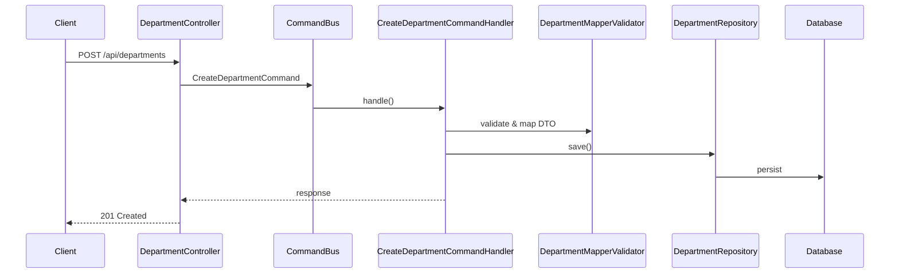

**Explanation:**
- Creates a new department, optionally as a child of another department.
- Associates department with an application if provided.

**Example Case:**
- Create a department named "Finance" under application ID `42`.

---

#### Endpoint: List Departments
| Method | Path | Purpose |
|--------|------|---------|
| GET    | /api/departments | List departments |

**Request:**
- Query Parameters: Optional filters (applicationCode, parentCode, status, etc.)

**Response:**
- 200 OK: List of DepartmentDTO

**Workflow Diagram:**
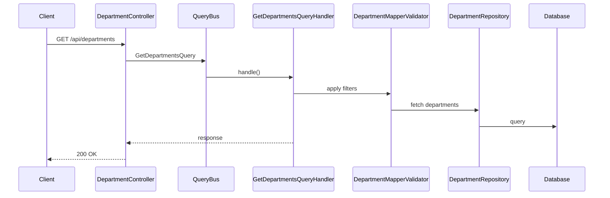

**Explanation:**
- Lists all departments, optionally filtered by application, parent, or status.

**Example Case:**
- List all departments for application code `app42`.

---

#### Endpoint: Get Department by ID
| Method | Path | Purpose |
|--------|------|---------|
| GET    | /api/departments/{id} | Get department by ID |

**Request:**
- Path Parameter: `id` (Long)

**Response:**
- 200 OK: DepartmentDTO
- 404 Not Found: If department does not exist

**Workflow Diagram:**
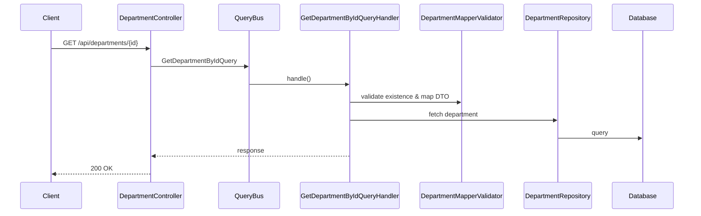

**Explanation:**
- Retrieves details of a specific department by its ID.

**Example Case:**
- Get department with ID `101`.

---

#### Endpoint: Update Department
| Method | Path | Purpose |
|--------|------|---------|
| PUT    | /api/departments/{code} | Update department |

**Request:**
- Path Parameter: `code` (String)
- Body: DepartmentDTO (fields to update)

**Response:**
- 200 OK: Updated DepartmentDTO
- 404 Not Found: If department does not exist
- 400 Bad Request: Validation errors

**Workflow Diagram:**
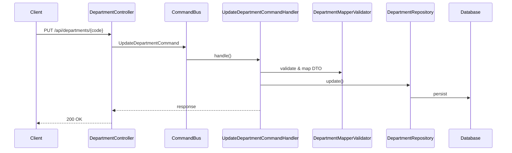

**Explanation:**
- Updates department details, including name, parent, or application association.

**Example Case:**
- Update the name of department with code `finance` to "Finance & Accounting".

---

#### Endpoint: Delete Department
| Method | Path | Purpose |
|--------|------|---------|
| DELETE | /api/departments/{code} | Delete department |

**Request:**
- Path Parameter: `code` (String)

**Response:**
- 204 No Content: Successfully deleted
- 404 Not Found: If department does not exist

**Workflow Diagram:**
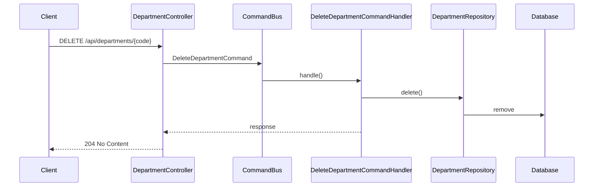

**Explanation:**
- Deletes the department and handles child/related entities as needed.

**Example Case:**
- Delete department with code `finance`.

---

#### Endpoint: Add Applications to Department
| Method | Path | Purpose |
|--------|------|---------|
| POST   | /api/departments/{code}/applications | Add applications to department |

**Request:**
- Path Parameter: `code` (String)
- Body: List of ApplicationDTO (applications to add)

**Response:**
- 204 No Content: Successfully added
- 404 Not Found: If department or applications do not exist
- 400 Bad Request: Validation errors

**Workflow Diagram:**
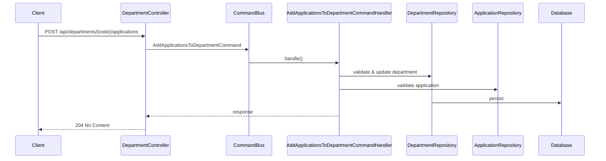

**Explanation:**
- Adds one or more applications to the specified department.
- Ensures parent-child consistency for application assignments.

**Example Case:**
- Add applications `app123` and `app456` to department with code `finance`.

---

#### Endpoint: Remove Applications from Department
| Method | Path | Purpose |
|--------|------|---------|
| DELETE | /api/departments/{code}/applications | Remove applications from department |

**Request:**
- Path Parameter: `code` (String)
- Body: List of ApplicationDTO (applications to remove)

**Response:**
- 204 No Content: Successfully removed
- 404 Not Found: If department or applications do not exist
- 400 Bad Request: Validation errors

**Workflow Diagram:**
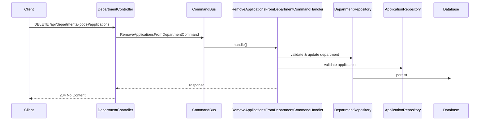

**Explanation:**
- Removes one or more applications from the specified department.

**Example Case:**
- Remove application `app123` from department with code `finance`.

---

#### Endpoint: Add Menus to Department
| Method | Path | Purpose |
|--------|------|---------|
| POST   | /api/departments/{code}/menus | Add menus to department |

**Request:**
- Path Parameter: `code` (String)
- Body: List of MenuEntryDTO (menus to add)

**Response:**
- 204 No Content: Successfully added
- 404 Not Found: If department or menus do not exist
- 400 Bad Request: Validation errors

**Workflow Diagram:**
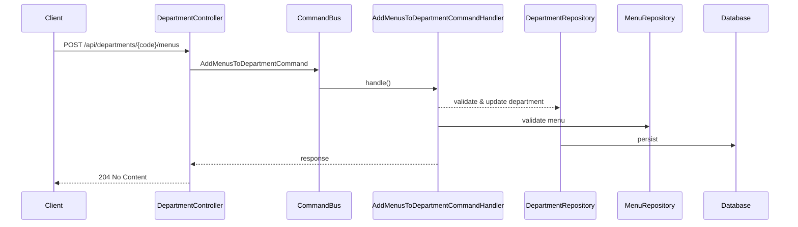

**Explanation:**
- Adds one or more menus to the specified department.

**Example Case:**
- Add menu `menu123` to department with code `finance`.

---

#### Endpoint: Remove Menus from Department
| Method | Path | Purpose |
|--------|------|---------|
| DELETE | /api/departments/{code}/menus | Remove menus from department |

**Request:**
- Path Parameter: `code` (String)
- Body: List of MenuEntryDTO (menus to remove)

**Response:**
- 204 No Content: Successfully removed
- 404 Not Found: If department or menus do not exist
- 400 Bad Request: Validation errors

**Workflow Diagram:**
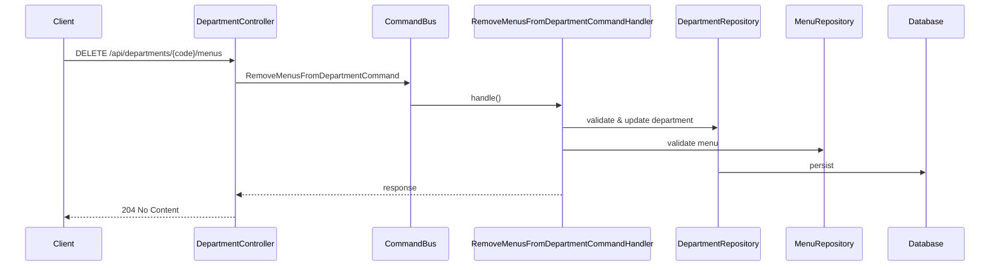

**Explanation:**
- Removes one or more menus from the specified department.

**Example Case:**
- Remove menu `menu123` from department with code `finance`.

---

#### Endpoint: Get Available Menus for Department
| Method | Path | Purpose |
|--------|------|---------|
| GET    | /api/departments/{code}/menus/available | Get available menus for department |

**Request:**
- Path Parameter: `code` (String)

**Response:**
- 200 OK: List of MenuEntryDTO
- 404 Not Found: If department does not exist

**Workflow Diagram:**
```mermaid
sequenceDiagram
    participant Client
    participant DepartmentController
    participant QueryBus
    participant GetAvailableMenusForDepartmentQueryHandler
    participant MenuRepository
    participant Database

    Client->>DepartmentController: GET /api/departments/{code}/menus/available
    DepartmentController->>QueryBus: GetAvailableMenusForDepartmentQuery
    QueryBus->>GetAvailableMenusForDepartmentQueryHandler: handle()
    GetAvailableMenusForDepartmentQueryHandler->>MenuRepository: fetch available menus
    MenuRepository->>Database: query
    GetAvailableMenusForDepartmentQueryHandler-->>DepartmentController: response
    DepartmentController-->>Client: 200 OK
```

**Explanation:**
- Lists menus available for assignment to the specified department.

**Example Case:**
- Get available menus for department with code `finance`.

---

#### Endpoint: Get Available Resources for Department
| Method | Path | Purpose |
|--------|------|---------|
| GET    | /api/departments/{code}/resources/available | Get available resources for department |

**Request:**
- Path Parameter: `code` (String)

**Response:**
- 200 OK: List of ResourceDTO
- 404 Not Found: If department does not exist

**Workflow Diagram:**
```mermaid
sequenceDiagram
    participant Client
    participant DepartmentController
    participant QueryBus
    participant GetAvailableResourcesForDepartmentQueryHandler
    participant ResourceRepository
    participant Database

    Client->>DepartmentController: GET /api/departments/{code}/resources/available
    DepartmentController->>QueryBus: GetAvailableResourcesForDepartmentQuery
    QueryBus->>GetAvailableResourcesForDepartmentQueryHandler: handle()
    GetAvailableResourcesForDepartmentQueryHandler->>ResourceRepository: fetch available resources
    ResourceRepository->>Database: query
    GetAvailableResourcesForDepartmentQueryHandler-->>DepartmentController: response
    DepartmentController-->>Client: 200 OK
```

**Explanation:**
- Lists resources available for assignment to the specified department.

**Example Case:**
- Get available resources for department with code `finance`.

---

### UserController

#### Endpoints
| Method | Path | Purpose |
|--------|------|---------|
| POST   | /api/users | Create user |
| GET    | /api/users | List users |
| GET    | /api/users/{uid} | Get user by UID |
| PUT    | /api/users/{uid} | Update user |
| DELETE | /api/users/{uid} | Delete user |
| POST   | /api/users/{uid}/roles | Add roles to user |
| DELETE | /api/users/{uid}/roles | Remove roles from user |
| GET    | /api/users/{uid}/roles | Get roles for user |
| POST   | /api/users/invite | Invite user |

---

#### Endpoint: Create User
| Method | Path | Purpose |
|--------|------|---------|
| POST   | /api/users | Create user |

**Request:**
- Body: IGRPUserDTO (uid, name, email, departmentCode, etc.)

**Response:**
- 201 Created: IGRPUserDTO
- 400 Bad Request: Validation errors

**Workflow Diagram:**
```mermaid
sequenceDiagram
    participant Client
    participant UserController
    participant CommandBus
    participant CreateUserCommandHandler
    participant IGRPUserMapper
    participant IGRPUserRepository
    participant Database

    Client->>UserController: POST /api/users
    UserController->>CommandBus: CreateUserCommand
    CommandBus->>CreateUserCommandHandler: handle()
    CreateUserCommandHandler->>IGRPUserMapper: map DTO
    CreateUserCommandHandler->>IGRPUserRepository: save()
    IGRPUserRepository->>Database: persist
    CreateUserCommandHandler-->>UserController: response
    UserController-->>Client: 201 Created
```

**Explanation:**
- Creates a new user and associates with department if provided.

**Example Case:**
- Create user with UID `john.doe`, name "John Doe", department code `finance`.

---

#### Endpoint: List Users
| Method | Path | Purpose |
|--------|------|---------|
| GET    | /api/users | List users |

**Request:**
- Query Parameters: Optional filters (departmentCode, status, etc.)

**Response:**
- 200 OK: List of IGRPUserDTO

**Workflow Diagram:**
```mermaid
sequenceDiagram
    participant Client
    participant UserController
    participant QueryBus
    participant GetUsersQueryHandler
    participant UserRepository
    participant Database

    Client->>UserController: GET /api/users
    UserController->>QueryBus: GetUsersQuery
    QueryBus->>GetUsersQueryHandler: handle()
    GetUsersQueryHandler->>UserRepository: fetch users
    UserRepository->>Database: query
    GetUsersQueryHandler-->>UserController: response
    UserController-->>Client: 200 OK
```

**Explanation:**
- Lists all users, optionally filtered by department or status.

**Example Case:**
- List all users in department code `finance`.

---

#### Endpoint: Get User by UID
| Method | Path | Purpose |
|--------|------|---------|
| GET    | /api/users/{uid} | Get user by UID |

**Request:**
- Path Parameter: `uid` (String)

**Response:**
- 200 OK: IGRPUserDTO
- 404 Not Found: If user does not exist

**Workflow Diagram:**
```mermaid
sequenceDiagram
    participant Client
    participant UserController
    participant QueryBus
    participant GetUserByUidQueryHandler
    participant UserRepository
    participant Database

    Client->>UserController: GET /api/users/{uid}
    UserController->>QueryBus: GetUserByUidQuery
    QueryBus->>GetUserByUidQueryHandler: handle()
    GetUserByUidQueryHandler-->UserRepository: fetch user
    UserRepository->>Database: query
    GetUserByUidQueryHandler-->>UserController: response
    UserController-->>Client: 200 OK
```

**Explanation:**
- Retrieves details of a specific user by UID.

**Example Case:**
- Get user with UID `john.doe`.

---

#### Endpoint: Update User
| Method | Path | Purpose |
|--------|------|---------|
| PUT    | /api/users/{uid} | Update user |

**Request:**
- Path Parameter: `uid` (String)
- Body: IGRPUserDTO (fields to update)

**Response:**
- 200 OK: Updated IGRPUserDTO
- 404 Not Found: If user does not exist
- 400 Bad Request: Validation errors

**Workflow Diagram:**
```mermaid
sequenceDiagram
    participant Client
    participant UserController
    participant CommandBus
    participant UpdateUserCommandHandler
    participant UserMapper
    participant UserRepository
    participant Database

    Client->>UserController: PUT /api/users/{uid}
    UserController->>CommandBus: UpdateUserCommand
    CommandBus->>UpdateUserCommandHandler: handle()
    UpdateUserCommandHandler->>UserMapper: map DTO
    UpdateUserCommandHandler->>UserRepository: update()
    UserRepository->>Database: persist
    UpdateUserCommandHandler-->>UserController: response
    UserController-->>Client: 200 OK
```

**Explanation:**
- Updates user details, including name, department, or status.

**Example Case:**
- Update the name of user `john.doe` to "Johnathan Doe".

---

#### Endpoint: Delete User
| Method | Path | Purpose |
|--------|------|---------|
| DELETE | /api/users/{uid} | Delete user |

**Request:**
- Path Parameter: `uid` (String)

**Response:**
- 204 No Content: Successfully deleted
- 404 Not Found: If user does not exist

**Workflow Diagram:**
```mermaid
sequenceDiagram
    participant Client
    participant UserController
    participant CommandBus
    participant DeleteUserCommandHandler
    participant UserRepository
    participant Database

    Client->>UserController: DELETE /api/users/{uid}
    UserController->>CommandBus: DeleteUserCommand
    CommandBus->>DeleteUserCommandHandler: handle()
    DeleteUserCommandHandler->>UserMapper: map to DTO
    DeleteUserCommandHandler->>UserRepository: delete()
    UserRepository->>Database: remove
    DeleteUserCommandHandler-->>UserController: response
    UserController-->>Client: 204 No Content
```

**Explanation:**
- Deletes the user and handles related entities as needed.

**Example Case:**
- Delete user with UID `john.doe@igrp.cv`.

---

#### Endpoint: Add Roles to User
| Method | Path | Purpose |
|--------|------|---------|
| POST   | /api/users/{uid}/roles | Add roles to user |

**Request:**
- Path Parameter: `uid` (String)
- Body: List of RoleDTO (roles to add)

**Response:**
- 204 No Content: Successfully added
- 404 Not Found: If user or roles do not exist
- 400 Bad Request: Validation errors

**Workflow Diagram:**
```mermaid
sequenceDiagram
    participant Client
    participant UserController
    participant CommandBus
    participant AddRolesToUserCommandHandler
    participant UserRepository
    participant RoleRepository
    participant Database

    Client->>UserController: POST /api/users/{uid}/roles
    UserController->>CommandBus: AddRolesToUserCommand
    CommandBus->>AddRolesToUserCommandHandler: handle()
    AddRolesToUserCommandHandler->>UserRepository: update user
    AddRolesToUserCommandHandler->>RoleRepository: validate roles
    UserRepository->>Database: persist
    AddRolesToUserCommandHandler-->>UserController: response
    UserController-->>Client: 204 No Content
```

**Explanation:**
- Adds one or more roles to the specified user.

**Example Case:**
- Add roles `admin` and `manager` to user `john.doe`.

---

#### Endpoint: Remove Roles from User
| Method | Path | Purpose |
|--------|------|---------|
| DELETE | /api/users/{uid}/roles | Remove roles from user |

**Request:**
- Path Parameter: `uid` (String)
- Body: List of RoleDTO (roles to remove)

**Response:**
- 204 No Content: Successfully removed
- 404 Not Found: If user or roles do not exist
- 400 Bad Request: Validation errors

**Workflow Diagram:**
```mermaid
sequenceDiagram
    participant Client
    participant UserController
    participant CommandBus
    participant RemoveRolesFromUserCommandHandler
    participant UserRepository
    participant RoleRepository
    participant Database

    Client->>UserController: DELETE /api/users/{uid}/roles
    UserController->>CommandBus: RemoveRolesFromUserCommand
    CommandBus->>RemoveRolesFromUserCommandHandler: handle()
    RemoveRolesFromUserCommandHandler->>UserRepository: update user
    RemoveRolesFromUserCommandHandler->>RoleRepository: validate roles
    UserRepository->>Database: persist
    RemoveRolesFromUserCommandHandler-->>UserController: response
    UserController-->>Client: 204 No Content
```

**Explanation:**
- Removes one or more roles from the specified user.

**Example Case:**
- Remove role `manager` from user `john.doe`.

---

#### Endpoint: Get Roles for User
| Method | Path | Purpose |
|--------|------|---------|
| GET    | /api/users/{uid}/roles | Get roles for user |

**Request:**
- Path Parameter: `uid` (String)

**Response:**
- 200 OK: List of RoleDTO
- 404 Not Found: If user does not exist

**Workflow Diagram:**
```mermaid
sequenceDiagram
    participant Client
    participant UserController
    participant QueryBus
    participant GetRolesForUserQueryHandler
    participant RoleRepository
    participant Database

    Client->>UserController: GET /api/users/{uid}/roles
    UserController->>QueryBus: GetRolesForUserQuery
    QueryBus->>GetRolesForUserQueryHandler: handle()
    GetRolesForUserQueryHandler->>RoleRepository: fetch roles
    RoleRepository->>Database: query
    GetRolesForUserQueryHandler-->>UserController: response
    UserController-->>Client: 200 OK
```

**Explanation:**
- Lists roles assigned to the specified user.

**Example Case:**
- Get roles for user `john.doe`.

---

#### Endpoint: Invite User
| Method | Path | Purpose |
|--------|------|---------|
| POST   | /api/users/invite | Invite user |

**Request:**
- Body: InviteUserDTO (uid, email, departmentCode, etc.)

**Response:**
- 200 OK: Invitation sent
- 400 Bad Request: Validation errors

**Workflow Diagram:**
```mermaid
sequenceDiagram
    participant Client
    participant UserController
    participant CommandBus
    participant InviteUserCommandHandler
    participant UserRepository
    participant EmailService
    participant Database

    Client->>UserController: POST /api/users/invite
    UserController->>CommandBus: InviteUserCommand
    CommandBus->>InviteUserCommandHandler: handle()
    InviteUserCommandHandler->>UserRepository: save invitation
    UserRepository->>Database: persist
    InviteUserCommandHandler->>EmailService: send invitation
    EmailService-->>InviteUserCommandHandler: result
    InviteUserCommandHandler-->>UserController: response
    UserController-->>Client: 200 OK
```

**Explanation:**
- Invites a user to the platform, sending an email invitation.

**Example Case:**
- Invite user with UID `jane.doe`, email `jane.doe@example.com` to department code `finance`.

---

### MenuController

#### Endpoints
| Method | Path                            | Purpose                      |
|--------|---------------------------------|------------------------------|
| POST   | /api/menus                      | Create menu                  |
| GET    | /api/menus                      | List menus                   |
| GET    | /api/menus/{code}               | Get menu by code             |
| PUT    | /api/menus/{code}               | Update menu                  |
| DELETE | /api/menus/{code}               | Delete menu                  |
| POST   | /api/menus/{code}/roles         | Add roles to menu            |
| DELETE | /api/menus/{code}/roles         | Remove roles from menu       |
| POST   | /api/menus/{code}/departments   | Add departments to menu      |
| DELETE | /api/menus/{code}/departments   | Remove departments from menu |

---

#### Endpoint: Create Menu
| Method | Path       | Purpose     |
|--------|------------|-------------|
| POST   | /api/menus | Create menu |

**Request:**
- Body: MenuEntryDTO (name, type, applicationId, etc.)

**Response:**
- 201 Created: MenuEntryDTO
- 400 Bad Request: Validation errors

**Workflow Diagram:**
```mermaid
sequenceDiagram
    participant Client
    participant MenuController
    participant CommandBus
    participant CreateMenuCommandHandler
    participant MenuRepository
    participant Database

    Client->>MenuController: POST /api/menus
    MenuController->>CommandBus: CreateMenuCommand
    CommandBus->>CreateMenuCommandHandler: handle()
    CreateMenuCommandHandler->>MenuRepository: save()
    MenuRepository->>Database: persist
    CreateMenuCommandHandler-->>MenuController: response
    MenuController-->>Client: 201 Created
```

**Explanation:**
- Creates a new menu entry, optionally linked to an application.

**Example Case:**
- Create a menu named "Dashboard" for application code `app42`.

---

#### Endpoint: List Menus
| Method | Path | Purpose |
|--------|------|---------|
| GET    | /api/menus | List menus |

**Request:**
- Query Parameters: Optional filters (applicationCode, type, etc.)

**Response:**
- 200 OK: List of MenuEntryDTO

**Workflow Diagram:**
```mermaid
sequenceDiagram
    participant Client
    participant MenuController
    participant QueryBus
    participant GetMenusQueryHandler
    participant MenuRepository
    participant Database

    Client->>MenuController: GET /api/menus
    MenuController->>QueryBus: GetMenusQuery
    QueryBus->>GetMenusQueryHandler: handle()
    GetMenusQueryHandler->>MenuRepository: fetch menus
    MenuRepository->>Database: query
    GetMenusQueryHandler-->>MenuController: response
    MenuController-->>Client: 200 OK
```

**Explanation:**
- Lists all menus, optionally filtered by application or type.

**Example Case:**
- List all menus for application code `app42`.

---

#### Endpoint: Get Menu by ID
| Method | Path              | Purpose          |
|--------|-------------------|------------------|
| GET    | /api/menus/{code} | Get menu by code |

**Request:**
- Path Parameter: `id` (Long)

**Response:**
- 200 OK: MenuEntryDTO
- 404 Not Found: If menu does not exist

**Workflow Diagram:**
```mermaid
sequenceDiagram
    participant Client
    participant MenuController
    participant QueryBus
    participant GetMenuByIdQueryHandler
    participant MenuService
    participant MenuRepository
    participant Database

    Client->>MenuController: GET /api/menus/{code}
    MenuController->>QueryBus: GetMenuByIdQuery
    QueryBus->>GetMenuByIdQueryHandler: handle()
    GetMenuByIdQueryHandler->>MenuService: validate existence
    MenuService->>MenuRepository: fetch menu
    MenuRepository->>Database: query
    GetMenuByIdQueryHandler-->>MenuController: response
    MenuController-->>Client: 200 OK
```

**Explanation:**
- Retrieves details of a specific menu by its ID.

**Example Case:**
- Get menu with code `menu101`.

---

#### Endpoint: Update Menu
| Method | Path              | Purpose     |
|--------|-------------------|-------------|
| PUT    | /api/menus/{code} | Update menu |

**Request:**
- Path Parameter: `code` (String)
- Body: MenuEntryDTO (fields to update)

**Response:**
- 200 OK: Updated MenuEntryDTO
- 404 Not Found: If menu does not exist
- 400 Bad Request: Validation errors

**Workflow Diagram:**
```mermaid
sequenceDiagram
    participant Client
    participant MenuController
    participant CommandBus
    participant UpdateMenuCommandHandler
    participant MenuRepository
    participant Database

    Client->>MenuController: PUT /api/menus/{code}
    MenuController->>CommandBus: UpdateMenuCommand
    CommandBus->>UpdateMenuCommandHandler: handle()
    UpdateMenuCommandHandler->>MenuRepository: update()
    MenuRepository->>Database: persist
    UpdateMenuCommandHandler-->>MenuController: response
    MenuController-->>Client: 200 OK
```

**Explanation:**
- Updates menu details, such as name or type.

**Example Case:**
- Update the name of menu with code `menu101` to "Main Dashboard".

---

#### Endpoint: Delete Menu
| Method | Path              | Purpose     |
|--------|-------------------|-------------|
| DELETE | /api/menus/{code} | Delete menu |

**Request:**
- Path Parameter: `code` (String)

**Response:**
- 204 No Content: Successfully deleted
- 404 Not Found: If menu does not exist

**Workflow Diagram:**
```mermaid
sequenceDiagram
    participant Client
    participant MenuController
    participant CommandBus
    participant DeleteMenuCommandHandler
    participant MenuRepository
    participant Database

    Client->>MenuController: DELETE /api/menus/{id}
    MenuController->>CommandBus: DeleteMenuCommand
    CommandBus->>DeleteMenuCommandHandler: handle()
    DeleteMenuCommandHandler->>MenuRepository: delete()
    MenuRepository->>Database: remove
    DeleteMenuCommandHandler-->>MenuController: response
    MenuController-->>Client: 204 No Content
```

**Explanation:**
- Deletes the menu and handles related items as needed.

**Example Case:**
- Delete menu with code `menu101`.

---

#### Endpoint: Add Roles to Menu
| Method | Path                    | Purpose           |
|--------|-------------------------|-------------------|
| POST   | /api/menus/{code}/roles | Add roles to menu |

**Request:**
- Path Parameter: `code` (String)
- Body: List of role codes (roles to add)

**Response:**
- 204 No Content: Successfully added
- 404 Not Found: If menu or roles do not exist
- 400 Bad Request: Validation errors

**Workflow Diagram:**
```mermaid
sequenceDiagram
    participant Client
    participant MenuController
    participant CommandBus
    participant AddRolesToMenuCommandHandler
    participant MenuRepository
    participant Database

    Client->>MenuController: POST /api/menus/{id}/items
    MenuController->>CommandBus: AddItemsToMenuCommand
    CommandBus->>AddRolesToMenuCommandHandler: handle()
    AddRolesToMenuCommandHandler->>MenuRepository: update menu
    MenuRepository->>Database: persist
    AddRolesToMenuCommandHandler-->>MenuController: response
    MenuController-->>Client: 204 No Content
```

**Explanation:**
- Adds one or more roles to the specified menu.

**Example Case:**
- Add roles `role123` and `role456` to menu with code `menu101`.

---

#### Endpoint: Remove Roles from Menu
| Method | Path                    | Purpose                |
|--------|-------------------------|------------------------|
| DELETE | /api/menus/{code}/roles | Remove roles from menu |

**Request:**
- Path Parameter: `code` (String)
- Body: List of role codes (roles to remove)

**Response:**
- 204 No Content: Successfully removed
- 404 Not Found: If menu or roles do not exist
- 400 Bad Request: Validation errors

**Workflow Diagram:**
```mermaid
sequenceDiagram
    participant Client
    participant MenuController
    participant CommandBus
    participant RemoveRolesFromMenuCommandHandler
    participant MenuRepository
    participant Database

    Client->>MenuController: DELETE /api/menus/{id}/items
    MenuController->>CommandBus: RemoveItemsFromMenuCommand
    CommandBus->>RemoveRolesFromMenuCommandHandler: handle()
    RemoveRolesFromMenuCommandHandler->>MenuRepository: update menu
    MenuRepository->>Database: persist
    RemoveRolesFromMenuCommandHandler-->>MenuController: response
    MenuController-->>Client: 204 No Content
```

**Explanation:**
- Removes one or more roles from the specified menu.

**Example Case:**
- Remove role `role123` from menu with code `menu101`.

---

#### Endpoint: Add Departments to Menu
| Method | Path                          | Purpose                 |
|--------|-------------------------------|-------------------------|
| POST   | /api/menus/{code}/departments | Add departments to menu |

**Request:**
- Path Parameter: `code` (String)
- Body: List of department codes (departments to add)

**Response:**
- 204 No Content: Successfully added
- 404 Not Found: If menu or departments do not exist
- 400 Bad Request: Validation errors

**Workflow Diagram:**
```mermaid
sequenceDiagram
    participant Client
    participant MenuController
    participant CommandBus
    participant AddDepartmentsToMenuCommandHandler
    participant MenuRepository
    participant Database

    Client->>MenuController: POST /api/menus/{id}/items
    MenuController->>CommandBus: AddItemsToMenuCommand
    CommandBus->>AddDepartmentsToMenuCommandHandler: handle()
    AddDepartmentsToMenuCommandHandler->>MenuRepository: update menu
    MenuRepository->>Database: persist
    AddDepartmentsToMenuCommandHandler-->>MenuController: response
    MenuController-->>Client: 204 No Content
```

**Explanation:**
- Adds one or more departments to the specified menu.

**Example Case:**
- Add departments `department123` and `department456` to menu with code `menu101`.

---

#### Endpoint: Remove Departments from Menu
| Method | Path                          | Purpose                      |
|--------|-------------------------------|------------------------------|
| DELETE | /api/menus/{code}/departments | Remove departments from menu |

**Request:**
- Path Parameter: `code` (String)
- Body: List of department codes (departments to remove)

**Response:**
- 204 No Content: Successfully removed
- 404 Not Found: If menu or departments do not exist
- 400 Bad Request: Validation errors

**Workflow Diagram:**
```mermaid
sequenceDiagram
    participant Client
    participant MenuController
    participant CommandBus
    participant RemoveDepartmentsFromMenuCommandHandler
    participant MenuRepository
    participant Database

    Client->>MenuController: DELETE /api/menus/{id}/items
    MenuController->>CommandBus: RemoveItemsFromMenuCommand
    CommandBus->>RemoveDepartmentsFromMenuCommandHandler: handle()
    RemoveDepartmentsFromMenuCommandHandler->>MenuRepository: update menu
    MenuRepository->>Database: persist
    RemoveDepartmentsFromMenuCommandHandler-->>MenuController: response
    MenuController-->>Client: 204 No Content
```

**Explanation:**
- Removes one or more departments from the specified menu.

**Example Case:**
- Remove department `department123` from menu with code `menu101`.

---

### ResourceController

#### Endpoints
| Method | Path                        | Purpose                    |
|--------|-----------------------------|----------------------------|
| POST   | /api/resources              | Create resource            |
| GET    | /api/resources              | List resources             |
| GET    | /api/resources/{name}       | Get resource by name       |
| PUT    | /api/resources/{name}       | Update resource            |
| DELETE | /api/resources/{name}       | Delete resource            |
| POST   | /api/resources/{name}/items | Add items to resource      |
| DELETE | /api/resources/{name}/items | Remove items from resource |
| GET    | /api/resources/{name}/items | Get items for resource     |

---

#### Endpoint: Create Resource
| Method | Path           | Purpose         |
|--------|----------------|-----------------|
| POST   | /api/resources | Create resource |

**Request:**
- Body: ResourceDTO (name, type, applicationCode, etc.)

**Response:**
- 201 Created: ResourceDTO
- 400 Bad Request: Validation errors

**Workflow Diagram:**
```mermaid
sequenceDiagram
    participant Client
    participant ResourceController
    participant CommandBus
    participant CreateResourceCommandHandler
    participant ResourceRepository
    participant Database

    Client->>ResourceController: POST /api/resources
    ResourceController->>CommandBus: CreateResourceCommand
    CommandBus->>CreateResourceCommandHandler: handle()
    CreateResourceCommandHandler->>ResourceRepository: save()
    ResourceRepository->>Database: persist
    CreateResourceCommandHandler-->>ResourceController: response
    ResourceController-->>Client: 201 Created
```

**Explanation:**
- Creates a new resource, optionally linked to an application.

**Example Case:**
- Create a resource named "Document" for application code `app42`.

---

#### Endpoint: List Resources
| Method | Path           | Purpose        |
|--------|----------------|----------------|
| GET    | /api/resources | List resources |

**Request:**
- Query Parameters: Optional filters (applicationCode, type, etc.)

**Response:**
- 200 OK: List of ResourceDTO

**Workflow Diagram:**
```mermaid
sequenceDiagram
    participant Client
    participant ResourceController
    participant QueryBus
    participant GetResourcesQueryHandler
    participant ResourceRepository
    participant Database

    Client->>ResourceController: GET /api/resources
    ResourceController->>QueryBus: GetResourcesQuery
    QueryBus->>GetResourcesQueryHandler: handle()
    GetResourcesQueryHandler->>ResourceRepository: fetch resources
    ResourceRepository->>Database: query
    GetResourcesQueryHandler-->>ResourceController: response
    ResourceController-->>Client: 200 OK
```

**Explanation:**
- Lists all resources, optionally filtered by application or type.

**Example Case:**
- List all resources for application code `app42`.

---

#### Endpoint: Get Resource by ID
| Method | Path                  | Purpose              |
|--------|-----------------------|----------------------|
| GET    | /api/resources/{name} | Get resource by name |

**Request:**
- Path Parameter: `name` (String)

**Response:**
- 200 OK: ResourceDTO
- 404 Not Found: If resource does not exist

**Workflow Diagram:**
```mermaid
sequenceDiagram
    participant Client
    participant ResourceController
    participant QueryBus
    participant GetResourceByIdQueryHandler
    participant ResourceRepository
    participant Database

    Client->>ResourceController: GET /api/resources/{id}
    ResourceController->>QueryBus: GetResourceByIdQuery
    QueryBus->>GetResourceByIdQueryHandler: handle()
    GetResourceByIdQueryHandler->>ResourceRepository: fetch resource
    ResourceRepository->>Database: query
    GetResourceByIdQueryHandler-->>ResourceController: response
    ResourceController-->>Client: 200 OK
```

**Explanation:**
- Retrieves details of a specific resource by its name.

**Example Case:**
- Get resource with name `document123`.

---
#### Endpoint: Update Resource
| Method | Path                  | Purpose              |
|--------|-----------------------|----------------------|
| PUT    | /api/resources/{name} | Update resource      |

**Request:**
- Path Parameter: `name` (String)
- Body: ResourceDTO (fields to update)

**Response:**
- 200 OK: Updated ResourceDTO
- 404 Not Found: If resource does not exist
- 400 Bad Request: Validation errors

**Workflow Diagram:**
```mermaid
sequenceDiagram
    participant Client
    participant ResourceController
    participant CommandBus
    participant UpdateResourceCommandHandler
    participant ResourceRepository
    participant Database

    Client->>ResourceController: PUT /api/resources/{id}
    ResourceController->>CommandBus: UpdateResourceCommand
    CommandBus->>UpdateResourceCommandHandler: handle()
    UpdateResourceCommandHandler->>ResourceRepository: update()
    ResourceRepository->>Database: persist
    UpdateResourceCommandHandler-->>ResourceController: response
    ResourceController-->>Client: 200 OK
```

**Explanation:**
- Updates resource details, such as name or type.

**Example Case:**
- Update the name of resource with name `document123` to "Main Document".

---
#### Endpoint: Delete Resource
| Method | Path                  | Purpose              |
|--------|-----------------------|----------------------|
| DELETE | /api/resources/{name} | Delete resource      |

**Request:**
- Path Parameter: `name` (String)

**Response:**
- 204 No Content: Successfully deleted
- 404 Not Found: If resource does not exist

**Workflow Diagram:**
```mermaid
sequenceDiagram
    participant Client
    participant ResourceController
    participant CommandBus
    participant DeleteResourceCommandHandler
    participant ResourceRepository
    participant Database

    Client->>ResourceController: DELETE /api/resources/{id}
    ResourceController->>CommandBus: DeleteResourceCommand
    CommandBus->>DeleteResourceCommandHandler: handle()
    DeleteResourceCommandHandler->>ResourceRepository: delete()
    ResourceRepository->>Database: remove
    DeleteResourceCommandHandler-->>ResourceController: response
    ResourceController-->>Client: 204 No Content
```

**Explanation:**
- Deletes the resource and handles related items as needed.

**Example Case:**
- Delete resource with name `document123`.

---

#### Endpoint: Add Items to Resource
| Method | Path                        | Purpose               |
|--------|-----------------------------|-----------------------|
| POST   | /api/resources/{name}/items | Add items to resource |

**Request:**
- Path Parameter: `name` (String)
- Body: List of ResourceItemDTO (items to add)

**Response:**
- 204 No Content: Successfully added
- 404 Not Found: If resource or items do not exist
- 400 Bad Request: Validation errors

**Workflow Diagram:**
```mermaid
sequenceDiagram
    participant Client
    participant ResourceController
    participant CommandBus
    participant AddItemsToResourceCommandHandler
    participant ResourceRepository
    participant Database

    Client->>ResourceController: POST /api/resources/{id}/items
    ResourceController->>CommandBus: AddItemsToResourceCommand
    CommandBus->>AddItemsToResourceCommandHandler: handle()
    AddItemsToResourceCommandHandler->>ResourceRepository: update resource
    ResourceRepository->>Database: persist
    AddItemsToResourceCommandHandler-->>ResourceController: response
    ResourceController-->>Client: 204 No Content
```

**Explanation:**
- Adds one or more items to the specified resource.

**Example Case:**
- Add items `item123` and `item456` to resource with name `document123`.

---

#### Endpoint: Remove Items from Resource
| Method | Path                        | Purpose                    |
|--------|-----------------------------|----------------------------|
| DELETE | /api/resources/{name}/items | Remove items from resource |

**Request:**
- Path Parameter: `name` (String)
- Body: List of ResourceItemDTO (items to remove)

**Response:**
- 204 No Content: Successfully removed
- 404 Not Found: If resource or items do not exist
- 400 Bad Request: Validation errors

**Workflow Diagram:**
```mermaid
sequenceDiagram
    participant Client
    participant ResourceController
    participant CommandBus
    participant RemoveItemsFromResourceCommandHandler
    participant ResourceRepository
    participant Database

    Client->>ResourceController: DELETE /api/resources/{id}/items
    ResourceController->>CommandBus: RemoveItemsFromResourceCommand
    CommandBus->>RemoveItemsFromResourceCommandHandler: handle()
    RemoveItemsFromResourceCommandHandler-->>ResourceRepository: update resource
    ResourceRepository->>Database: persist
    RemoveItemsFromResourceCommandHandler-->>ResourceController: response
    ResourceController-->>Client: 204 No Content
```

**Explanation:**
- Removes one or more items from the specified resource.

**Example Case:**
- Remove item `item123` from resource with name `document123`.

---

#### Endpoint: Get Items for Resource
| Method | Path                        | Purpose                |
|--------|-----------------------------|------------------------|
| GET    | /api/resources/{name}/items | Get items for resource |

**Request:**
- Path Parameter: `name` (String)

**Response:**
- 200 OK: List of ResourceItemDTO
- 404 Not Found: If resource does not exist

**Workflow Diagram:**
```mermaid
sequenceDiagram
    participant Client
    participant ResourceController
    participant QueryBus
    participant GetItemsForResourceQueryHandler
    participant ResourceService
    participant ResourceRepository
    participant Database

    Client->>ResourceController: GET /api/resources/{id}/items
    ResourceController->>QueryBus: GetItemsForResourceQuery
    QueryBus->>GetItemsForResourceQueryHandler: handle()
    GetItemsForResourceQueryHandler->>ResourceRepository: fetch items
    ResourceRepository->>Database: query
    GetItemsForResourceQueryHandler-->>ResourceController: response
    ResourceController-->>Client: 200 OK
```

**Explanation:**
- Lists items assigned to the specified resource.

**Example Case:**
- Get items for resource with ID `101`.

---

## PermissionsController

### Summary of Endpoints
| Method | Path                              | Purpose                      |
|--------|-----------------------------------|------------------------------|
| POST   | /api/permissions                  | Create a new permission      |
| GET    | /api/permissions                  | List all permissions         |
| GET    | /api/permissions/{name}           | Get permission by name       |
| PUT    | /api/permissions/{name}           | Update permission            |
| DELETE | /api/permissions/{name}           | Delete permission            |
| POST   | /api/roles/{roleCode}/permissions | Assign permissions to role   |
| DELETE | /api/roles/{roleCode}/permissions | Remove permissions from role |

---

### Endpoint: Create Permission
| Method | Path             | Purpose                 |
|--------|------------------|-------------------------|
| POST   | /api/permissions | Create a new permission |

**Request:**
- Body: PermissionDTO

**Response:**
- 201 Created: PermissionDTO
- 400 Bad Request: Validation errors

**Workflow Diagram:**
```mermaid
sequenceDiagram
    participant Client
    participant PermissionsController
    participant CommandBus
    participant CreatePermissionCommandHandler
    participant PermissionRepository
    participant Database

    Client->>PermissionsController: POST /api/permissions
    PermissionsController->>CommandBus: CreatePermissionCommand
    CommandBus->>CreatePermissionCommandHandler: handle()
    CreatePermissionCommandHandler->>PermissionRepository: save
    PermissionRepository->>Database: insert
    CreatePermissionCommandHandler-->>PermissionsController: response
    PermissionsController-->>Client: 201 Created
```

**Explanation:**
- Creates a new permission with the provided details.

**Example Case:**
- Create permission `VIEW_REPORTS`.

---

### Endpoint: List Permissions
| Method | Path             | Purpose              |
|--------|------------------|----------------------|
| GET    | /api/permissions | List all permissions |

**Response:**
- 200 OK: List of PermissionDTO

**Workflow Diagram:**
```mermaid
sequenceDiagram
    participant Client
    participant PermissionsController
    participant QueryBus
    participant ListPermissionsQueryHandler
    participant PermissionRepository
    participant Database

    Client->>PermissionsController: GET /api/permissions
    PermissionsController->>QueryBus: ListPermissionsQuery
    QueryBus->>ListPermissionsQueryHandler: handle()
    ListPermissionsQueryHandler->>PermissionRepository: findAll
    PermissionRepository->>Database: query
    ListPermissionsQueryHandler-->>PermissionsController: response
    PermissionsController-->>Client: 200 OK
```

**Explanation:**
- Retrieves all permissions in the system.

**Example Case:**
- List all available permissions.

---

### Endpoint: Get Permission by name
| Method | Path                    | Purpose                |
|--------|-------------------------|------------------------|
| GET    | /api/permissions/{name} | Get permission by name |

**Request:**
- Path Parameter: `name` (String)

**Response:**
- 200 OK: PermissionDTO
- 404 Not Found: If permission does not exist

**Workflow Diagram:**
```mermaid
sequenceDiagram
    participant Client
    participant PermissionsController
    participant QueryBus
    participant GetPermissionByIdQueryHandler
    participant PermissionRepository
    participant Database

    Client->>PermissionsController: GET /api/permissions/{id}
    PermissionsController->>QueryBus: GetPermissionByIdQuery
    QueryBus->>GetPermissionByIdQueryHandler: handle()
    GetPermissionByIdQueryHandler->>PermissionRepository: findById
    PermissionRepository->>Database: query
    GetPermissionByIdQueryHandler-->>PermissionsController: response
    PermissionsController-->>Client: 200 OK
```

**Explanation:**
- Retrieves details for a specific permission by its name.

**Example Case:**
- Get permission with name `VIEW_REPORTS`.

---

### Endpoint: Update Permission
| Method | Path                    | Purpose           |
|--------|-------------------------|-------------------|
| PUT    | /api/permissions/{name} | Update permission |

**Request:**
- Path Parameter: `name` (String)
- Body: PermissionDTO

**Response:**
- 200 OK: Updated PermissionDTO
- 400 Bad Request: Validation errors
- 404 Not Found: If permission does not exist

**Workflow Diagram:**
```mermaid
sequenceDiagram
    participant Client
    participant PermissionsController
    participant CommandBus
    participant UpdatePermissionCommandHandler
    participant PermissionRepository
    participant Database

    Client->>PermissionsController: PUT /api/permissions/{id}
    PermissionsController->>CommandBus: UpdatePermissionCommand
    CommandBus->>UpdatePermissionCommandHandler: handle()
    UpdatePermissionCommandHandler->>PermissionRepository: save
    PermissionRepository->>Database: update
    UpdatePermissionCommandHandler-->>PermissionsController: response
    PermissionsController-->>Client: 200 OK
```

**Explanation:**
- Updates the details of an existing permission by its name.

**Example Case:**
- Update permission with name `VIEW_REPORTS` to change its description.

---

### Endpoint: Delete Permission
| Method | Path                    | Purpose           |
|--------|-------------------------|-------------------|
| DELETE | /api/permissions/{name} | Delete permission |

**Request:**
- Path Parameter: `name` (String)

**Response:**
- 204 No Content: Successfully deleted
- 404 Not Found: If permission does not exist

**Workflow Diagram:**
```mermaid
sequenceDiagram
    participant Client
    participant PermissionsController
    participant CommandBus
    participant DeletePermissionCommandHandler
    participant PermissionRepository
    participant Database

    Client->>PermissionsController: DELETE /api/permissions/{id}
    PermissionsController->>CommandBus: DeletePermissionCommand
    CommandBus->>DeletePermissionCommandHandler: handle()
    DeletePermissionCommandHandler->>PermissionRepository: delete
    PermissionRepository->>Database: remove
    DeletePermissionCommandHandler-->>PermissionsController: response
    PermissionsController-->>Client: 204 No Content
```

**Explanation:**
- Deletes the specified permission from the system.

**Example Case:**
- Delete permission with name `VIEW_REPORTS`.

---

### Endpoint: Assign Permissions to Role
| Method | Path                              | Purpose                    |
|--------|-----------------------------------|----------------------------|
| POST   | /api/roles/{roleCode}/permissions | Assign permissions to role |

**Request:**
- Path Parameter: `roleCode` (String)
- Body: List of PermissionDTO

**Response:**
- 204 No Content: Successfully assigned
- 404 Not Found: If role or permissions do not exist
- 400 Bad Request: Validation errors

**Workflow Diagram:**
```mermaid
sequenceDiagram
    participant Client
    participant PermissionsController
    participant CommandBus
    participant AssignPermissionsToRoleCommandHandler
    participant PermissionRepository
    participant Database

    Client->>PermissionsController: POST /api/roles/{roleId}/permissions
    PermissionsController->>CommandBus: AssignPermissionsToRoleCommand
    CommandBus->>AssignPermissionsToRoleCommandHandler: handle()
    AssignPermissionsToRoleCommandHandler->>PermissionRepository: assign
    PermissionRepository->>Database: update
    AssignPermissionsToRoleCommandHandler-->>PermissionsController: response
    PermissionsController-->>Client: 204 No Content
```

**Explanation:**
- Assigns one or more permissions to the specified role.

**Example Case:**
- Assign permissions `VIEW_REPORTS` and `EDIT_USERS` to role code `ADMIN`.

---
### Endpoint: Remove Permissions from Role
| Method | Path                              | Purpose                      |
|--------|-----------------------------------|------------------------------|
| DELETE | /api/roles/{roleCode}/permissions | Remove permissions from role |

**Request:**
- Path Parameter: `roleCode` (String)
- Body: List of PermissionDTO

**Response:**
- 204 No Content: Successfully removed
- 404 Not Found: If role or permissions do not exist
- 400 Bad Request: Validation errors

**Workflow Diagram:**
```mermaid
sequenceDiagram
    participant Client
    participant PermissionsController
    participant CommandBus
    participant RemovePermissionsFromRoleCommandHandler
    participant PermissionRepository
    participant Database

    Client->>PermissionsController: DELETE /api/roles/{roleId}/permissions
    PermissionsController->>CommandBus: RemovePermissionsFromRoleCommand
    CommandBus->>RemovePermissionsFromRoleCommandHandler: handle()
    RemovePermissionsFromRoleCommandHandler->>PermissionRepository: remove
    PermissionRepository->>Database: update
    RemovePermissionsFromRoleCommandHandler-->>PermissionsController: response
    PermissionsController-->>Client: 204 No Content
```

**Explanation:**
- Removes one or more permissions from the specified role.

**Example Case:**
- Remove permission `EDIT_USERS` from role code `ADMIN`.

---

## RolesController

### Summary of Endpoints
| Method | Path                              | Purpose                      |
|--------|-----------------------------------|------------------------------|
| POST   | /api/roles                        | Create a new role            |
| GET    | /api/roles/{roleCode}             | Get role by code             |
| PUT    | /api/roles/{roleCode}             | Update role                  |
| DELETE | /api/roles/{roleCode}             | Delete role                  |
| GET    | /api/roles/by-user/{uid}          | List roles by user           |
| POST   | /api/users/{id}/roles             | Assign users to role         |
| DELETE | /api/users/{id}/roles             | Remove users from role       |
| POST   | /api/roles/{roleCode}/permissions | Assign permissions to role   |
| DELETE | /api/roles/{roleCode}/permissions | Remove permissions from role |

---

### Endpoint: Create Role
| Method | Path       | Purpose           |
|--------|------------|-------------------|
| POST   | /api/roles | Create a new role |

**Request:**
- Body: RoleDTO

**Response:**
- 201 Created: RoleDTO
- 400 Bad Request: Validation errors

**Workflow Diagram:**
```mermaid
sequenceDiagram
    participant Client
    participant RolesController
    participant CommandBus
    participant CreateRoleCommandHandler
    participant RoleRepository
    participant Database
    participant IAdapter
    participant ExternalIAM

    Client->>RolesController: POST /api/roles
    RolesController->>CommandBus: CreateRoleCommand
    CommandBus->>CreateRoleCommandHandler: handle()
    CreateRoleCommandHandler->>RoleRepository: save
    RoleRepository->>Database: insert
    CreateRoleCommandHandler-->>RolesController: response
    CreateRoleCommandHandler-->>IAdapter: sync role to provider
    IAdapter-->>ExternalIAM: create role
    ExternalIAM-->>IAdapter: role created
    IAdapter-->>CreateRoleCommandHandler: role synced
    CreateRoleCommandHandler-->>RolesController: response
    RolesController-->>Client: 201 Created
```

**Explanation:**
- Creates a new role with the provided details.

**Example Case:**
- Create role `ADMIN`.

---

### Endpoint: List Roles
| Method | Path       | Purpose        |
|--------|------------|----------------|
| GET    | /api/roles | List all roles |

**Response:**
- 200 OK: List of RoleDTO

**Workflow Diagram:**
```mermaid
sequenceDiagram
    participant Client
    participant RolesController
    participant QueryBus
    participant ListRolesQueryHandler
    participant RoleRepository
    participant Database

    Client->>RolesController: GET /api/roles
    RolesController->>QueryBus: ListRolesQuery
    QueryBus->>ListRolesQueryHandler: handle()
    ListRolesQueryHandler->>RoleRepository: findAll
    RoleRepository->>Database: query
    ListRolesQueryHandler-->>RolesController: response
    RolesController-->>Client: 200 OK
```

**Explanation:**
- Retrieves all roles in the system.

**Example Case:**
- List all available roles.

---

### Endpoint: Get Role by code
| Method | Path              | Purpose          |
|--------|-------------------|------------------|
| GET    | /api/roles/{code} | Get role by code |

**Request:**
- Path Parameter: `code` (String)

**Response:**
- 200 OK: RoleDTO
- 404 Not Found: If role does not exist

**Workflow Diagram:**
```mermaid
sequenceDiagram
    participant Client
    participant RolesController
    participant QueryBus
    participant GetRoleByIdQueryHandler
    participant RoleRepository
    participant Database

    Client->>RolesController: GET /api/roles/{id}
    RolesController->>QueryBus: GetRoleByIdQuery
    QueryBus->>GetRoleByIdQueryHandler: handle()
    GetRoleByIdQueryHandler->>RoleRepository: findByCode
    RoleRepository->>Database: query
    GetRoleByIdQueryHandler-->>RolesController: response
    RolesController-->>Client: 200 OK
```

**Explanation:**
- Retrieves details for a specific role.

**Example Case:**
- Get role with code `ADMIN`.

---

### Endpoint: Update Role
| Method | Path              | Purpose     |
|--------|-------------------|-------------|
| PUT    | /api/roles/{code} | Update role |

**Request:**
- Path Parameter: `code` (String)
- Body: RoleDTO

**Response:**
- 200 OK: Updated RoleDTO
- 400 Bad Request: Validation errors
- 404 Not Found: If role does not exist

**Workflow Diagram:**
```mermaid
sequenceDiagram
    participant Client
    participant RolesController
    participant CommandBus
    participant UpdateRoleCommandHandler
    participant RoleRepository
    participant Database

    Client->>RolesController: PUT /api/roles/{id}
    RolesController->>CommandBus: UpdateRoleCommand
    CommandBus->>UpdateRoleCommandHandler: handle()
    UpdateRoleCommandHandler->>RoleRepository: save
    RoleRepository->>Database: update
    UpdateRoleCommandHandler-->>RolesController: response
    RolesController-->>Client: 200 OK
```

**Explanation:**
- Updates the details of an existing role.
Replace `id` with `code` in the path parameter.

**Example Case:**
- Update role with code `ADMIN` to change its name.

---

### Endpoint: Delete Role
| Method | Path              | Purpose     |
|--------|-------------------|-------------|
| DELETE | /api/roles/{code} | Delete role |

**Request:**
- Path Parameter: `code` (String)

**Response:**
- 204 No Content: Successfully deleted
- 404 Not Found: If role does not exist

**Workflow Diagram:**
```mermaid
sequenceDiagram
    participant Client
    participant RolesController
    participant CommandBus
    participant DeleteRoleCommandHandler
    participant RoleRepository
    participant Database

    Client->>RolesController: DELETE /api/roles/{id}
    RolesController->>CommandBus: DeleteRoleCommand
    CommandBus->>DeleteRoleCommandHandler: handle()
    DeleteRoleCommandHandler->>RoleRepository: delete
    RoleRepository->>Database: remove
    DeleteRoleCommandHandler-->>RolesController: response
    RolesController-->>Client: 204 No Content
```

**Explanation:**
- Deletes the specified role from the system.
Replace `id` with `code` in the path parameter.

**Example Case:**
- Delete role with code `ADMIN`.

---

### Endpoint: List Roles by User
| Method | Path                   | Purpose            |
|--------|------------------------|--------------------|
| GET    | /api/users/{uid}/roles | List roles by user |

**Request:**
- Path Parameter: `uid` (String)

**Response:**
- 200 OK: List of RoleDTO
- 404 Not Found: If user does not exist

**Workflow Diagram:**
```mermaid
sequenceDiagram
    participant Client
    participant RolesController
    participant QueryBus
    participant GetUserRolesQueryHandler
    participant RoleRepository
    participant UserRepository
    participant Database

    Client->>RolesController: GET /api/roles/by-user/{uid}
    RolesController->>QueryBus: ListRolesByUserQuery
    QueryBus->>GetUserRolesQueryHandler: handle()
    GetUserRolesQueryHandler->>UserRepository: find user
    GetUserRolesQueryHandler->>RoleRepository: find roles
    RoleRepository->>Database: query
    UserRepository->>Database: query
    GetUserRolesQueryHandler-->>RolesController: response
    RolesController-->>Client: 200 OK
```

**Explanation:**
- Lists all roles assigned to a specific user.

**Example Case:**
- List roles for user `john.doe@igrp.cv`.

---

### Endpoint: Assign Users to Role
| Method | Path                   | Purpose              |
|--------|------------------------|----------------------|
| POST   | /api/users/{uid}/roles | Assign users to role |

**Request:**
- Path Parameter: `uid` (Long)
- Body: List of UserDTO

**Response:**
- 204 No Content: Successfully assigned
- 404 Not Found: If role or users do not exist
- 400 Bad Request: Validation errors

**Workflow Diagram:**
```mermaid
sequenceDiagram
    participant Client
    participant RolesController
    participant CommandBus
    participant AddRolesToUserCommandHandler
    participant RoleRepository
    participant Database

    Client->>RolesController: POST /api/users/{uid}/roles
    RolesController->>CommandBus: AddRolesToUserCommand
    CommandBus->>AddRolesToUserCommandHandler: handle()
    AddRolesToUserCommandHandler->>RoleRepository: assign
    RoleRepository->>Database: update
    AddRolesToUserCommandHandler-->>RolesController: response
    RolesController-->>Client: 204 No Content
```

**Explanation:**
- Assigns one or more users to the specified role.

**Example Case:**
- Assign users `john.doe@igrp.cv` and `jane.doe@igrp.cv` to role with code `ADMIN`.

---

### Endpoint: Remove Users from Role
| Method | Path                   | Purpose                |
|--------|------------------------|------------------------|
| DELETE | /api/users/{uid}/roles | Remove users from role |

**Request:**
- Path Parameter: `uid` (String)
- Body: List of RoleDTO

**Response:**
- 204 No Content: Successfully removed
- 404 Not Found: If role or users do not exist
- 400 Bad Request: Validation errors

**Workflow Diagram:**
```mermaid
sequenceDiagram
    participant Client
    participant RolesController
    participant CommandBus
    participant RemoveRolesFromUserCommandHandler
    participant RoleService
    participant RoleRepository
    participant Database

    Client->>RolesController: DELETE /api/roles/{id}/users
    RolesController->>CommandBus: RemoveUsersFromRoleCommand
    CommandBus->>RemoveRolesFromUserCommandHandler: handle()
    RemoveRolesFromUserCommandHandler->>RoleRepository: remove
    RoleRepository->>Database: update
    RemoveRolesFromUserCommandHandler-->>RolesController: response
    RolesController-->>Client: 204 No Content
```

**Explanation:**
- Removes one or more users from the specified role.

**Example Case:**
- Remove user `jane.doe@igrp.cv` from role with code `ADMIN`.

---

### Endpoint: Assign Permissions to Role
| Method | Path                          | Purpose                    |
|--------|-------------------------------|----------------------------|
| POST   | /api/roles/{code}/permissions | Assign permissions to role |

**Request:**
- Path Parameter: `code` (String)
- Body: List of PermissionDTO

**Response:**
- 204 No Content: Successfully assigned
- 404 Not Found: If role or permissions do not exist
- 400 Bad Request: Validation errors

**Workflow Diagram:**
```mermaid
sequenceDiagram
    participant Client
    participant RolesController
    participant CommandBus
    participant AddPermissionsCommandHandler
    participant RoleRepository
    participant Database

    Client->>RolesController: POST /api/roles/{code}/permissions
    RolesController->>CommandBus: AddPermissionsCommand
    CommandBus->>AddPermissionsCommandHandler: handle()
    AddPermissionsCommandHandler->>RoleRepository: assign
    RoleRepository->>Database: update
    AddPermissionsCommandHandler-->>RolesController: response
    RolesController-->>Client: 204 No Content
```

**Explanation:**
- Assigns one or more permissions to the specified role.

**Example Case:**
- Assign permissions `VIEW_REPORTS` and `EDIT_USERS` to role with code `ADMIN`.

---

### Endpoint: Remove Permissions from Role
| Method | Path                          | Purpose                      |
|--------|-------------------------------|------------------------------|
| DELETE | /api/roles/{code}/permissions | Remove permissions from role |

**Request:**
- Path Parameter: `code` (String)
- Body: List of PermissionDTO

**Response:**
- 204 No Content: Successfully removed
- 404 Not Found: If role or permissions do not exist
- 400 Bad Request: Validation errors

**Workflow Diagram:**
```mermaid
sequenceDiagram
    participant Client
    participant RolesController
    participant CommandBus
    participant RemovePermissionsCommandHandler
    participant RoleRepository
    participant Database
    
    Client->>RolesController: DELETE /api/roles/{code}/permissions
    RolesController->>CommandBus: RemovePermissionsCommand
    CommandBus->>RemovePermissionsCommandHandler: handle()
    RemovePermissionsCommandHandler->>RoleRepository: remove
    RoleRepository->>Database: update
    RemovePermissionsCommandHandler-->>RolesController: response
    RolesController-->>Client: 204 No Content
```

**Explanation:**
- Removes one or more permissions from the specified role.

**Example Case:**
- Remove permission `EDIT_USERS` from role with code `ADMIN`.

---

## FilesController

### Summary of Endpoints
| Method | Path               | Purpose               |
|--------|--------------------|-----------------------|
| POST   | /api/files/public  | Upload a public file  |
| POST   | /api/files/private | Upload a private file |
| GET    | /api/files/url     | Get file URL by ID    |
---

### Endpoint: Upload File
| Method | Path                           | Purpose       |
|--------|--------------------------------|---------------|
| POST   | /api/files/<public \| private> | Upload a file |

**Request:**
- Multipart/form-data: file, metadata (optional)

**Response:**
- 201 Created: FileUrlDTO (id, url, name, type)
- 400 Bad Request: Validation errors

**Workflow Diagram:**
```mermaid
sequenceDiagram
    participant Client
    participant FilesController
    participant CommandBus
    participant UploadFileCommandHandler
    participant StorageService
    participant StorageSDK
    participant Database

    Client->>FilesController: POST /api/files/upload
    FilesController->>CommandBus: UploadFileCommand
    CommandBus->>UploadFileCommandHandler: handle()
    UploadFileCommandHandler->>StorageService: validate & store
    StorageService->>StorageSDK: save
    StorageSDK->>Database: insert
    UploadFileCommandHandler-->>FilesController: response
    FilesController-->>Client: 201 Created
```

**Explanation:**
- Uploads a file and returns its path.

**Example Case:**
- Upload a PDF document.

---

### Endpoint: Get File URL by ID
| Method | Path           | Purpose              |
|--------|----------------|----------------------|
| GET    | /api/files/url | Get file URL by path |

**Request:**
- Query Parameter: `privateFilePath` (Long)

**Response:**
- 200 OK: FileUrlDTO
- 404 Not Found: If file does not exist

**Workflow Diagram:**
```mermaid
sequenceDiagram
    participant Client
    participant FilesController
    participant QueryBus
    participant GetFileUrlQueryHandler
    participant StorageService
    participant StorageSDK
    participant Database

    Client->>FilesController: GET /api/files/url
    FilesController->>QueryBus: GetFileUrlQuery
    QueryBus->>GetFileUrlQueryHandler: handle()
    GetFileUrlQueryHandler->>StorageService: fetch file URL
    StorageService->>StorageSDK: findById
    StorageSDK->>Database: query
    GetFileUrlQueryHandler-->>FilesController: response
    FilesController-->>Client: 200 OK
```

**Explanation:**
- Retrieves the URL for the specified file.

**Example Case:**
- Get URL for file with path `/public/superadmin/1234-5678-9abc-def/photo.jpg`.

---

---

## GlobalConfigurationController

### Summary of Endpoints
| Method | Path                      | Purpose                          |
|--------|---------------------------|----------------------------------|
| POST   | /api/global-configuration | Set global configuration         |
| GET    | /api/global-configuration | Get global configuration by type |

---

### Endpoint: Set Global Configuration
| Method | Path                      | Purpose                  |
|--------|---------------------------|--------------------------|
| POST   | /api/global-configuration | Set global configuration |

**Request:**
- Body (application/json):
  - `config` (string, required): Configuration value
  - `type` (enum, required): Type of configuration (`CLUSTER`, `ORGANIZATION`)

**Response:**
- 200 OK: GlobalConfigurationDTO
  - `config` (string)
  - `type` (enum: `CLUSTER`, `ORGANIZATION`)

**Workflow Diagram:**
```mermaid
sequenceDiagram
    participant Client
    participant GlobalConfigurationController
    participant CommandBus
    participant SetGlobalConfigurationCommandHandler
    participant GlobalConfigurationRepository
    participant Database

    Client->>GlobalConfigurationController: POST /api/global-configuration
    GlobalConfigurationController->>CommandBus: SetGlobalConfigurationCommand
    CommandBus->>SetGlobalConfigurationCommandHandler: handle()
    SetGlobalConfigurationCommandHandler->>GlobalConfigurationRepository: save
    GlobalConfigurationRepository->>Database: update
    SetGlobalConfigurationCommandHandler-->>GlobalConfigurationController: response
    GlobalConfigurationController-->>Client: 200 OK
```

**Explanation:**
- Sets a global configuration value for the specified type.

**Example Case:**
- Set cluster configuration: `{ "config": "cluster-xyz", "type": "CLUSTER" }`

---

### Endpoint: Get Global Configuration by Type
| Method | Path                      | Purpose                          |
|--------|---------------------------|----------------------------------|
| GET    | /api/global-configuration | Get global configuration by type |

**Request:**
- Query Parameter: `type` (string, required, values: `CLUSTER`, `ORGANIZATION`)

**Response:**
- 200 OK: GlobalConfigurationDTO
  - `config` (string)
  - `type` (enum: `CLUSTER`, `ORGANIZATION`)

**Workflow Diagram:**
```mermaid
sequenceDiagram
    participant Client
    participant GlobalConfigurationController
    participant QueryBus
    participant GetGlobalConfigurationQueryHandler
    participant GlobalConfigurationRepository
    participant Database

    Client->>GlobalConfigurationController: GET /api/global-configuration?type=CLUSTER
    GlobalConfigurationController->>QueryBus: GetGlobalConfigurationQuery
    QueryBus->>GetGlobalConfigurationQueryHandler: handle()
    GetGlobalConfigurationQueryHandler->>GlobalConfigurationRepository: findByType
    GlobalConfigurationRepository->>Database: query
    GetGlobalConfigurationQueryHandler-->>GlobalConfigurationController: response
    GlobalConfigurationController-->>Client: 200 OK
```

**Explanation:**
- Retrieves the global configuration value for the specified type.

**Example Case:**
- Get organization configuration: `/api/global-configuration?type=ORGANIZATION`

---

## M2MController

### Summary of Endpoints
| Method | Path                        | Purpose                        |
|--------|-----------------------------|--------------------------------|
| POST   | /api/m2m/sync/permissions   | Sync permissions (M2M)         |
| POST   | /api/m2m/sync/resources     | Sync resources (M2M)           |
| POST   | /api/m2m/sync/applications  | Sync applications (M2M)        |

---

### Endpoint: Sync Permissions (M2M)
| Method | Path                      | Purpose              |
|--------|---------------------------|----------------------|
| POST   | /api/m2m/sync/permissions | Sync permissions     |

**Request:**
- Body (application/json): List of PermissionDTO
  - `id` (integer, optional)
  - `name` (string, required)
  - `description` (string, optional)
  - `status` (enum, optional)
  - `departmentCode` (string, optional)

**Response:**
- 204 No Content: Successfully synced

**Workflow Diagram:**
```mermaid
sequenceDiagram
    participant Client
    participant M2MController
    participant CommandBus
    participant SyncPermissionsCommandHandler
    participant PermissionRepository
    participant Database

    Client->>M2MController: POST /api/m2m/sync/permissions
    M2MController->>CommandBus: SyncPermissionsCommand
    CommandBus->>SyncPermissionsCommandHandler: handle()
    SyncPermissionsCommandHandler->>PermissionRepository: save
    PermissionRepository->>Database: update
    SyncPermissionsCommandHandler-->>M2MController: response
    M2MController-->>Client: 204 No Content
```

**Explanation:**
- Synchronizes a list of permissions between systems.

**Example Case:**
- Sync permissions: `[ { "name": "VIEW_REPORTS" }, { "name": "EDIT_USERS" } ]`

---

### Endpoint: Sync Resources (M2M)
| Method | Path                      | Purpose              |
|--------|---------------------------|----------------------|
| POST   | /api/m2m/sync/resources   | Sync resources       |

**Request:**
- Body (application/json): ResourceDTO
  - `id` (integer, optional)
  - `name` (string, required)
  - `description` (string, optional)
  - `type` (enum, required)
  - `status` (enum, optional)
  - `applications` (list of string, optional)
  - `items` (list of ResourceItemDTO, optional)
  - `externalId` (string, optional)
  - `createdBy` (string, optional)
  - `createdDate` (string, optional)
  - `lastModifiedBy` (string, optional)
  - `lastModifiedDate` (string, optional)
  - `permissions` (list of string, optional)

**Response:**
- 204 No Content: Successfully synced

**Workflow Diagram:**
```mermaid
sequenceDiagram
    participant Client
    participant M2MController
    participant CommandBus
    participant SyncResourcesCommandHandler
    participant ResourceRepository
    participant Database

    Client->>M2MController: POST /api/m2m/sync/resources
    M2MController->>CommandBus: SyncResourcesCommand
    CommandBus->>SyncResourcesCommandHandler: handle()
    SyncResourcesCommandHandler->>ResourceRepository: save
    ResourceRepository->>Database: update
    SyncResourcesCommandHandler-->>M2MController: response
    M2MController-->>Client: 204 No Content
```

**Explanation:**
- Synchronizes a resource between systems.

**Example Case:**
- Sync resource: `{ "name": "REPORTS", "type": "MODULE" }`

---

### Endpoint: Sync Applications (M2M)
| Method | Path                         | Purpose              |
|--------|------------------------------|----------------------|
| POST   | /api/m2m/sync/applications   | Sync applications    |

**Request:**
- Body (application/json): ApplicationDTO
  - `id` (integer, optional)
  - `code` (string, required)
  - `name` (string, required)
  - `description` (string, optional)
  - `status` (enum, optional)
  - `type` (enum, required)
  - `owner` (string, optional)
  - `picture` (string, optional)
  - `url` (uri, optional)
  - `slug` (string, optional)
  - `createdBy` (string, optional)
  - `createdDate` (string, optional)
  - `lastModifiedBy` (string, optional)
  - `lastModifiedDate` (string, optional)
  - `departments` (list of string, optional)

**Response:**
- 204 No Content: Successfully synced

**Workflow Diagram:**
```mermaid
sequenceDiagram
    participant Client
    participant M2MController
    participant CommandBus
    participant SyncApplicationsCommandHandler
    participant ApplicationRepository
    participant Database

    Client->>M2MController: POST /api/m2m/sync/applications
    M2MController->>CommandBus: SyncApplicationsCommand
    CommandBus->>SyncApplicationsCommandHandler: handle()
    SyncApplicationsCommandHandler->>ApplicationRepository: save
    ApplicationRepository->>Database: update
    SyncApplicationsCommandHandler-->>M2MController: response
    M2MController-->>Client: 204 No Content
```

**Explanation:**
- Synchronizes an application between systems.

**Example Case:**
- Sync application: `{ "code": "APP_XYZ", "name": "App XYZ", "type": "INTERNAL" }`

---
