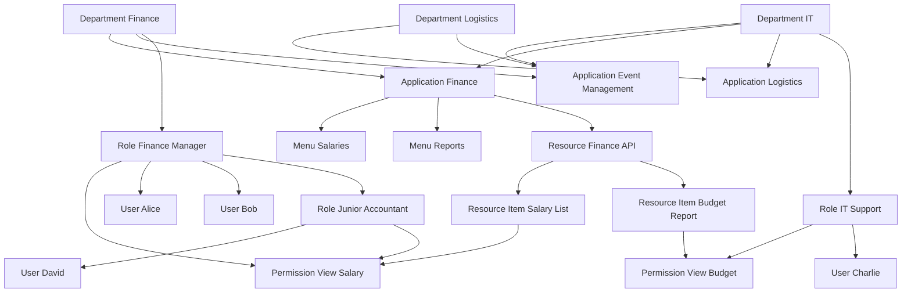

# iGRP Access Management API Refactoring Specification

## Version History

| Version | Author            | Date       | Changes                                 |
|---------|-------------------|------------|-----------------------------------------|
| 1.0.0   | @Marcelo.Monteiro | 2025-07-11 | Initial documentation                   |
| 1.0.1   | @Marcelo.Monteiro | 2025-09-23 | 2nd Revision - Cross Department Sharing |
| ...     | ...               | ...        | ...                                     |

## Table of Contents

[[_TOC_]]

## 1. Access Control Rules

1. **Department (Top-level access)**

   * Departments are the top unit of access.
   * Departments can have **child departments** (recursive hierarchy).
   * **Rule:** A child department can only access applications, menus and resources that its parent department already has access to.
   * **Example:** If Department Finance has access to Application Finance, then a child department (e.g., Payroll Department) can inherit access but cannot access Application Logistics unless Finance already has access.

2. **Applications**

   * Applications belong to one or more departments.
   * An application contains **menus** and **resources**.
   * Access to an application is controlled by **both department and role**.
   * **Example:** Application Finance can be linked to Department Finance and Department IT. Users in IT with the right roles can access Application Finance menus and resources.

3. **Menus**

   * Menus are **role-based access only**.
   * A user must have a role linked to the menu to see it.
   * **Example:** Menu Salaries is linked to the "HR Manager" role. Only users with that role will see the Salaries menu in the app.

4. **Resources**

   * Resources belong to applications.
   * Resource access is **controlled by both roles and permissions**.
   * **Example:** A Resource Item "Salary List" can be accessed if the user has the "HR Manager" role **and/or** the "View Salary" permission.

5. **Roles**

   * Roles are **department-specific** (a role cannot belong to multiple departments).
   * Roles contain:
      * **Multiple permissions**
      * **Multiple users**
   * Users can have **multiple roles**.
   * Roles can be hierarchical (recursive).
   * **Rule:** A child role can only be given permissions and users that the parent role already has access to.
   * **Example:** Role "Finance Manager" may have a child role "Junior Accountant." Junior Accountant can only inherit permissions that Finance Manager has, not create new ones outside.

6. **Permissions**

   * Permissions can exist independently or be linked to a resource or role (or both).
   * Permissions can be checked:

      * Directly against a resource item (ABAC check)
      * Or indirectly, through roles a user holds.
   * **Example:** Permission "View Budget" is linked to Resource Item "Budget Report". If the user’s role has this permission, they can access that resource.

7. **Users**

   * A user is assigned one or more roles.
   * Through roles, a user inherits the **permissions** of that role.
   * **Example:** User Alice has roles "Finance Manager" and "Project Approver." She can see menus for both roles and access resources permitted by both.

## 2. Access Logic Diagram

Here’s the extended diagram that reflects the access control rules:



### Example Use Cases

1. **Menu Access (RBAC only)**

   * Alice has Role Finance Manager (RFM).
   * RFM is linked to Menu Salaries (MS).
   * ✅ Alice sees the Salaries menu.
   * ❌ Bob, without RFM, won’t see it.

2. **Resource Access (RBAC + Permission)**

   * Charlie has Role IT Support (RIT).
   * RIT is linked to Resource Item Budget Report (IB) via Permission View Budget (PB).
   * ✅ Charlie can access Budget Report API.
   * ❌ David (Junior Accountant) cannot, since his role doesn’t inherit PB.

3. **Department Hierarchy**

   * Department IT (DIT) has access to Finance Application.
   * Payroll (child department of Finance) can only inherit applications/resources/menus that Finance already has.
   * ✅ Payroll gets Finance App menus if the parent has access.
   * ❌ Payroll cannot request Logistics App directly.

## 3. Endpoint Changes:

| **Endpoint**                                   | **Context** | **Description**                                                    | **Notes / Rule Alignment**                                           |
| ---------------------------------------------- | ----------- | ------------------------------------------------------------------ | -------------------------------------------------------------------- |
| `GET /applications`                            | Attribution | List all applications for management.                              | Used to attribute apps to departments (Rule 2).                      |
| `POST /applications`                           | Attribution | Create a new application.                                          | Owned by a department (Rule 2).                                      |
| `GET /applications/{id}`                       | Attribution | Fetch details of an application for management.                    | Shows ownership + which departments it can be shared to (Rule 2).    |
| `PUT /applications/{id}`                       | Attribution | Update application metadata.                                       | Department ownership stays fixed (Rule 2).                           |
| `DELETE /applications/{id}`                    | Attribution | Remove an application.                                             | Only owning department can delete (Rule 1 & 2).                      |
| `GET /applications/{appCode}/menus`            | Usage/Check | Fetch menus the current user can access.                           | Menus = role-based only (Rule 3).                                    |
| `GET /applications/{appCode}/resources`        | Usage/Check | Fetch resources accessible in an app.                              | Resources = role + permission check (Rule 4).                        |
| `GET /departments`                             | Attribution | List departments.                                                  | Departments are top-level (Rule 1).                                  |
| `POST /departments`                            | Attribution | Create a new department.                                           | Can create children; parent inherits (Rule 1).                       |
| `GET /departments/{id}`                        | Attribution | Fetch department details.                                          | Includes parent/child links (Rule 1).                                |
| `PUT /departments/{id}`                        | Attribution | Update department metadata.                                        | Recursive rules preserved (Rule 1).                                  |
| `DELETE /departments/{id}`                     | Attribution | Delete department.                                                 | Only if no children (Rule 1).                                        |
| `GET /departments/{id}/applications/available` | Attribution | List applications a department can attribute.                      | Includes inherited or shared apps (Rule 2).                          |
| `GET /departments/{id}/menus/available`        | Attribution | List menus a department can attribute.                             | Only menus of apps the parent has or shared apps (Rule 3).           |
| `GET /departments/{id}/resources/available`    | Attribution | List resources a department can attribute.                         | Respect recursive inheritance (Rule 4).                              |
| `GET /menus`                                   | Attribution | List all menus for management.                                     | Used when assigning menus to roles/departments (Rule 3).             |
| `POST /menus`                                  | Attribution | Create a new menu.                                                 | Belongs to an application (Rule 3).                                  |
| `GET /menus/{id}`                              | Attribution | Fetch menu details.                                                | Shows linked roles (Rule 3).                                         |
| `PUT /menus/{id}`                              | Attribution | Update a menu.                                                     | Only owning application’s department can modify (Rule 3).            |
| `DELETE /menus/{id}`                           | Attribution | Remove a menu.                                                     | Rules must ensure children departments lose access too (Rule 1).     |
| `GET /resources`                               | Attribution | List all resources for management.                                 | Used to assign resources to departments (Rule 4).                    |
| `POST /resources`                              | Attribution | Create a new resource.                                             | Belongs to an application (Rule 4).                                  |
| `GET /resources/{id}`                          | Attribution | Fetch resource details.                                            | Shows linked roles and permissions (Rule 4 & 6).                     |
| `PUT /resources/{id}`                          | Attribution | Update a resource.                                                 | Ownership logic enforced (Rule 4).                                   |
| `DELETE /resources/{id}`                       | Attribution | Delete a resource.                                                 | Children departments lose access (Rule 1 & 4).                       |
| `GET /resources/{resourceId}/items`            | Usage/Check | List resource items the current user can access.                   | RBAC + ABAC checks (Rule 4 & 6).                                     |
| `GET /roles`                                   | Attribution | List all roles for management.                                     | Department-specific (Rule 5).                                        |
| `POST /roles`                                  | Attribution | Create a new role under a department.                              | Can link to parent role (recursive) (Rule 5).                        |
| `GET /roles/{id}`                              | Attribution | Fetch role details.                                                | Includes permissions, users, parent/child roles (Rule 5).            |
| `PUT /roles/{id}`                              | Attribution | Update role details.                                               | Still tied to one department (Rule 5).                               |
| `DELETE /roles/{id}`                           | Attribution | Delete a role.                                                     | Must cascade children properly (Rule 5).                             |
| `GET /roles/{id}/permissions/available`        | Attribution | List permissions that can be attributed to a role.                 | Parent → child constraints; child → parent inheritance (Rule 5 & 6). |
| `GET /permissions`                             | Attribution | List all permissions for management.                               | Standalone or linked to role/resource (Rule 6).                      |
| `POST /permissions`                            | Attribution | Create a permission.                                               | Can exist standalone (Rule 6).                                       |
| `GET /permissions/{id}`                        | Attribution | Fetch permission details.                                          | Shows linked roles/resources (Rule 6).                               |
| `PUT /permissions/{id}`                        | Attribution | Update permission metadata.                                        | Ownership & linkage must be consistent (Rule 6).                     |
| `DELETE /permissions/{id}`                     | Attribution | Delete a permission.                                               | Must remove from roles/resources (Rule 6).                           |
| `POST /permissions/check-attribution`          | Attribution | Check if a permission can be attributed to a role/user/department. | Recursive inheritance rules applied (Rule 6).                        |
| `POST /permissions/check`                      | Usage/Check | Validate if a user has a permission.                               | Via direct role or ABAC check (Rule 6).                              |
| `GET /users`                                   | Attribution | List all users.                                                    | For assigning roles (Rule 7).                                        |
| `POST /users`                                  | Attribution | Create a new user.                                                 | Assign roles during creation (Rule 7).                               |
| `GET /users/{id}`                              | Attribution | Fetch user details.                                                | Includes assigned roles (Rule 7).                                    |
| `PUT /users/{id}`                              | Attribution | Update user metadata.                                              | Roles and permissions inherited automatically (Rule 7).              |
| `DELETE /users/{id}`                           | Attribution | Delete user.                                                       | Must revoke role associations (Rule 7).                              |
| `GET /users/{id}/roles`                        | Usage/Check | List roles and effective permissions of a user.                    | Shows runtime inherited access (Rule 7).                             |
| `POST /access/check`                           | Usage/Check | Unified runtime access validation.                                 | For menus/resources/items (Rule 3, 4, 6, 7).                         |
| `POST /access/attribution/check`               | Attribution | Check if access can be attributed to a dept/role/user.             | Enforces sharing + recursive inheritance (all Rules).                |

## 4. Model Changes

To support **sharing + recursive inheritance**:

---

### **DepartmentEntity**

* Must handle **owned vs shared elements**.
* New join tables:

   * `t_department_application`
   * `t_department_menu`
   * `t_department_resource`
* Add flags:

```java
@Column(name = "shared_from")
private Integer sharedFromDepartmentId; // points to the department that shared this access
```

---

### **ApplicationEntity**

* Still belongs to one department originally (owner).
* But can be linked to multiple via `t_department_application` (departments).

```java
@ManyToMany(fetch = FetchType.LAZY)
@JoinTable(
        name = "t_department_application",
        joinColumns = @JoinColumn(name = "application_id"),
        inverseJoinColumns = @JoinColumn(name = "department_id")
)
private Set<DepartmentEntity> departments = new HashSet<>();

@ManyToOne
@JoinColumn(name = "owner_department_id", nullable = false)
private DepartmentEntity ownerDepartment;
```

---

### **MenuEntryEntity**

* Must be linked to roles.
* Add sharing link:

```java
@ManyToMany(fetch = FetchType.LAZY)
@JoinTable(
    name = "t_menu_entry_role",
    joinColumns = @JoinColumn(name = "menu_entry_id"),
    inverseJoinColumns = @JoinColumn(name = "role_id")
)
private Set<RoleEntity> roles = new HashSet<>();

@ManyToMany(fetch = FetchType.LAZY)
@JoinTable(
    name = "t_department_menu",
    joinColumns = @JoinColumn(name = "menu_id"),
    inverseJoinColumns = @JoinColumn(name = "department_id")
)
private Set<DepartmentEntity> departments = new HashSet<>();
```

---

### **ResourceItemEntity**

* Role + permission already defined.
* Add sharing to departments:

```java
@ManyToMany
@JoinTable(
    name = "t_department_resource",
    joinColumns = @JoinColumn(name = "resource_item_id"),
    inverseJoinColumns = @JoinColumn(name = "department_id")
)
private Set<DepartmentEntity> departments = new HashSet<>();
```

---

### **RoleEntity**

* Department-specific.
* Recursive parent-child.
* New inheritance rule enforcement at service level:

   * Child role: can create new permissions → propagate upward.
   * Parent role: permissions cascade downward unless explicitly excluded.

### Availability Data

**Departments**

* **Fetch applications that a department can use OR attribute:**

   * Usage: apps already linked.
   * Attribution: apps shared through menus/resources of parent departments or other departments.
* **Endpoint:**

  ```
  GET /departments/{id}/applications/available
  ```
* **Response Example:**

  ```json
   [
      {
        "id": 10,
        "code": "FIN_APP",
        "ownedBy": "Finance",
        "sharedFrom": "Finance"
      },
      {
        "id": 11,
        "code": "LOG_APP",
        "ownedBy": "Logistics",
        "sharedFrom": "IT"
      }
   ]
  ```

---

**Menus**

* **List menus that can be attributed to a department:**

   * Must respect:

      * If the parent department has the application → children can attribute menus of that app.
      * If the application is shared through another department, those menus become available.
* **Endpoint:**

  ```
  GET /departments/{id}/menus/available
  ```
* **Response Example:**

  ```json
  [
      { "id": 100, "name": "Salaries", "application": "Finance", "sharedFrom": "Finance" },
      { "id": 101, "name": "Reports", "application": "Finance", "sharedFrom": "IT" }
  ]
  ```

---

**Resources**

* **List resource items a department can attribute:**

   * Based on parent department’s access.
   * Respect recursive inheritance.
* **Endpoint:**

  ```
  GET /departments/{id}/resources/available
  ```
* **Response Example:**

  ```json
  [
      { "id": 200, "name": "Salary List", "permission": "ViewSalary", "sharedFrom": "Finance" },
      { "id": 201, "name": "Budget Report", "permission": "ViewBudget", "sharedFrom": "IT" }
  ]
  ```

---

**Roles**

* **Recursive rule support:**

   * A child role can only use what a parent role has but can create new permissions.
   * Parent inherits new permissions created in child.
* **Endpoints:**

  ```
  GET /roles/{id}/permissions/available
  ```

  ```json
  [
      { "id": 300, "name": "GPT", "fromParent": true },
      { "id": 301, "name": "XPTO", "fromChild": true }
  ]
  ```

---

#### Unified Access Attribution Check

* New unified endpoint to validate if access **can be attributed**:

  ```
  POST /access/attribution/check
  ```
* **Request Example:**

  ```json
  {
    "departmentId": 2,
    "targetType": "MENU",
    "targetId": 101
  }
  ```
  
targetType possible values: APPLICATION | MENU | RESOURCE | ROLE | PERMISSION  

* **Response Example:**

  ```json
  {
    "granted": true,
    "reason": "Parent department IT has access, can be shared down to Logistics"
  }
  ```

### DTO Changes:
```diff
public class ApplicationDTO {
-   private String departmentCode;
+   private String ownerDepartmentCode;
+   private List<String> departments;
}

public class MenuEntryDTO {
-   private List<String> permissions;
+   private List<String> roles;
+   private List<String> departments;
}

public class ResourceDTO {
+   private List<String> departments;
}

public class PermissionDTO {
-   private Integer departmentId;
+   private String departmentCode;
}
```

## Migration Strategy

1. **Database Migration**:
    - Add new columns with default values
    - Backfill data from relationships
    - Phase out old columns

2. **API Versioning**:
    - Maintain v1 endpoints during transition
    - Introduce v2 with new patterns
    - Deprecate v1 after full migration