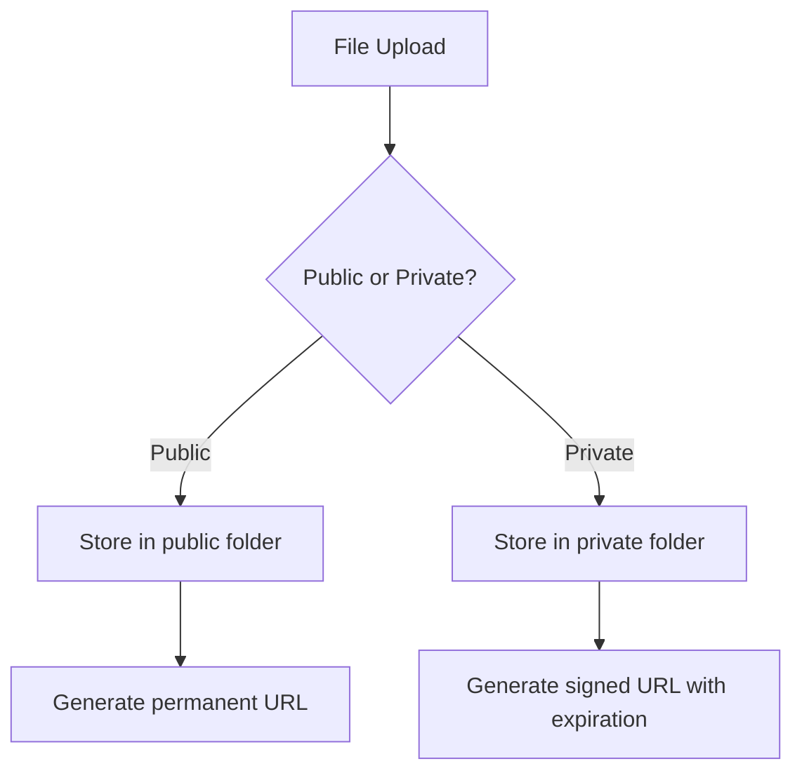
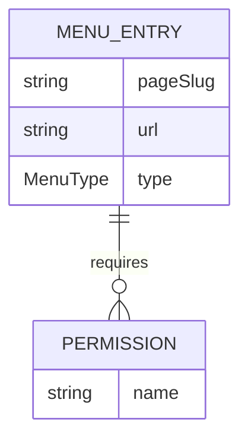
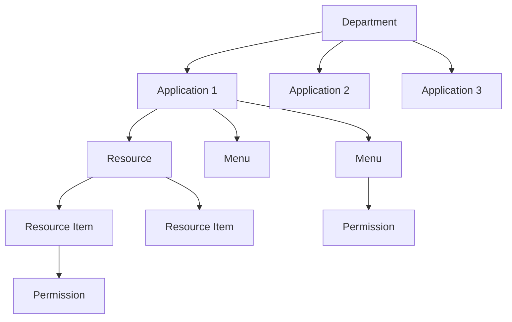

# iGRP Access Management API Refactoring Specification

## Version History

| Version | Author            | Date       | Changes               |
|---------|-------------------|------------|-----------------------|
| 1.0.0   | @Marcelo.Monteiro | 2025-07-11 | Initial documentation |
| ...     | ...               | ...        | ...                   |

## Table of Contents

[[_TOC_]]

## 1. Public/Private File Storage System



### Endpoint Changes:
| Current Endpoint          | New Endpoint              | Changes                           |
|---------------------------|---------------------------|-----------------------------------|
| `POST /files/uploadFile` | `POST /files/public`      | Handles public files only upload  |
| `POST /files/uploadFile` | `POST /files/private`     | Handles private files only upload |
| `GET /files/getLink/{id}`  | `GET /files/{fileId}/url` | Returns file URL                  |

### Benefits:
1. Clear separation of public vs private content
2. Enhanced security for sensitive files
3. Optimized CDN usage patterns

## 2. Menu-Resource Relationship Changes, Default app and menus



### Changes to Applications:
```java
public enum AppType {

   // New: System type for default app 
   SYSTEM(
           "SYSTEM",
           "System"
   );

   // keep the other types the same

   private final String code;
   private final String description;

   AppType(String code, String description) {
      this.code = code;
      this.description = description;
   }

}
```

### Changes to MenuEntry:
```java
public class MenuEntry {
    // Removed: private Resource resourceId;
    
    @Column(name = "page_slug")
    private String pageSlug;

    @OneToMany(mappedBy = "menuEntryId")
    private List<Permission> permissions;
    
}
```

```java
public enum MenuEntryType {

   // New: System Page for default menus 
   SYSTEM_PAGE(
           "SYSTEM_PAGE",
           "System Page"
   );
   
   // keep the other types the same

   private final String code;
   private final String description;

   MenuEntryType(String code, String description) {
      this.code = code;
      this.description = description;
   }

}
```

### MenuType Behavior:
| Type            | Required Fields | Relationship |
|-----------------|-----------------|-------------|
| `SYSTEM_PAGE`   | pageSlug        | Permission  |
| `MENU_PAGE`     | pageSlug, url   | Permission  |
| `EXTERNAL_PAGE` | url             | Permission  |
| `FOLDER`        | -               | Child menus |

### Default app and system pages generation
In a server running, check if all the default system app and menus are created, if not they will be created.

### Benefits:
1. Decouples menu structure from resources
2. Simplifies menu management
3. Allows more flexible navigation structures
4. Allows the system app and menus to be managed by the API like the other apps instead of statically in App Center project

## 3. Department-Centric Hierarchy



### DDL Changes:
```sql
-- Departments become top-level
ALTER TABLE t_department DROP COLUMN application_id;

-- Applications belong to departments
ALTER TABLE t_application ADD COLUMN department_id INTEGER;
ALTER TABLE t_application 
    ADD CONSTRAINT fk_application_department 
    FOREIGN KEY (department_id) REFERENCES t_department(id);

-- Update other tables to reference department also instead of just application
ALTER TABLE t_permission ADD COLUMN department_id INTEGER;
ALTER TABLE t_resource ADD COLUMN department_id INTEGER;
```

### Benefits:
1. More natural organizational hierarchy
2. Department-level permission management
3. Cross-application resource sharing

## 4. Code/Name Based Referencing

### New Endpoints:
| Resource     | New Endpoints                     | Example URL                     |
|--------------|-----------------------------------|---------------------------------|
| Application  | `GET /applications/by-code/{code}`| `/applications/by-code/HR_SYSTEM` |
| Department   | `GET /departments/by-code/{code}` | `/departments/by-code/FINANCE`  |
| Role         | `GET /roles/by-name/{name}`       | `/roles/by-name/approver`       |
| Permission   | `GET /permissions/by-name/{name}` | `/permissions/by-name/view_docs`|

### DTO Changes:
```diff
public class ApplicationDTO {
-   private Integer departmentId;
+   private String departmentCode;
}

public class PermissionDTO {
-   private Integer departmentId;
+   private String departmentCode;
}

public class RoleDTO {
-   private Integer departmentId;
+   private String departmentCode;
-   private Integer parentId;
+   private String parentName;
}

public class DepartmentDTO {
-   private Integer parentId;
+   private String parentCode;
}

public class ResourceDTO {
-   private Integer applicationId;
+   private String applicationCode;
}

// same for other references

```

### Benefits:
1. Human-readable identifiers
2. More stable external references, especially for iGRP App Center
3. Simplified integration for menu detection and application context

## 5. API Specification after new changes

### Department Endpoints

#### Create Department
```http
POST /api/departments
```
```json
{
  "code": "IT",
  "name": "Information Technology",
  "description": "IT Department",
  "parentCode": "HQ"
}
```

#### Get Department by Code
```http
GET /api/departments/by-code/{code}
```
```json
{
  "code": "IT",
  "name": "Information Technology",
  "description": "IT Department",
  "parentCode": "HQ"
}
```

### Application Endpoints

#### Create Application
```http
POST /api/applications
```
```json
{
  "code": "HR_SYSTEM",
  "name": "Human Resources System",
  "type": "INTERNAL",
  "departmentCode": "IT"
}
```

#### Get Applications by Department
```http
GET /api/departments/{code}/applications
```

### Role Endpoints

#### Create Role
```http
POST /api/roles
```
```json
{
  "name": "hr_manager",
  "description": "HR Manager",
  "departmentCode": "IT"
}
```

#### Assign Role to User
```http
POST /api/users/{id}/roles
```
```json
{
  "roleName": "hr_manager"
}
```

### Menu Endpoints

#### Create Menu Entry
```http
POST /api/menus
```
```json
{
  "name": "Employee Dashboard",
  "type": "MENU_PAGE",
  "pageSlug": "employee-dashboard",
  "url": "pages/employee-dashboard",
  "applicationCode": "HR_SYSTEM",
  "permissionName": "view_dashboard"
}
```

### Permission Endpoints

#### Create Permission
```http
POST /api/permissions
```
```json
{
  "name": "approve_leave",
  "description": "Approve employee leave requests",
  "departmentCode": "IT"
}
```

### Resource Endpoints

#### Create Resource
```http
POST /api/resources
```
```json
{
  "name": "Leave Requests",
  "type": "API",
  "applicationCode": "HR_SYSTEM"
}
```

#### Create Resource Item
```http
POST /api/resources/{id}/items
```
```json
{
  "name": "approve-leave",
  "url": "/api/leave/approve",
  "permissionName": "approve_leave"
}
```

### File Endpoints

#### Upload Public File
```http
POST /api/files/public
```
```json
{
  "file": "<binary>",
  "folder": "avatars"
}
```

#### Upload Private File
```http
POST /api/files/private
```
```json
{
  "file": "<binary>",
  "folder": "signatures"
}
```

```
NOTE: Username is mapped from session, then normalized and converted into a subfolder
```

#### Get File URL
```http
GET /api/files/{fileId}/url
```

Public File Scenario:

```json
{
  "url": "https://minio-stage.inss.gw/igrp/public/avatars/john_doe/user123.png"
}
```

Private File Scenario:

```json
{
  "url": "https://minio-stage.inss.gw/igrp/private/signatures/john_doe/user123.png?signature=abc123",
  "expiration": "2025-07-15T12:00:00Z"
}
```

## Summary of Benefits

| Refactoring Area          | Key Benefits                                                                 |
|---------------------------|------------------------------------------------------------------------------|
| File Storage              | Secure private files, optimized public content delivery                      |
| Menu Structure            | Flexible navigation, simplified management, decoupled from resources         |
| Department Hierarchy      | Natural organizational structure, cross-application resource sharing         |
| Code-Based Referencing    | Human-readable IDs, stable external references, simpler integrations         |
| API Consistency           | Uniform patterns, predictable endpoints, better developer experience         |

## Migration Strategy

1. **Database Migration**:
    - Add new columns with default values
    - Backfill data from relationships
    - Phase out old columns

2. **API Versioning**:
    - Maintain v1 endpoints during transition
    - Introduce v2 with new patterns
    - Deprecate v1 after full migration