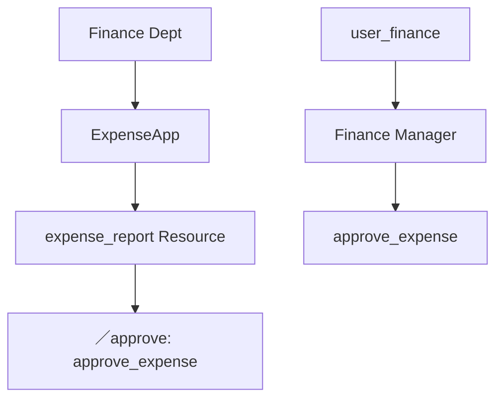

# iGRP Access Management API Test Guide
**Permission Management Simulation**

This document provides a comprehensive test guide for simulating permission management in the refactored Access Management API. The tests cover the hierarchical structure (Department → Application → Resource → Resource Item) and validate that permissions are correctly enforced based on user roles.

---

## **1. Test Environment Setup**

### **1.1 Prerequisites**
- Access Management API (v2) running
- Database with test data (departments, applications, roles, users, resources)
- Postman or automated testing framework (e.g., Jest, JUnit)

### **1.2 Test Data Preparation**
Populate the database with:
- **Departments**: `Finance`, `HR`, `IT` (hierarchical)
- **Applications**:
    - `Finance` → `ExpenseApp`, `PayrollApp`
    - `HR` → `EmployeePortal`, `RecruitmentApp`
- **Roles**:
    - `Finance Manager` (Finance Dept) → Permissions: `approve_expense`, `view_reports`
    - `HR Admin` (HR Dept) → Permissions: `edit_employee`, `view_salary`
- **Users**:
    - `user_finance` → Role: `Finance Manager`
    - `user_hr` → Role: `HR Admin`
- **Resources & Items**:
    - `ExpenseApp` → Resource: `expense_report` → Items:
        - `/submit` → Permission: `submit_expense`
        - `/approve` → Permission: `approve_expense`

---

## **2. Test Scenarios**

### **2.1 Role-Permission Assignment**
**Objective**: Verify that roles are correctly assigned permissions.

| Test Case | Request | Expected Result |
|-----------|---------|-----------------|
| Assign `approve_expense` to `Finance Manager` | `POST /roles/{id}/permissions` <br> Body: `["approve_expense"]` | 200 OK, permission appears in `GET /roles/{id}/permissions` |
| Check if `user_finance` inherits `approve_expense` | `GET /users/{id}/permissions` | Returns `["approve_expense", ...]` |

---

### **2.2 Department Hierarchy Validation**
**Objective**: Ensure permissions cascade correctly in department hierarchy.



**Test Steps**:
1. `GET /departments/{code}/applications` → Verify `ExpenseApp` is listed under `Finance`.
2. `GET /applications/ExpenseApp/resources` → Verify `expense_report` exists.
3. `GET /resources/expense_report/items` → Verify `/approve` requires `approve_expense`.

---

### **2.3 Resource Access Control**
**Objective**: Validate that users can only access resources if their role has the required permission.

| Test Case | Request | Expected Result |
|-----------|---------|-----------------|
| `user_finance` accesses `/approve` | `GET /expense/approve` (with user token) | 200 OK (has `approve_expense`) |
| `user_hr` accesses `/approve` | `GET /expense/approve` (with HR token) | 403 Forbidden (missing permission) |

---

### **2.4 Menu Visibility Based on Permissions**
**Objective**: Ensure menus are only visible to users with the required permissions.

**Sample Menu Structure**:
```json
{
  "name": "Finance Dashboard",
  "type": "MENU_PAGE",
  "pageSlug": "dashboard",
  "url": "http://localhost:3000/pages/dashboard",
  "permissionName": "view_finance",
  "applicationCode": "ExpenseApp"
}
```

**Test Steps**:
1. Assign `view_finance` to `Finance Manager`.
2. `GET /menus` (as `user_finance`) → Returns `Finance Dashboard`.
3. `GET /menus` (as `user_hr`) → Excludes `Finance Dashboard`.

---

### **2.5 Permission Denied Scenarios**
**Objective**: Test edge cases where access should be denied.

| Test Case | Request | Expected Result |
|-----------|---------|-----------------|
| User with no role tries to access resource | `GET /expense/approve` | 403 Forbidden |
| Role permission revoked mid-session | `GET /expense/approve` (after permission removal) | 403 Forbidden |
| Invalid resource item | `GET /expense/invalid` | 404 Not Found |

---

## **4. Expected Outcomes**

| Scenario | Pass Condition |
|----------|----------------|
| Role has permission → Resource accessible | 200 OK |
| Role lacks permission → Blocked | 403 Forbidden |
| Department change → Permissions updated | New permissions apply |
| Menu visibility | Only shows permitted menus |

---

## **5. Test Report Template**

| Test Case | Status (Pass/Fail) | Notes                            |
|-----------|--------------------|----------------------------------|
| Role-Permission Assignment | -                  | -                                |
| Department Hierarchy | -                  | Verified cascade?                |
| Resource Access Control | -                  | Correct 403 for HR user?         |
| Menu Visibility | -                  | Finance Dashboard hidden for HR? |

---

**Conclusion**:  
This guide ensures the permission system works as designed, with:  
✅ **Role-based access control**  
✅ **Department hierarchy enforcement**  
✅ **Resource and menu visibility rules**  
✅ **Automated validation**