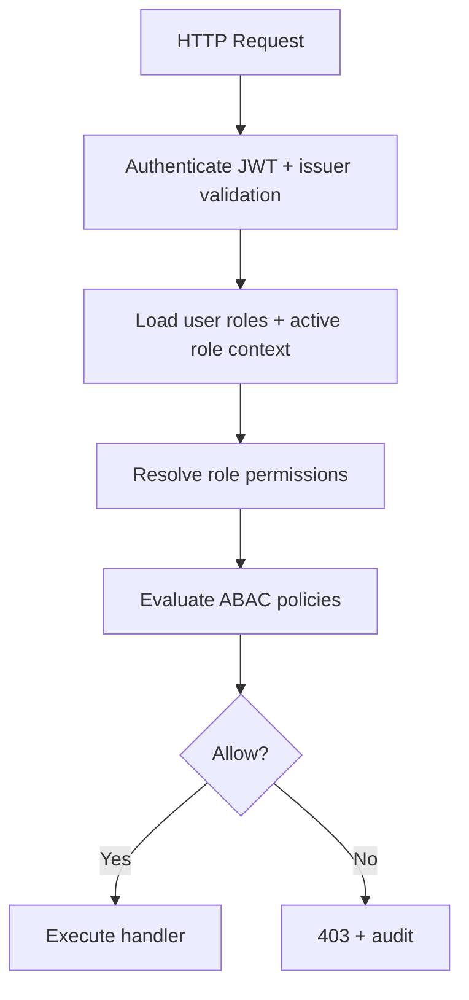
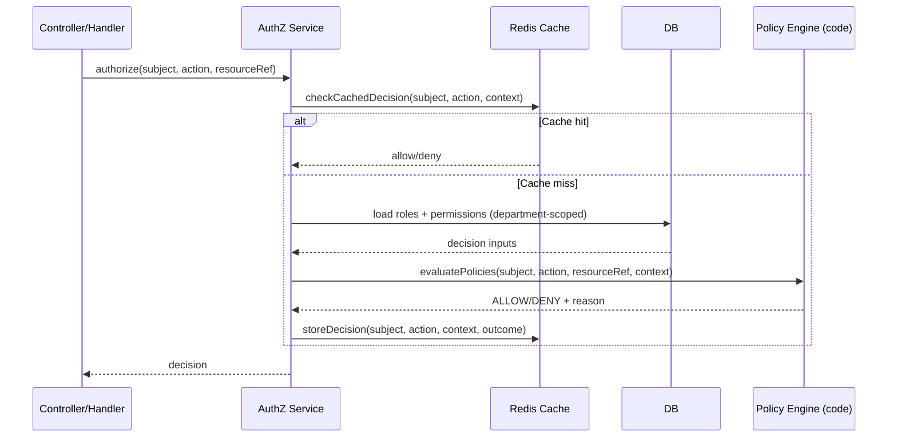

# Enterprise Authorization — iGRP Access Management (Skill Reference)

This document guides an AI agent refactoring `igrp_platform_access_management` into an **enterprise-grade authorization architecture**, aligned with the recommendations described for enterprise level IAMs.

It covers:
- Fine-grained permission naming (`module.resource.action`)
- Hybrid RBAC (multi-role) using departments as logical grouping
- Policy-based authorization (ABAC) with an explicit decision pipeline
- Enterprise audit logging and compliance-grade event capture
- Performance + caching + invalidation for authorization decisions
- Secure implementation patterns in Spring Boot
- `IGRPUserDTO` modeling changes: add NIC and phone number

---

## 0) Current System Snapshot (What Exists Today)

### Permission checks in the runtime

Permission checks are executed through a service bean usable by `@PreAuthorize`:
- `@Service("igrpAuthorization")`: [IgrpAuthorizationService.java](src/main/java/cv/igrp/platform/access_management/shared/security/IgrpAuthorizationService.java#L13-L115)
- It calls a command handler that delegates to `AuthorizationCore` (framework auth): [SingleCheckAuthorizationHandler.java](src/main/java/cv/igrp/platform/access_management/authorization/application/commands/handler/SingleCheckAuthorizationHandler.java#L12-L41)

Permissions are generated at build-time in `PermissionsRegistry.Permission` and synchronized into the DB at startup:
- [AuthorizationSyncService.java](src/main/java/cv/igrp/platform/access_management/shared/infrastructure/service/AuthorizationSyncService.java#L16-L57)

### Permission caching and invalidation

There is a Redis-backed cache for permission checks:
- `permissionCache` with `@Cacheable`: [PermissionCacheService.java](src/main/java/cv/igrp/platform/access_management/authorization/domain/service/PermissionCacheService.java#L40-L104)
- Invalidation uses a redis scan-based eviction service: [PermissionCacheEvictService.java](src/main/java/cv/igrp/platform/access_management/shared/infrastructure/cache/PermissionCacheEvictService.java#L15-L95)
- A web interceptor does broad invalidation for “write” endpoints: [CacheEvictionInterceptor.java](src/main/java/cv/igrp/platform/access_management/shared/infrastructure/cache/CacheEvictionInterceptor.java#L21-L55), registered in [WebConfig.java](src/main/java/cv/igrp/platform/access_management/shared/config/WebConfig.java#L8-L25)

### Data model highlights

- Users have many roles and an “active role” context:
  - [IGRPUserEntity.java](src/main/java/cv/igrp/platform/access_management/shared/infrastructure/persistence/entity/IGRPUserEntity.java#L23-L68)
- Roles are department-scoped and have permissions:
  - [RoleEntity.java](src/main/java/cv/igrp/platform/access_management/shared/infrastructure/persistence/entity/RoleEntity.java#L27-L97)
- Audit exists through:
  - Hibernate Envers on main entities (e.g., `@Audited` on user/role/department entities)
  - a dedicated security audit module (audit events, log service): [SecurityAuditService.java](src/main/java/cv/igrp/platform/access_management/security_audit/application/service/SecurityAuditService.java#L11-L56)

---

## 1) Target Architecture Overview (Enterprise Authorization)

### Guiding goals

- **Fine-grained permissions**: standardize on `module.resource.action` (e.g., `igrp.users.create`, `igrp.reports.update`)
- **Hybrid RBAC**:
  - multi-role membership (already exists)
  - permissions are granted only through roles
  - departments are the logical grouping boundary (no extra “module” layer)
- **ABAC policies**:
  - ownership, state, scope, departmental constraints
  - standard decision pipeline
- **Audit-first**:
  - record who/what/when/where with high-fidelity context
  - old/new values for sensitive changes
- **Performance**:
  - cache authorization decisions safely
  - immediate invalidation on access configuration changes

### Recommended high-level flow

---

## 2) Fine-Grained Permissions (`module.resource.action`) and Department Grouping

### 2.1 Permission naming convention

Adopt:
- `module.resource.action` (keep consistent across the platform)

Examples:
- `users.create`, `users.update`, `users.disable`
- `finance.transactions.approve`
- `reports.view`
- `settings.audit.export`

Rules:
- Lowercase
- Dot-separated
- No spaces
- No role names in permission codes

### 2.2 How to keep permissions organized (no “module” table)

This project already has a strong grouping concept: **Departments**.

Use departments as the enterprise grouping boundary:
- Departments own roles.
- Roles grant permissions.
- Permissions remain global codes (`module.resource.action`) and are reused across departments.

Operationally:
- Department-specific access is expressed by role assignment within a department.
- When listing permissions in admin UIs, group them by:
  - permission prefix (`users.*`, `finance.*`) and/or
  - resource type (Users, Roles, Permissions, Menus, Resources)

---

## 3) Hybrid RBAC (Multi-Role, Role-Only Permissions)

### 3.1 Multi-role membership

The codebase already supports user-role `many-to-many`:
- `IGRPUserEntity.roles` mapped to `t_role_users`: [IGRPUserEntity.java](src/main/java/cv/igrp/platform/access_management/shared/infrastructure/persistence/entity/IGRPUserEntity.java#L57-L62)

Keep this and strengthen it:
- Use role membership for capability sets
- Use “activeRole” as *context selection* (UI scope, department scope)
- Do not introduce direct user permission overrides (permissions come from roles only)

---

## 4) Policy-Based Authorization (ABAC) Specification (Industry Patterns)

### 4.1 Why ABAC in this project

RBAC answers “who” broadly.
ABAC answers “when/how” with context:
- ownership: a user can edit their own records
- state: only edit if resource is `DRAFT`
- scope: only operate within department scope

### 4.2 Policy model primitives

Define policies as code (recommended for Spring Boot systems):
- `Policy` interface:
  - inputs: `Authentication`, `Action`, `ResourceContext`
  - output: `ALLOW|DENY` + reason

Policy examples:
- `OwnershipPolicy`: subject must match resource.ownerId
- `DepartmentScopePolicy`: subject must have a role in resource.department
- `StatePolicy`: resource.status must be allowed for action

### 4.3 Spring Security implementation patterns

Use **Spring AuthorizationManager** (preferred in modern Spring Security):
- Method level:
  - `@PreAuthorize("@authz.allow('users.update', #userId)")`
  - or a typed annotation: `@RequirePermission("users.update")`
- Web layer:
  - route-based `AuthorizationManager<RequestAuthorizationContext>`

Recommended split:
- Permission evaluation is “fast path” (cacheable):
  - `hasPermission(subject, action, resource?)`
- Policy evaluation is “context path”:
  - fetch resource context if needed, then evaluate ABAC policies

### 4.4 Standard decision pipeline (6 steps)

Implement the explicit pipeline:
1. Authenticate (JWT, issuer, signature)
2. Load roles (multi-role + active role context)
3. Load role permissions
4. Resolve resource context (only when policy requires it)
5. Validate policy rules (ABAC)
6. Audit the decision (allowed/denied + reasons)

### 4.5 Industry implementation patterns (recommended for this codebase)

Implement ABAC with two complementary layers:

1) **Permission gate** (fast, cacheable)
- “Does the subject have permission `module.resource.action` in current context?”
- Keep using the existing `@Service("igrpAuthorization")` entrypoint for permission checks:
  - [IgrpAuthorizationService.java](src/main/java/cv/igrp/platform/access_management/shared/security/IgrpAuthorizationService.java#L13-L115)

2) **Policy engine** (contextual, not always cacheable)
- Policies run only after the permission gate passes (fail-fast).
- Policies evaluate context such as:
  - ownership (`resource.ownerId == subject`)
  - status machine (`resource.status == DRAFT`)
  - departmental scope (`subject has role in resource.department`)

Recommended Spring integration approaches:

- **Method security with a single authorization facade**:
  - `@PreAuthorize("@authz.allow('users.update', #userId)")`
  - `@PreAuthorize("@authz.allow('transactions.approve', #transactionId)")`
- **Typed annotations for consistency** (optional):
  - `@RequirePermission("users.update")`
  - `@RequirePolicy("OwnershipPolicy")`

Recommended “policy contract”:
- Input: subject (sub), activeRoleId, roleIds, action code, resource reference
- Output: allow/deny + structured reason list (for audit)

Mermaid (runtime resolution):

---

## 5) Enterprise-Grade Audit Logging

### 5.1 Required metadata (minimum)

For every sensitive event, log:
- Who: `user_external_id` (subject/sub) and internal `user_id` if available
- What: action (`module.resource.action`)
- Resource: type + id (e.g., `User#123`)
- Timestamp
- IP address
- Outcome: allowed/denied

### 5.2 Change tracking

Prefer:
- Envers for entity snapshots (already used via `@Audited`)
- plus structured security audit events (already implemented) enriched with additional context:
  - [SecurityAuditService.java](src/main/java/cv/igrp/platform/access_management/security_audit/application/service/SecurityAuditService.java#L11-L56)
  - [SecurityAuditServiceImpl.java](src/main/java/cv/igrp/platform/access_management/security_audit/application/service/SecurityAuditServiceImpl.java#L39-L107)
  - context enrichment: [SecurityAuditContextProvider.java](src/main/java/cv/igrp/platform/access_management/security_audit/application/service/SecurityAuditContextProvider.java#L28-L45)

Recommended enterprise extensions:
- Record **authorization decision reasons** from ABAC evaluation.
- Record **request path** and a stable **correlation id** (if present in headers).
- For critical updates, log old/new values:
  - Use Envers as the source of truth for snapshots.
  - For “security-sensitive” fields, also write a compact change summary in audit context.

Integration points:
- Log access denied in the authorization layer (`ACCESS_DENIED`) with action + resourceRef + reasons
- Log access granted for sensitive actions (`ACCESS_GRANTED`) when required by compliance
- Log role assignment/removal and permission changes as privilege events
- Log profile switches (`PROFILE_ACTIVATED`) (already logged in `SetActiveCurrentUserRoleCommandHandler`)

### 5.3 “Enterprise logging” definition for this project

Enterprise logging means:
- every privilege change is auditable
- every authorization denial is auditable
- sensitive reads can be auditable (configurable)
- audit failures do not break business flow (fail-safe)

---

## 6) Performance Optimization + Caching

### 6.1 Cache strategy

Use a two-level cache:
- L1: Redis — cached authorization decisions and/or precomputed permission sets per subject
- L2: DB precomputation — materialized views are referenced in the existing spec:
  - [PERMISSION_MANAGEMENT_SPECS.md](docs/PERMISSION_MANAGEMENT_SPECS.md#L141-L170)

### 6.2 Cache keys

Recommended cache keys for enterprise mode:
- For decision caching (current model): `sub:module.resource.action`
- For precomputed permission sets (optional): `sub:effectivePermissions`
- Include active role context only if the platform treats active role as an authorization boundary:
  - `sub:{sub}:activeRole:{roleId}:effectivePermissions`

### 6.3 Invalidation rules (must be immediate)

Invalidate user permission cache when:
- role assigned/removed
- active role changed
- role permissions changed
- department/role status changes (active/inactive/deleted)

Implementation pattern to keep:
- a dedicated eviction service (scan-based exists today):
  - [PermissionCacheEvictService.java](src/main/java/cv/igrp/platform/access_management/shared/infrastructure/cache/PermissionCacheEvictService.java#L15-L95)

Improvements required for enterprise scale:
- targeted invalidation:
  - invalidate by subject for user changes
  - invalidate by role by querying affected users and evicting subjects in batches
- avoid “evictAll” as the primary strategy (keep only as a fallback/safety mechanism)

---

## 7) Security Best Practices (Required)

- Least privilege by default: roles grant minimal permissions.
- Server-side enforcement only:
  - controllers must never trust client-provided role context
- Avoid hard-coded role names:
  - use `@igrpAuthorization.checkPermission(PermissionsRegistry.Permission.X)`
  - migrate to `module.resource.action` permission naming systematically
- Deny by default:
  - missing permission → deny
- Do not log tokens.
- Align identity references:
  - subject key is `external_id`/JWT `sub` (already used in [AuthenticationHelper.java](src/main/java/cv/igrp/platform/access_management/shared/security/AuthenticationHelper.java#L25-L44))

---

## 8) Implementation Roadmap (Agent-Oriented)

### Phase 1 — Schema foundations

- Confirm permission naming is consistently `module.resource.action`
- Ensure role-permission relationships cover all required capabilities
- Extend audit schema and context to include:
  - action code
  - resource reference
  - decision reasons

### Phase 2 — Authorization core refactor

- Update authorization resolution to:
  - keep department scoping explicit when required (active role context)
- Keep Redis caching as L1; introduce/keep materialized views as L2 if needed

### Phase 3 — Policy engine and Spring integration

- Implement policy evaluation layer (ABAC)
- Wire it into `@PreAuthorize` via a single entrypoint:
  - `@authz.allow(action, resourceRef, context)`
- Apply to all controllers; remove any direct role-string logic

### Phase 4 — Audit and compliance hardening

- Standardize audit events:
  - action codes are `module.resource.action`
  - logs include ip, user-agent, requestPath, outcome, and reasons
  - ensure privilege changes and denials are always logged

### Phase 5 — Performance hardening

- Switch invalidation from broad eviction to targeted eviction
- Add batch eviction by role/department changes
- Benchmark permission checks under expected load

---

## 9) `IGRPUserDTO` Modeling Change: Add NIC + Phone Number

### 9.1 DTO changes

Add fields to `IGRPUserDTO`:
- `nic` (national identification code)
- `phoneNumber`

Reference DTO location:
- [IGRPUserDTO.java](src/main/java/cv/igrp/platform/access_management/shared/application/dto/IGRPUserDTO.java#L19-L45)

Recommended validation constraints (spec-level):
- `nic`:
  - `@Size(max=13)`
  - `@Pattern` for allowed format (define per country; keep configurable)
- `phoneNumber`:
  - `@Size(max=32)`
  - `@Pattern` using E.164 format recommended: `^\\+?[1-9]\\d{1,14}$`

### 9.2 Entity and DB changes

Update `t_user` to store:
- `nic` (nullable initially)
- `phone_number` (nullable initially)

Update entity:
- [IGRPUserEntity.java](src/main/java/cv/igrp/platform/access_management/shared/infrastructure/persistence/entity/IGRPUserEntity.java#L31-L67)

Migration path:
1. Add columns nullable + indexes if needed (e.g., unique if required)
2. Update entity + DTO + mappers
3. Update user create/update endpoints to accept/write fields
4. Add auditing for changes to NIC/phone (sensitive PII)

PII note:
- treat NIC as sensitive: avoid exposing it where not required
- restrict access via specific permission(s), e.g. `igrp.users.pii.view`, `igrp.users.pii.update`