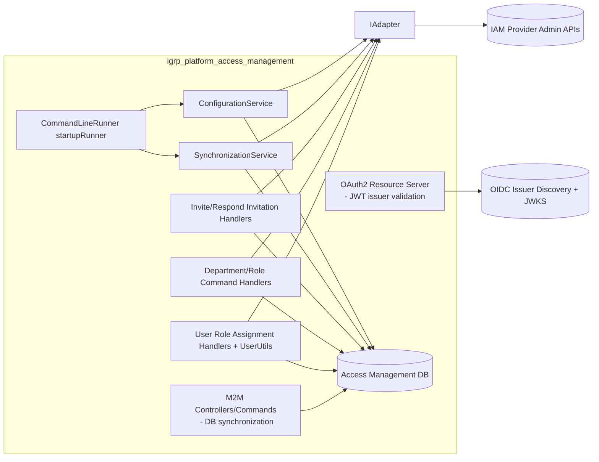
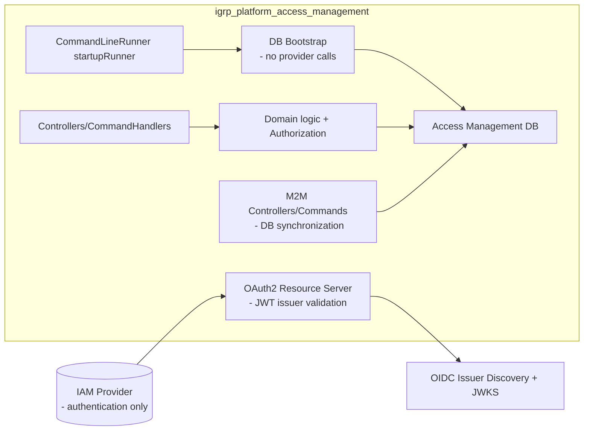

# No-Adapter Architecture (Skill Reference)

This document is a skill reference for agents working on `igrp_platform_access_management`. It documents:
- the current architecture where the API uses `IAdapter` to synchronize and mutate IAM providers
- the target architecture where the API has no `IAdapter` usage and performs no IAM provider synchronizations
- the exact link points (classes and flows) that currently depend on `IAdapter`
- the concrete actions required to break those link points safely

## Outcome Definition

Target end-state:
- No `IAdapter` injection in application/business code paths.
- No IAM-provider synchronization or admin API usage from this service.
- The only IAM interaction is authentication-time validation (OIDC issuer validation, JWT verification, claims extraction).

Non-goals:
- replacing the IAM provider
- redesigning the entire authorization model (keep DB authorization behavior; remove provider mutation)
- changing the M2M sync flows that populate the DB (those are not IAM provider sync)

---

## Repository Context (What This API Is)

This service is a Spring Boot API whose canonical domain is **Access Management** stored in the service database:
- departments, roles, permissions, resources, applications, menus
- user records and invitation lifecycle

It exposes:
- “business/admin” API endpoints (secured by OAuth2 resource server JWT validation)
- M2M endpoints under `/api/m2m/**` protected by a static header token filter (machine token), used to synchronize DB state from other systems

Key entrypoints:
- Application bootstrap: [IgrpPlatformAccessManagementApplication.java](src/main/java/cv/igrp/platform/access_management/IgrpPlatformAccessManagementApplication.java#L1-L44)
- OAuth2/JWT security: [OAuth2SecurityConfiguration.java](src/main/java/cv/igrp/platform/access_management/shared/security/OAuth2SecurityConfiguration.java#L35-L156), [JwtDecoderConfiguration.java](src/main/java/cv/igrp/platform/access_management/shared/security/JwtDecoderConfiguration.java#L1-L23)

---

## Current Architecture (With `IAdapter`)

### What `IAdapter` is used for in this codebase

In this repository, `cv.igrp.framework.auth.core.adapter.IAdapter` is used as an abstraction over IAM provider “admin” operations:
- resolving users (`resolveUser`)
- creating/updating/deleting departments/roles/permissions/resources
- assigning/unassigning roles to users
- creating protocol mappers in the provider (JWT claim mapper for roles)

### Current High-Level Diagram

### Where `IAdapter` is invoked (Link Points)

These are the concrete, code-level coupling points that must be removed for the target architecture.

#### A) Startup bootstrapping calls

1) Startup runner triggers “config + sync” at boot:
- [IgrpPlatformAccessManagementApplication.java](src/main/java/cv/igrp/platform/access_management/IgrpPlatformAccessManagementApplication.java#L27-L41)

2) ConfigurationService uses `IAdapter` for provider-side validation and bootstrap:
- validates superadmin existence via provider lookup: [ConfigurationService.java](src/main/java/cv/igrp/platform/access_management/shared/infrastructure/service/ConfigurationService.java#L52-L71)
- creates/checks department/role/permission/application in provider: [ConfigurationService.java](src/main/java/cv/igrp/platform/access_management/shared/infrastructure/service/ConfigurationService.java#L125-L238)
- assigns role to superadmin in provider: [ConfigurationService.java](src/main/java/cv/igrp/platform/access_management/shared/infrastructure/service/ConfigurationService.java#L416-L436)

3) SynchronizationService implements reconciliation logic that reads/writes provider state:
- provider reconciliation entrypoint: [SynchronizationService.java](src/main/java/cv/igrp/platform/access_management/shared/infrastructure/service/SynchronizationService.java#L43-L78)
- sync departments/roles/permissions/resources: [SynchronizationService.java](src/main/java/cv/igrp/platform/access_management/shared/infrastructure/service/SynchronizationService.java#L142-L384)
- sync user-role assignments + provider existence checks: [SynchronizationService.java](src/main/java/cv/igrp/platform/access_management/shared/infrastructure/service/SynchronizationService.java#L428-L502)
- user presence reconciliation (provider “wins”): [SynchronizationService.java](src/main/java/cv/igrp/platform/access_management/shared/infrastructure/service/SynchronizationService.java#L504-L543)
- protocol mapper management in provider: [SynchronizationService.java](src/main/java/cv/igrp/platform/access_management/shared/infrastructure/service/SynchronizationService.java#L545-L557)

#### B) User invitation flow depends on provider lookups

Invite requires provider existence:
- [InviteUserCommandHandler.java](src/main/java/cv/igrp/platform/access_management/users/application/commands/InviteUserCommandHandler.java#L93-L167)

Respond/accept invitation requires provider existence and takes `externalId` from provider:
- [RespondUserInvitationCommandHandler.java](src/main/java/cv/igrp/platform/access_management/users/application/commands/RespondUserInvitationCommandHandler.java#L77-L163)

#### C) Department and role management mutates provider state

Departments:
- create department in provider: [PostDepartmentCommandHandler.java](src/main/java/cv/igrp/platform/access_management/department/application/commands/PostDepartmentCommandHandler.java#L79-L124)
- rename department in provider: [UpdateDepartmentCommandHandler.java](src/main/java/cv/igrp/platform/access_management/department/application/commands/UpdateDepartmentCommandHandler.java#L108-L123)
- delete department in provider: [DeleteDepartmentCommandHandler.java](src/main/java/cv/igrp/platform/access_management/department/application/commands/DeleteDepartmentCommandHandler.java#L65-L107)

Roles:
- create role in provider: [CreateRoleCommandHandler.java](src/main/java/cv/igrp/platform/access_management/department/application/commands/CreateRoleCommandHandler.java#L119-L134)
- delete role in provider: [DeleteRoleCommandHandler.java](src/main/java/cv/igrp/platform/access_management/department/application/commands/DeleteRoleCommandHandler.java#L94-L106)

#### D) User-role assignment mutates provider state

Manual role assignment/removal endpoints update Keycloak via adapter:
- assign role to user in provider (+ compensation rollback): [AddRolesToUserCommandHandler.java](src/main/java/cv/igrp/platform/access_management/users/application/commands/AddRolesToUserCommandHandler.java#L108-L159)
- unassign role from user in provider: [RemoveRolesFromUserCommandHandler.java](src/main/java/cv/igrp/platform/access_management/users/application/commands/RemoveRolesFromUserCommandHandler.java#L83-L135)

UserUtils mutates provider state based on status changes:
- reads provider user roles and unassigns roles: [UserUtils.java](src/main/java/cv/igrp/platform/access_management/shared/infrastructure/utils/UserUtils.java#L64-L94)
- restores roles in provider on reactivation: [UserUtils.java](src/main/java/cv/igrp/platform/access_management/shared/infrastructure/utils/UserUtils.java#L96-L124)

#### E) Configuration properties indicate provider admin integration

Current properties include:
- OIDC issuer validation (keep): `spring.security.oauth2.resourceserver.jwt.issuer-uri`
- provider-admin connectivity (remove for target architecture): `igrp.keycloak.*`
- provider-dependent bootstrap (remove or redefine): `igrp.superadmin.*`

See: [application.properties](src/main/resources/application.properties#L23-L79)

---

## Target Architecture (No `IAdapter`, No Provider Synchronization)

### Core Principle

This API becomes **provider-agnostic** for synchronization and administration. It:
- does not list/create/update/delete anything in the IAM provider
- does not assign/unassign roles in the IAM provider
- does not reconcile DB vs provider at startup or on-demand

The IAM provider remains responsible for:
- authenticating users
- issuing JWTs

This API remains responsible for:
- validating JWT issuer/signature
- enforcing access decisions using its own database models (roles/permissions/departments/resources)

### Target High-Level Diagram

### What stays as “IAM interaction”

Issuer validation and JWT verification remains:
- [JwtDecoderConfiguration.java](src/main/java/cv/igrp/platform/access_management/shared/security/JwtDecoderConfiguration.java#L1-L23)
- `spring.security.oauth2.resourceserver.jwt.issuer-uri=${AUTH_JWT_ISSUER}` in [application.properties](src/main/resources/application.properties#L23)

No other runtime callouts to IAM are allowed.

---

## How to Break the Link Points (Concrete Actions)

This section is the actionable “migration playbook”. Apply it in order.

### 1) Stop startup-time synchronization and provider bootstrap

Current:
- startup runner calls provider-dependent bootstrap and reconciliation.

Action:
- Remove `SynchronizationService` from startup sequence and project wiring.
- Convert `ConfigurationService.initializeSystemConfiguration()` into a DB-only bootstrap:
  - create default department/app/permission/resource/role/user records purely in DB if missing
  - do not validate superadmin existence via provider
  - do not assign roles via provider

Files:
- [IgrpPlatformAccessManagementApplication.java](src/main/java/cv/igrp/platform/access_management/IgrpPlatformAccessManagementApplication.java#L27-L41)
- [ConfigurationService.java](src/main/java/cv/igrp/platform/access_management/shared/infrastructure/service/ConfigurationService.java#L52-L123)
- [SynchronizationService.java](src/main/java/cv/igrp/platform/access_management/shared/infrastructure/service/SynchronizationService.java#L1-L120)

Expected behavioral change:
- “provider must be reachable at startup” is removed.
- “roles claim protocol mapper auto-created” is removed; issuer must already be configured externally.

### 2) Remove provider-dependent invitation semantics

Current semantics:
- invitation only succeeds if the user already exists in provider (`adapter.resolveUser(email)`).
- accept invitation stores provider external id.

Target semantics (no provider calls):
- Keep “invite-only” access control, but move identity verification to authentication-time:
  - create invitation by email and desired roles in DB (no provider check)
  - user must authenticate via IAM and present a JWT whose email claim matches the invitation email
  - on acceptance, store `external_id` from JWT subject (or provider-specific stable claim) without calling provider APIs

Files:
- [InviteUserCommandHandler.java](src/main/java/cv/igrp/platform/access_management/users/application/commands/InviteUserCommandHandler.java#L93-L167)
- [RespondUserInvitationCommandHandler.java](src/main/java/cv/igrp/platform/access_management/users/application/commands/RespondUserInvitationCommandHandler.java#L77-L163)

Implementation notes:
- Define which JWT claim is canonical for email (`email` vs `preferred_username`) and for subject (`sub`).
- Never “trust” invitation email without correlating it to authenticated JWT claims at acceptance time.

### 3) Remove provider mutation from Department and Role commands

Current behavior mutates provider state on CRUD.

Target behavior:
- Department and role CRUD is DB-only.
- IAM remains unchanged; no propagation.

Files:
- [PostDepartmentCommandHandler.java](src/main/java/cv/igrp/platform/access_management/department/application/commands/PostDepartmentCommandHandler.java#L79-L124)
- [UpdateDepartmentCommandHandler.java](src/main/java/cv/igrp/platform/access_management/department/application/commands/UpdateDepartmentCommandHandler.java#L108-L123)
- [DeleteDepartmentCommandHandler.java](src/main/java/cv/igrp/platform/access_management/department/application/commands/DeleteDepartmentCommandHandler.java#L65-L107)
- [CreateRoleCommandHandler.java](src/main/java/cv/igrp/platform/access_management/department/application/commands/CreateRoleCommandHandler.java#L119-L134)
- [DeleteRoleCommandHandler.java](src/main/java/cv/igrp/platform/access_management/department/application/commands/DeleteRoleCommandHandler.java#L94-L106)

Expected behavioral change:
- If downstream systems relied on IAM role existence, they must switch to DB-driven authorization or claim-based authorization independently.

### 4) Remove provider mutation from user-role assignments and status changes

Current:
- DB updates + IAM role assignments are coupled (including rollback/compensation).

Target:
- DB updates only. IAM role assignments are out-of-scope for this service.

Files:
- [AddRolesToUserCommandHandler.java](src/main/java/cv/igrp/platform/access_management/users/application/commands/AddRolesToUserCommandHandler.java#L108-L159)
- [RemoveRolesFromUserCommandHandler.java](src/main/java/cv/igrp/platform/access_management/users/application/commands/RemoveRolesFromUserCommandHandler.java#L83-L135)
- [UserUtils.java](src/main/java/cv/igrp/platform/access_management/shared/infrastructure/utils/UserUtils.java#L35-L124)

Replacement approach:
- Keep role backup/restore logic purely in DB (if needed).
- Remove provider calls in `UserUtils.handleRoleAssignmentsOnStatusChange`.

### 5) Remove configuration and dependencies that imply provider admin access

Config:
- Remove `igrp.keycloak.*` properties from [application.properties](src/main/resources/application.properties).
- Re-evaluate `igrp.superadmin.*`:
  - keep only as DB bootstrap seed values.

Build dependencies:
- `cv.igrp.framework.auth:core` may still be needed for authorities mapping and framework integration, but the code must not use the adapter/admin APIs.
- `cv.igrp.framework.auth:keycloak-spring-boot` should be removable if it only exists for provider admin operations in this service.

See: [pom.xml](pom.xml#L150-L190)

### 6) Update tests to remove adapter mocking

Any tests importing/mocking `IAdapter` must be rewritten:
- remove adapter mocks
- verify DB-only outcomes
- validate issuer-based authentication behavior using Spring Security test utilities

Search patterns for updates:
- `import cv.igrp.framework.auth.core.adapter.IAdapter;`
- `mock(IAdapter.class)`

---

## “Link Points” Diagram (What Must Disappear)

```mermaid
flowchart TB
  Adapter[IAdapter]

  App[IgrpPlatformAccessManagementApplication]
  Config[ConfigurationService]
  Sync[SynchronizationService]
  Invite[InviteUserCommandHandler]
  Respond[RespondUserInvitationCommandHandler]
  DeptCreate[PostDepartmentCommandHandler]
  DeptUpdate[UpdateDepartmentCommandHandler]
  DeptDelete[DeleteDepartmentCommandHandler]
  RoleCreate[CreateRoleCommandHandler]
  RoleDelete[DeleteRoleCommandHandler]
  AddRoles[AddRolesToUserCommandHandler]
  RemoveRoles[RemoveRolesFromUserCommandHandler]
  Utils[UserUtils]

  App --> Config --> Adapter
  App --> Sync --> Adapter
  Invite --> Adapter
  Respond --> Adapter
  DeptCreate --> Adapter
  DeptUpdate --> Adapter
  DeptDelete --> Adapter
  RoleCreate --> Adapter
  RoleDelete --> Adapter
  AddRoles --> Adapter
  RemoveRoles --> Adapter
  Utils --> Adapter
```

Acceptance criterion for refactor:
- the above diagram becomes empty (no edges to `IAdapter`) or the classes disappear entirely.

---

## Agent Checklist (Do This When Implementing)

1. Remove startup call chain to provider sync and provider bootstrap.
2. Make configuration bootstrap DB-only.
3. Replace invitation flow with JWT-claim-based identity confirmation.
4. Remove provider CRUD from department/role operations.
5. Remove provider role assignment logic from user role operations and UserUtils.
6. Remove provider admin configuration keys and dependencies as appropriate.
7. Update tests and CI to reflect DB-only behavior.
8. Confirm security remains issuer-based and M2M behavior unchanged.