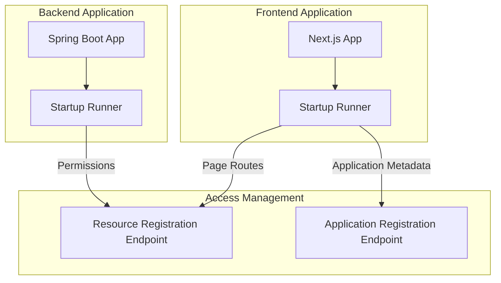

# Comprehensive Analysis: Page and API Resource Detection for Access Management Integration

## Version History

| Version | Author            | Date       | Changes                       |
|---------|-------------------|------------|-------------------------------|
| 1.0.0   | @Marcelo.Monteiro | 2025-09-12 | Page detection alternatives   |
| 1.0.1   | @Marcelo.Monteiro | 2025-10-10 | Page detection logic refactor |
| ...     | ...               | ...        | ...                           |


## 1. Introduction

This document provides a detailed analysis of implementing a provider-agnostic page and API resource detection system for access management integration. The solution aims to replace the current CI/CD-dependent approach with a Docker-based implementation that works across multiple cloud providers (Azure, AWS, etc.).

## 2. Current System Limitations

The existing implementation has several limitations:

1. **CI/CD Platform Dependency**: Tightly coupled with GitLab CI/CD
2. **Provider Lock-in**: Difficult to adapt to different cloud providers
3. **Static Detection**: Relies on file-based metadata rather than runtime detection
4. **Limited Framework Support**: Currently focused on iGRP Studio without support for other frameworks

## 3. Proposed Architecture

### 3.1 High-Level Architecture


### 3.2 Core Components

1. **Startup Runner**: For Next.js and Spring Boot applications, it runs on every application startup to sync the current resources with Access Management API
2. **Resource Registration Endpoint**: Runtime API endpoints to register resource metadata
3. **Application Registration Endpoint**: Runtime API endpoints to register application metadata

## 4. Implementation

### 4.1 Next.js Page Detection Script

**Approach**: This will detect all the `page.tsx` directories, filtering out group, private or other special directories on the result path.
The scan directory is the generated pages directory in iGRP: `src\app\(igrp)\(generated)`. The output file will be a `routes.ts` file in the `src` directory.

```typescript
/**
 * Generates a TypeScript file that exports all Next.js routes found in the "app" directory.
 * Handles special cases like group folders, private folders, encoded names, and dynamic routes.
 */

const fs = require("fs");
const path = require("path");

// Project-specific app directory
const ROOT = process.cwd();
const IGRP_GENERATED_PAGES = path.join("src", "app", "(igrp)", "(generated)");
const PAGES_DIR = path.join(ROOT, IGRP_GENERATED_PAGES);
const OUTPUT_FILE = path.join(ROOT, "src", "routes.ts");

/**
 * Normalize a folder name to a route segment.
 * @param segment folder name
 * @returns null if folder should stop the route (private), otherwise the segment (or null to skip adding)
 */
function normalizeSegment(segment: string): string | null {
   segment = decodeURIComponent(segment);

   if (segment.startsWith("_")) {
      // Private folder → skip entire route
      return null;
   }

   // Remove group folders like (group)
   if (/^\(.+\)$/.test(segment)) return "";

   // Remove other non-route folders (like @component or (..)list)
   if (/^@/.test(segment)) return "";
   if (/^\(.+\.\.\..*\)$/.test(segment)) return "";

   return segment;
}

/**
 * Recursively collect all routes
 */
function collectRoutes(dir: string, baseSegments: string[] = []): string[] {
   const entries = fs.readdirSync(dir, { withFileTypes: true });
   const routes: string[] = [];

   for (const entry of entries) {
      const fullPath = path.join(dir, entry.name);

      if (entry.isDirectory()) {
         const segment = normalizeSegment(entry.name);

         if (segment === null) continue; // private folder → skip entirely

         // Only add segment if it is not an ignored folder
         const newBase = segment ? [...baseSegments, segment] : [...baseSegments];
         routes.push(...collectRoutes(fullPath, newBase));
      } else if (/\.tsx?$/.test(entry.name) || /\.jsx?$/.test(entry.name)) {
         const basename = entry.name.replace(/\.(js|jsx|ts|tsx)$/, "");
         if (basename !== "page") continue;

         let route = "/" + baseSegments.join("/");
         if (route === "") route = "/";
         routes.push(route);
      }
   }

   return routes;
}

/**
 * Write the routes array to a TypeScript file
 */
function generateRoutesFile(): void {
   console.log(`🔍 Scanning directory: ${PAGES_DIR}`);

   if (!fs.existsSync(PAGES_DIR)) {
      console.error(`❌ Directory not found: ${PAGES_DIR}`);
      process.exit(1);
   }

   const routes = collectRoutes(PAGES_DIR).sort();

   const fileContent = `// Auto-generated by iGRP
// Do not edit manually

export const routes = ${JSON.stringify(routes, null, 2)} as const;

export type Route = typeof routes[number];
`;

   fs.writeFileSync(OUTPUT_FILE, fileContent, "utf-8");

   console.log(`✅ Generated ${routes.length} routes`);
   console.log(`📄 Output: ${OUTPUT_FILE}`);
}

generateRoutesFile();
```

The result `routes.ts` file is similar to this:

```typescript
// Auto-generated by iGRP
// Do not edit manually

export const routes = [
  "/",
  "/[...slug]/page-in-slug",
  "/declaracoes",
  "/declaracoes/[id]",
  "/declaracoes/[id]/contas",
  "/declaracoes/[id]/edit",
  "/declaracoes/lancamentos/novo",
  "/declaracoes/novo",
  "/entregas",
  "/page-in-group",
  "/page-in-sub-group",
  "/page1-in-group"
] as const;

export type Route = typeof routes[number];
```

On this project structure:
```css
project/
│
├─ src/
│   ├─ app/
│   │   ├─ (igrp)/
│   │   │   ├─ (generated)/
│   │   │   │   ├─ %5Flog%5F/
│   │   │   │   │   └─ page.tsx
│   │   │   │   ├─ (group)/
│   │   │   │   │   ├─ (subgroup)/
│   │   │   │   │   │   └─ page-in-sub-group/
│   │   │   │   │   │       └─ page.tsx
│   │   │   │   │   ├─ page1-in-group/
│   │   │   │   │   │   └─ page.tsx
│   │   │   │   │   └─ page-in-group/
│   │   │   │   │       └─ page.tsx
│   │   │   │   ├─ @component/
│   │   │   │   │   └─ page.tsx
│   │   │   │   ├─ [...slug]/
│   │   │   │   │   └─ page-in-slug/
│   │   │   │   │       └─ page.tsx
│   │   │   │   ├─ _private/
│   │   │   │   │   └─ page.tsx
│   │   │   │   ├─ declaracoes/
│   │   │   │   │   ├─ [id]/
│   │   │   │   │   │   ├─ contas/
│   │   │   │   │   │   │   └─ page.tsx
│   │   │   │   │   │   ├─ edit/
│   │   │   │   │   │   │   └─ page.tsx
│   │   │   │   │   │   └─ page.tsx
│   │   │   │   │   ├─ components/
│   │   │   │   │   │   └─ declaracaoform.tsx
│   │   │   │   │   ├─ lancamentos/
│   │   │   │   │   │   └─ novo/
│   │   │   │   │   │       └─ page.tsx
│   │   │   │   │   ├─ novo/
│   │   │   │   │   │   └─ page.tsx
│   │   │   │   │   └─ page.tsx
│   │   │   │   ├─ entregas/
│   │   │   │   │   ├─ components/
│   │   │   │   │   │   └─ deliverymodalform.tsx
│   │   │   │   │   └─ page.tsx
│   │   │   │   └─ layout.tsx
│   │   │   └─ ...
│   │   ├─ (myapp)/
│   │   └─ ...
│   ├─ routes.ts  ← generated file here
│   └─ ...
├─ tsconfig.json
└─ package.json
```

The script should be run on every app startup, and then the Access Management API should be called sending the route data:
```typescript
import { handleApiError } from '@/app/(myapp)/lib/api-error-handler';
import { NextResponse } from 'next/server';
import { routes } from '@/routes' // this will import the routes array present in the 'routes.ts' file

export async function GET() {
  try {
    console.log("Routes: ", routes) // this could be an API call passing the routes array in the request body
    return NextResponse.json(routes);
  } catch (error) {
    return handleApiError(error);
  }
}
```

In the POC, to run the script `ts-node` was used. The `package.json` file, should have a script `generate-routes`:

```json
"scripts": {
  "local": "npx run generate-routes && npx env-cmd -f env/.env.local next dev --turbopack", // added the command to generate routes
  "dev": "npx run generate-routes && next dev --turbopack", // added the command to generate routes
  "build": "pnpm format && next build",
  "start": "npx run generate-routes && next start", // added the command to generate routes
  "lint": "next lint",
  "format": "prettier --write .",
  "generate-routes": "ts-node scripts/generate-routes.ts" // this line should be added
}
```

Then the command should be executed in the startup:

```shell
pnpm run generate-routes
```

### 4.2 Spring Boot App Permissions Detection

#### Alternative 1: iGRP Studio App Permissions Settings

**Approach**: In the iGRP Studio, in an App Permissions Settings, the developer will add/update/remove all the necessary permissions for the business logic.

These permissions configuration will be saved at `.igrpstudio/permissions.json`. Then this will be used as the permissions array on the resource creation request body to Access Management API call.

**Implementation Details**:

1. **Loading the Permissions File**
At server startup, the Spring Boot application should read the `.igrpstudio/permissions.json` file located in the user’s home directory or project root. This can be achieved using Spring’s `ResourceLoader` or standard Java file I/O.

Example:

```java
import com.fasterxml.jackson.core.type.TypeReference;
import com.fasterxml.jackson.databind.ObjectMapper;
import org.springframework.stereotype.Component;

import javax.annotation.PostConstruct;
import java.io.File;
import java.io.IOException;
import java.util.List;
import java.util.Map;

@Component
public class PermissionsLoader {

    private final ObjectMapper objectMapper;
    private final AccessManagementClient accessManagementClient; // iGRP AM API client SDK

    public PermissionsLoader(ObjectMapper objectMapper, AccessManagementClient accessManagementClient) {
        this.objectMapper = objectMapper;
        this.accessManagementClient = accessManagementClient;
    }

    @PostConstruct
    public void loadPermissionsAndSync() throws IOException {
        File permissionsFile = new File("/.igrpstudio/permissions.json");
        if (!permissionsFile.exists()) {
            System.out.println("No permissions file found at " + permissionsFile.getAbsolutePath());
            return;
        }

        List<PermissionInfo> permissions = objectMapper.readValue(
            permissionsFile,
                new TypeReference<>() {
                }
        );

        // Call Access Management API for permissions registration
        accessManagementClient.syncPermission(permissions);

        System.out.println("Permissions synchronized with Access Management API");
    }
}
```

2. **Access Management API Call**

   * The client SDK should expose methods like `createPermission`, `updatePermission`, or a combined `createOrUpdatePermission`.
   * Each permission from `permissions.json` is mapped to the API request body as required by the Access Management service.

3. **Spring Boot Startup Integration**

   * By annotating the loader class with `@Component` and the method with `@PostConstruct`, the permissions are automatically loaded and synchronized when the application context is initialized.
   * This ensures that the system always has the latest permissions defined in iGRP Studio when the server starts.

4. **Error Handling & Logging**

   * If the permissions file is missing, log a warning and continue.
   * If the API call fails, log the error and optionally retry or halt startup depending on the criticality of the permissions.

5. **Example JSON Structure**
   The `.igrpstudio/permissions.json` file can have a structure like:

```json
[
  {
    "code": "CREATE_USER",
    "name": "Create User",
    "description": "Permission to create new users",
    "application": "USER_MANAGEMENT"
  },
  {
    "code": "VIEW_REPORTS",
    "name": "View Reports",
    "description": "Permission to view business reports",
    "application": "REPORTS"
  }
]
```

6. On startup from a command-line runner, this service can be invoked:

```java
package cv.igrp.platform.access_management.sync;

import com.fasterxml.jackson.core.type.TypeReference;
import com.fasterxml.jackson.databind.ObjectMapper;
import cv.igrp.framework.auth.core.model.PermissionInfo;
import lombok.extern.slf4j.Slf4j;
import org.springframework.beans.factory.annotation.Value;
import org.springframework.stereotype.Service;
import org.springframework.util.FileSystemUtils;

import javax.annotation.PostConstruct;
import java.io.File;
import java.io.IOException;
import java.nio.file.Files;
import java.util.List;
import java.util.Map;

/**
 * Service responsible for loading the .igrpstudio/permissions.json file and synchronizing
 * its contents with the Access Management API during Spring Boot application startup.
 * <p>
 * This allows developers to define all permissions in iGRP Studio and automatically
 * push them to the Access Management system without manual intervention.
 */
@Slf4j
@Service
public class PermissionsSyncService {

   private final ObjectMapper objectMapper;
   private final AccessManagementClient accessManagementClient;

   /**
    * Path to the permissions configuration file.
    * Default is ${user.home}/.igrpstudio/permissions.json but can be overridden in application properties.
    */
   @Value("${igrpstudio.permissions.file:${user.home}/.igrpstudio/permissions.json}")
   private String permissionsFilePath;

   public PermissionsSyncService(ObjectMapper objectMapper, AccessManagementClient accessManagementClient) {
      this.objectMapper = objectMapper;
      this.accessManagementClient = accessManagementClient;
   }

   /**
    * Loads the permissions configuration file and synchronizes its entries with
    * the Access Management API. This runs automatically on application startup.
    */
   @PostConstruct
   public void synchronizePermissions() {
      File permissionsFile = new File(permissionsFilePath);

      if (!permissionsFile.exists()) {
         log.warn("Permissions file not found: {}", permissionsFile.getAbsolutePath());
         return;
      }

      try {
         byte[] fileBytes = Files.readAllBytes(permissionsFile.toPath());
         List<PermissionInfo> permissions = objectMapper.readValue(
                 fileBytes,
                 new TypeReference<>() {
                 }
         );

         if (permissions.isEmpty()) {
            log.info("Permissions file is empty. Nothing to synchronize.");
            return;
         }

         log.info("Synchronizing {} permissions from {}", permissions.size(), permissionsFile.getAbsolutePath());
         int successCount = 0;
         
         try {
            syncWithRetry(permissions, 3);
            successCount++;
         } catch (Exception e) {
            log.error("Failed to sync permissions", e);
         }

         log.info("Successfully synchronized {}/{} permissions.", successCount, permissions.size());

      } catch (IOException e) {
         log.error("Error reading permissions file: {}", e.getMessage(), e);
      }
   }

   /**
    * Attempts to synchronize a list of permissions with the Access Management API,
    * retrying up to the specified number of times in case of transient errors.
    *
    * @param permissions list of permission definitions from permissions.json
    * @param maxRetries number of retry attempts
    */
   private void syncWithRetry(List<PermissionInfo> permissions, int maxRetries) {
      int attempt = 0;
      while (attempt < maxRetries) {
         try {
            accessManagementClient.syncPermissions(permissions);
            log.debug("Synced permissions");
            return;
         } catch (Exception e) {
            attempt++;
            log.warn("Attempt {}/{} failed for permissions: {}", attempt, maxRetries, e.getMessage());
            if (attempt >= maxRetries) throw e;
            try {
               Thread.sleep(1000L * attempt); // exponential backoff
            } catch (InterruptedException ignored) {
               Thread.currentThread().interrupt();
            }
         }
      }
   }
}
```

The `PermissionsSyncService` is responsible for automatically loading and synchronizing permission definitions stored in the `.igrpstudio/permissions.json` file with the Access Management API at Spring Boot application startup.

This mechanism allows developers to manage application permissions declaratively within iGRP Studio, ensuring that all permission updates are consistently propagated to the Access Management system without requiring manual intervention.

At Spring Boot startup, the `@PostConstruct` annotated method `synchronizePermissions()` is automatically executed.

This method:

1. Checks if the `permissions.json` file exists.

2. Reads and parses its content using Jackson’s ObjectMapper.

3. Maps the content into a list of `PermissionInfo` objects.

4. Sends the list of permissions to the Access Management API through the `AccessManagementClient`.

5. Retries synchronization automatically if temporary errors occur.

If the permissions file does not exist or is empty, the service logs a warning and gracefully continues startup without interruption.

---

**Next Steps**:

* Ensure the Access Management client SDK is configured and authenticated before calling the API.
* This approach allows **developers to manage permissions declaratively** in iGRP Studio while automating the synchronization process at server startup.
* Can be extended to **watch the `.igrpstudio/permissions.json` file** for changes and dynamically update permissions without restarting the server.

#### **Alternative 2: Source-Generated Permission Registration via SDK Providers**

This alternative introduces a **build-time source generation** and **runtime synchronization** mechanism for permissions, enabling seamless registration of permissions directly from annotated Java classes across all business microservices.
This approach eliminates the dependency on iGRP Studio for permission definition, while still allowing it to **scan, display, and regenerate** those permissions in the future via the same metadata.

---

**Objective**

Allow developers to define permissions **in code**, using annotations.
At build time, the **source generator** creates a registry of all declared permissions.
At runtime, the **Spring Boot IAM SDK** (specific to each provider) synchronizes those permissions with the central **Access Management API**, ensuring all services and the IAM database are aligned.

---

**High-Level Architecture**

```
 ┌─────────────────────────────────────────────────────────────┐
 │                   Business Microservice                     │
 │─────────────────────────────────────────────────────────────│
 │                  @IgrpPermission classes                    │
 │                               ↓                             │
 │     Source Generator → Generates PermissionsRegistry.java   │
 │                               ↓ (Runtime)                   │
 │                   IAM SDK (Provider-Specific)               │
 │                       PermissionSyncRunner                  │
 │                               ↓                             │
 │          AccessManagementClient → Access Management API     │   
 │                                                             │
 └─────────────────────────────────────────────────────────────┘
```

---

**1. Developer Workflow**

Developers define permissions using simple annotations:

```java
package com.example.myapp.shared.infrastructure.authorization.permission;

import cv.igrp.framework.stereotype.IgrpPermission;

@IgrpPermission(name = "USER_VIEW", description = "Allows viewing user profiles")
public class UserViewPermission {}

@IgrpPermission(name = "USER_EDIT", description = "Allows editing user information", enabled = false)
public class UserEditPermission {}
```

**Location convention**:

```
src/main/java/<project_package>/shared/infrastructure/authorization/permission/
```

---

**2. Annotation Definition**

```java
package cv.igrp.framework.stereotype;

import java.lang.annotation.*;

/**
 * Declares a permission constant to be automatically registered with
 * the Access Management system at build time.
 */
@Target(ElementType.TYPE)
@Retention(RetentionPolicy.SOURCE)
public @interface IgrpPermission {
    String name();
    String description() default "";
    boolean enabled() default true;
}
```

---

**3. Source Generation at Build Time**

**Processor Class**

Package: `cv.igrp.framework.auth.core.processor`

```java
package cv.igrp.framework.auth.core.processor;

import com.squareup.javapoet.*;
import cv.igrp.framework.stereotype.IgrpPermission;

import javax.annotation.processing.*;
import javax.lang.model.SourceVersion;
import javax.lang.model.element.*;
import java.io.IOException;
import java.util.Set;

/**
 * Annotation processor that scans for @IgrpPermission
 * and generates a PermissionsRegistry class.
 */
@SupportedAnnotationTypes("cv.igrp.framework.stereotype.IgrpPermission")
@SupportedSourceVersion(SourceVersion.RELEASE_21)
public class PermissionSourceGenerator extends AbstractProcessor {

    @Override
    public boolean process(Set<? extends TypeElement> annotations, RoundEnvironment roundEnv) {
        if (annotations.isEmpty()) return false;

        TypeSpec.Builder registry = TypeSpec.classBuilder("PermissionsRegistry")
                .addModifiers(Modifier.PUBLIC, Modifier.FINAL)
                .addJavadoc("Auto-generated by iGRP Source Generator. DO NOT EDIT.\n");

        TypeSpec.Builder enumBuilder = TypeSpec.enumBuilder("Permission")
                .addModifiers(Modifier.PUBLIC);

        for (Element element : roundEnv.getElementsAnnotatedWith(IgrpPermission.class)) {
            IgrpPermission ann = element.getAnnotation(IgrpPermission.class);
            if (ann == null) continue;

            String constName = ann.name().toUpperCase().replace("-", "_");
            String desc = ann.description().isEmpty() ? ann.name() : ann.description();
            String enabled = ann.enabled();

            enumBuilder.addEnumConstant(constName,
                    TypeSpec.anonymousClassBuilder("$S, $S, $L", ann.name(), desc, enabled).build());
        }

        enumBuilder.addField(String.class, "code", Modifier.PRIVATE, Modifier.FINAL);
        enumBuilder.addField(String.class, "description", Modifier.PRIVATE, Modifier.FINAL);
        enumBuilder.addField(boolean.class, "enabled", Modifier.PRIVATE, Modifier.FINAL);

        enumBuilder.addMethod(MethodSpec.constructorBuilder()
                .addParameter(String.class, "code")
                .addParameter(String.class, "description")
                .addParameter(boolean.class, "enabled")
                .addStatement("this.code = code")
                .addStatement("this.description = description")
                .addStatement("this.enabled = enabled")
                .build());

        enumBuilder.addMethod(MethodSpec.methodBuilder("getCode")
                .returns(String.class)
                .addModifiers(Modifier.PUBLIC)
                .addStatement("return code")
                .build());

        enumBuilder.addMethod(MethodSpec.methodBuilder("getDescription")
                .returns(String.class)
                .addModifiers(Modifier.PUBLIC)
                .addStatement("return description")
                .build());
        
        enumBuilder.addMethod(MethodSpec.methodBuilder("enabled")
                .returns(boolean.class)
                .addModifiers(Modifier.PUBLIC)
                .addStatement("return enabled")
                .build());

        registry.addType(enumBuilder.build());

        JavaFile javaFile = JavaFile.builder("cv.igrp.framework.auth.generated", registry.build())
                .build();

        try {
            javaFile.writeTo(processingEnv.getFiler());
        } catch (IOException e) {
            e.printStackTrace();
        }

        return true;
    }
}
```

**Registration File**

```
META-INF/services/javax.annotation.processing.Processor
```

Contents:

```
cv.igrp.framework.auth.core.processor.PermissionSourceGenerator
```

---

**4. Generated Output Example**

After compilation, a file is created at:

```
cv.igrp.framework.auth.generated.PermissionsRegistry
```

Example content:

```java
// Auto-generated by iGRP Source Generator
package cv.igrp.framework.auth.generated;

public final class PermissionsRegistry {
    public enum Permission {
        USER_VIEW("USER_VIEW", "Allows viewing user profiles", true),
        USER_EDIT("USER_EDIT", "Allows editing user information", false);

        private final String code;
        private final String description;
        private final boolean enabled;

        Permission(String code, String description, boolean enabled) {
            this.code = code;
            this.description = description;
            this.enabled = enabled;
        }

        public String getCode() { return code; }
        public String getDescription() { return description; }
        public boolean enabled() { return enabled; }
        
        
        
    }
}
```

---

**5. Runtime Synchronization via Provider SDK**

The IAM Core has a **Spring Boot SDK module** that includes an autoconfigured `PermissionSyncRunner`.

This runner:

* Reads the generated `PermissionsRegistry`
* Builds a list of DTOs (`cv.igrp.platform.access.client.model.PermissionDTO`)
* Synchronizes them with the **Access Management API**

---

**6. Provider Example: Auth Core SDK**

**Package**:
`cv.igrp.framework.auth.core.autoconfig`

**PermissionSyncRunner.java**

```java
package cv.igrp.framework.auth.core.autoconfig;

import cv.igrp.framework.auth.generated.PermissionsRegistry;
import cv.igrp.platform.access.client.ApiClient;
import cv.igrp.platform.access.client.constants.Status;
import cv.igrp.platform.access.client.model.PermissionDTO;
import jakarta.annotation.PostConstruct;
import org.slf4j.Logger;
import org.slf4j.LoggerFactory;
import org.springframework.context.annotation.Conditional;
import org.springframework.stereotype.Component;

import java.util.Arrays;
import java.util.List;

/**
 * Automatically synchronizes code-defined permissions with the Access Management API.
 */
@Component
public class PermissionSyncRunner {

    private static final Logger LOGGER = LoggerFactory.getLogger(PermissionSyncRunner.class);

    private final ApiClient accessClient;

    public PermissionSyncRunner(ApiClient accessClient) {
        this.accessClient = accessClient;
    }

    @PostConstruct
    public void syncPermissions() {
        try {
            LOGGER.info("[Permission Sync] Starting permission synchronization with Access Management API...");

            List<PermissionDTO> permissions = Arrays.stream(PermissionsRegistry.Permission.values())
                    .map(p -> new PermissionDTO()
                            .setName(p.getCode())
                            .setDescription(p.getDescription())
                            .setStatus(p.enabled() ? Status.ACTIVE : Status.INACTIVE))
                    .toList();

            accessClient.syncPermissions(permissions);

            LOGGER.info("[Permission Sync] Successfully synchronized {} permissions.", permissions.size());
        } catch (Exception ex) {
            LOGGER.error("[Permission Sync] Failed to synchronize permissions with Access Management API", ex);
        }
    }
}
```

---

**7. Spring Boot Auto-Configuration**

**File:**
`META-INF/spring/org.springframework.boot.autoconfigure.AutoConfiguration.imports`

```
cv.igrp.framework.auth.core.autoconfig.AutoConfiguration
```

**Implementation:**

```java
package cv.igrp.framework.auth.core.autoconfig;

import cv.igrp.framework.auth.core.client.AccessManagementClient;
import org.springframework.boot.autoconfigure.condition.ConditionalOnMissingBean;
import org.springframework.boot.context.properties.ConfigurationProperties;
import org.springframework.boot.context.properties.EnableConfigurationProperties;
import org.springframework.context.annotation.Bean;
import org.springframework.context.annotation.Configuration;

@Configuration
public class AutoConfiguration {

    @Bean
    @ConditionalOnMissingBean
    public ApiClient apiClient(@Value("${igrp.access.api.base-url}") String baseUrl) {
        ApiClient client = new ApiClient();
        client.setBaseUrl(baseUrl);
        return client;
    }
}
```

---

**9. Configuration Example**

In the business microservice:

```properties
igrp.access.api.base-url=http://access-management-service:8080
```

The SDK will automatically:

* Generate `PermissionsRegistry` at build time
* Run `PermissionSyncRunner` on startup
* Sync all permissions to the Access Management API

---

**10. @PreAuthorize Integration**

For a Strapi based approach, we must define the following bean in the Spring context:

```java
package cv.igrp.framework.auth.core.config;

import cv.igrp.framework.auth.generated.PermissionsRegistry;
import org.springframework.context.annotation.Bean;
import org.springframework.context.annotation.Configuration;

import java.util.Map;
import java.util.stream.Collectors;

/**
 * Exposes all generated permissions as a Spring bean named "permissions".
 * Allows expression usage like: @PreAuthorize("@igrpAuthorization.checkPermission(permissions.USER_EDIT)")
 */
@Configuration
public class PermissionsBeanConfig {

    @Bean(name = "permissions")
    public Map<String, String> permissions() {
        return Map.ofEntries(
                PermissionsRegistry.Permission.values()
                        .stream()
                        .map(p -> Map.entry(p.name(), p.getCode()))
                        .toArray(Map.Entry[]::new)
        );
    }
}
```

For the check permission API call we must define the following bean in the Spring context:

```java
package cv.igrp.framework.auth.core.security;

import cv.igrp.platform.access.client.ApiClient;
import cv.igrp.platform.access.client.api.AuthorizeApi;
import cv.igrp.platform.access.client.model.PermissionCheckRequestDTO;
import org.springframework.stereotype.Service;

@Service("igrpAuthorization")
@SuppressWarnings("unused")
public class IgrpAuthorizationService {

    private final ApiClient client;
    private final AuthenticationHelper authHelper;

    public IgrpAuthorizationService(ApiClient client, AuthenticationHelper authHelper) {
        this.client = client;
        this.authHelper = authHelper;
    }

    public boolean checkPermission(String resource, String action) {
        try {
            String token = authHelper.getToken();
            client.setAuthToken(token);
            AuthorizeApi authorizeApi = new AuthorizeApi(client);

            return authorizeApi.checkAuthorization(
                    new PermissionCheckRequestDTO(resource,
                            action)
            ).isAllowed();
        } catch (Exception e) {
            throw new RuntimeException(e);
        }
    }

}
```
Permissions can be referenced directly in code with constants generated at build time:

```java
@PreAuthorize("@igrpAuthorization.checkPermission(permissions.USER_EDIT)")
public ResponseEntity<?> updateUser(...) {
    // business logic
}
```
---

**11. Advantages**

| Aspect                          | Description                                                                    |
| ------------------------------- |--------------------------------------------------------------------------------|
| **Build-time safety**           | Permission constants generated by compiler                                     |
| **No runtime reflection cost**  | Static lookup, high performance, better support for native images like GraalVM |
| **SDK-driven synchronization**  | Managed per provider (Keycloak, WSO2, etc.)                                    |
| **Backward compatibility**      | Older SDKs remain valid; newer ones enhance auto-sync                          |
| **No cross-service dependency** | Business microservices never import internal DTOs                              |
| **iGRP Studio Integration**     | Studio can scan, visualize, and regenerate annotated permissions               |

---

**12. Extensions**

* **iGRP Studio Integration:**
  The iGRP Studio could parse these annotated classes, display them in a UI, allow editing, and regenerate the corresponding annotated permission files.

* **Version Tracking:**
  Add a checksum or hash-based version metadata to `PermissionsRegistry` for faster differential syncs.

* **Environment-Specific Sync Policies:**
  Define flags such as `igrp.iam.sync.enabled=false` to skip automatic syncs in production.


## **5. Machine-to-Machine Synchronization Endpoints**

### **Overview**

These endpoints are intended for backend system integrations (not user-facing), to synchronize **permissions** and **resources** from external systems or configuration management services.

They require authentication using **client credentials flow (machine token)** and must ensure **idempotent synchronization** — the same payload received twice should not alter the database.

---

### **5.1 Permissions Synchronization**

#### **Endpoint**

```
POST /api/m2m/sync/permissions
```

#### **Request Body**

An array of `PermissionDTO`:

```json
[
  {
    "code": "PERM_USER_VIEW",
    "name": "View Users",
    "description": "Allows viewing of user list",
    "status": "ACTIVE"
  },
  {
    "code": "PERM_USER_EDIT",
    "name": "Edit Users",
    "description": "Allows editing of users",
    "status": "ACTIVE"
  }
]
```

#### **Response**

| Status | Description                                                  |
| ------ | ------------------------------------------------------------ |
| 204    | Synchronization successful (no content returned).            |
| 400    | Invalid request (e.g. schema or business validation errors). |
| 500    | Internal server error.                                       |

#### **Controller Example**

```java
@RestController
@RequestMapping("/api/m2m/sync")
public class PermissionSyncController {

    private final PermissionSyncService permissionSyncService;

    public PermissionSyncController(PermissionSyncService permissionSyncService) {
        this.permissionSyncService = permissionSyncService;
    }

    @PostMapping("/permissions")
    public ResponseEntity<Void> synchronizePermissions(@RequestBody List<@Valid PermissionDTO> permissions) {
        try {
            permissionSyncService.synchronizePermissions(permissions);
            return ResponseEntity.noContent().build();
        } catch (IllegalArgumentException e) {
            return ResponseEntity.badRequest().build();
        } catch (Exception e) {
            return ResponseEntity.internalServerError().build();
        }
    }
}
```

#### **Service Layer**

The following service handles the synchronization logic:

* The incoming payload is a list of PermissionDTO.

* Each permission is global, i.e., not associated with any department or application.

* The synchronization is idempotent — if the permission already exists with identical data, no change is made.

* The response should return 204 No Content on success, and validation or runtime errors handled elsewhere.

```java
/**
 * Synchronizes system permissions via machine-to-machine integration.
 * This service ensures that the permissions in the database match the list
 * received from the external system. The synchronization is idempotent.
 */
@Service
public class PermissionSyncService {

   private static final Logger LOGGER = LoggerFactory.getLogger(PermissionSyncService.class);

   private final PermissionEntityRepository permissionRepository;
   private final ObjectMapper objectMapper;

   public PermissionSyncService(PermissionEntityRepository permissionRepository, ObjectMapper objectMapper) {
      this.permissionRepository = permissionRepository;
      this.objectMapper = objectMapper;
   }

   /**
    * Synchronizes the permissions list with the database.
    * <p>
    * - Creates new permissions if they don't exist.<br>
    * - Updates permissions if they differ.<br>
    * - Deletes permissions that are no longer in the incoming list.<br>
    * - Ignores departmentCode, since M2M permissions are global.<br>
    * </p>
    *
    * @param permissions the list of permissions to synchronize
    */
   @Transactional
   public void synchronizePermissions(List<PermissionDTO> permissions) {
      if (permissions == null || permissions.isEmpty()) {
         LOGGER.warn("[PermissionSync] Received empty permission list, skipping synchronization.");
         return;
      }

      LOGGER.info("[PermissionSync] Starting synchronization for {} permissions", permissions.size());

      // Normalize input
      List<PermissionDTO> validPermissions = permissions.stream()
              .filter(Objects::nonNull)
              .filter(dto -> dto.getName() != null && !dto.getName().isBlank())
              .collect(Collectors.toList());

      if (validPermissions.isEmpty()) {
         throw IgrpResponseStatusException.of(
                 HttpStatus.BAD_REQUEST,
                 "Invalid data",
                 "Permission list cannot be empty or contain null names"
         );
      }

      // Get all existing permissions
      List<PermissionEntity> existingPermissions = permissionRepository.findAll();
      Map<String, PermissionEntity> existingByName = existingPermissions.stream()
              .collect(Collectors.toMap(
                      p -> p.getName().toLowerCase(Locale.ROOT),
                      p -> p
              ));

      Set<String> incomingNames = validPermissions.stream()
              .map(dto -> dto.getName().toLowerCase(Locale.ROOT))
              .collect(Collectors.toSet());

      // Create or update incoming permissions
      for (PermissionDTO dto : validPermissions) {
         String key = dto.getName().toLowerCase(Locale.ROOT);
         PermissionEntity existing = existingByName.get(key);

         if (existing == null) {
            // Create new
            PermissionEntity newPerm = new PermissionEntity();
            newPerm.setName(dto.getName());
            newPerm.setDescription(dto.getDescription());
            newPerm.setStatus(dto.getStatus() != null ? dto.getStatus() : Status.ACTIVE);
            permissionRepository.save(newPerm);
            LOGGER.info("[PermissionSync] Created new permission '{}'", dto.getName());
         } else {
            // Check for difference using structural hash
            String existingHash = computeStructuralHash(existing);
            String incomingHash = computeStructuralHash(dto);

            if (!existingHash.equals(incomingHash)) {
               existing.setDescription(dto.getDescription());
               existing.setStatus(dto.getStatus() != null ? dto.getStatus() : Status.ACTIVE);
               permissionRepository.save(existing);
               LOGGER.info("[PermissionSync] Updated permission '{}'", dto.getName());
            } else {
               LOGGER.debug("[PermissionSync] Permission '{}' already up to date", dto.getName());
            }
         }
      }

      // Delete permissions not present in the incoming list
      List<PermissionEntity> toDelete = existingPermissions.stream()
              .filter(p -> !incomingNames.contains(p.getName().toLowerCase(Locale.ROOT)))
              .collect(Collectors.toList());

      if (!toDelete.isEmpty()) {
         for (PermissionEntity perm : toDelete) {
            permissionRepository.delete(perm);
            LOGGER.info("[PermissionSync] Deleted permission '{}'", perm.getName());
         }
      }

      LOGGER.info("[PermissionSync] Synchronization completed successfully.");
   }

   private String computeStructuralHash(PermissionEntity entity) {
      try {
         Map<String, Object> canonical = new LinkedHashMap<>();
         canonical.put("name", entity.getName());
         canonical.put("description", entity.getDescription());
         canonical.put("status", entity.getStatus());
         return DigestUtils.sha256Hex(objectMapper.writeValueAsString(canonical));
      } catch (Exception e) {
         throw new RuntimeException("Error computing hash for PermissionEntity", e);
      }
   }

   private String computeStructuralHash(PermissionDTO dto) {
      try {
         Map<String, Object> canonical = new LinkedHashMap<>();
         canonical.put("name", dto.getName());
         canonical.put("description", dto.getDescription());
         canonical.put("status", dto.getStatus());
         return DigestUtils.sha256Hex(objectMapper.writeValueAsString(canonical));
      } catch (Exception e) {
         throw new RuntimeException("Error computing hash for PermissionDTO", e);
      }
   }
}
```

---

### **5.2 Resources Synchronization**

#### **Endpoint**

```
POST /api/m2m/sync/resources
```

#### **Request Body**

A single `ResourceDTO` representing the latest authoritative resource definition:

In backend cases, the resource will typically have no items (endpoints) but will have permissions associated.
```json
{
  "name": "RES_USER_MANAGEMENT",
  "description": "User management module",
  "status": "ACTIVE",
  "type": "API",
  "items": [],
  "permissions": ["PERM_USER_VIEW", "PERM_USER_CREATE"]
}
```

In frontend cases, the resource will have items (pages) but typically no permissions directly associated.
```json
{
  "name": "RES_WEB_APP",
  "description": "Web application pages",
  "status": "ACTIVE",
  "type": "UI",
  "items": [
    {
      "name": "Home Page",
      "url": "/",
      "status": "ACTIVE"
    },
    {
      "name": "User Profile",
      "url": "/users/[id]",
      "status": "ACTIVE"
    }
  ],
  "permissions": []
}
```

#### **Response**

| Status | Description                                                      |
| ------ | ---------------------------------------------------------------- |
| 204    | Synchronization successful (database now matches incoming data). |
| 400    | Validation error (missing required fields or invalid structure). |
| 500    | Internal error during synchronization.                           |

---

### **5.2.1 Resource Synchronization Service**

#### **Logic**

1. Retrieve the incoming `ResourceDTO`.
2. Check if a `ResourceEntity` with the same `name` exists.
3. If it doesn’t exist → **create new** resource with all items and permissions.
4. If it exists:

   * Compute the **structural hash** (serialized form of the DTO minus transient fields) to determine if there’s a difference.
   * If hashes match → log and exit (no update).
   * If hashes differ → update:

      * Add new items.
      * Update existing items.
      * Remove items not in the DTO.
      * Sync permissions (create, remove, or update associations).
5. Return **204 No Content**.

---

#### **Implementation Example**

```java
@Service
public class ResourceSyncService {

    private static final Logger logger = LoggerFactory.getLogger(ResourceSyncService.class);

    private final ResourceEntityRepository resourceRepository;
    private final ResourceItemEntityRepository itemRepository;
    private final PermissionEntityRepository permissionRepository;
    private final ResourceMapper resourceMapper;

    public ResourceSyncService(ResourceEntityRepository resourceRepository,
                               ResourceItemEntityRepository itemRepository,
                               PermissionEntityRepository permissionRepository,
                               ResourceMapper resourceMapper) {
        this.resourceRepository = resourceRepository;
        this.itemRepository = itemRepository;
        this.permissionRepository = permissionRepository;
        this.resourceMapper = resourceMapper;
    }

    @Transactional
    public void synchronizeResource(ResourceDTO resourceDTO) {
        logger.info("[ResourceSync] Starting synchronization for resource '{}'", resourceDTO.getName());

        ResourceEntity existing = resourceRepository.findByName(resourceDTO.getName()).orElse(null);

        String incomingHash = computeStructuralHash(resourceDTO);

        if (existing != null) {
            String existingHash = computeStructuralHash(resourceMapper.toDto(existing));
            if (incomingHash.equals(existingHash)) {
                logger.info("[ResourceSync] Resource '{}' already up-to-date.", resourceDTO.getName());
                return;
            }

            logger.info("[ResourceSync] Updating existing resource '{}'", resourceDTO.getName());
            updateResource(existing, resourceDTO);
        } else {
            logger.info("[ResourceSync] Creating new resource '{}'", resourceDTO.getName());
            ResourceEntity entity = resourceMapper.toEntity(resourceDTO);
            resourceRepository.save(entity);
        }
    }

    private void updateResource(ResourceEntity existing, ResourceDTO dto) {
        existing.setDescription(dto.getDescription());
        existing.setStatus(dto.getStatus());

        // Update items
        Set<String> incomingNames = dto.getItems().stream().map(ResourceItemDTO::getName).collect(Collectors.toSet());
        existing.getItems().removeIf(item -> !incomingNames.contains(item.getName()));

        for (ResourceItemDTO itemDto : dto.getItems()) {
            existing.getItems().stream()
                    .filter(it -> it.getName().equals(itemDto.getName()))
                    .findFirst()
                    .ifPresentOrElse(
                            it -> it.updateFromDTO(itemDto),
                            () -> existing.getItems().add(resourceMapper.toEntity(itemDto))
                    );
        }

        // Update permissions
        Set<String> incomingPerms = dto.getPermissions().stream().map(PermissionDTO::getCode).collect(Collectors.toSet());
        existing.getPermissions().removeIf(p -> !incomingPerms.contains(p.getCode()));

        for (PermissionDTO permDto : dto.getPermissions()) {
            PermissionEntity permission = permissionRepository.findByCode(permDto.getCode())
                    .orElseGet(() -> permissionRepository.save(new PermissionEntity(permDto.getCode(), permDto.getName())));
            existing.getPermissions().add(permission);
        }

        resourceRepository.save(existing);
    }

    private String computeStructuralHash(ResourceDTO dto) {
        try {
            ObjectMapper mapper = new ObjectMapper();
            String canonicalJson = mapper.writeValueAsString(dto);
            return DigestUtils.sha256Hex(canonicalJson);
        } catch (Exception e) {
            throw new RuntimeException("Error computing resource hash", e);
        }
    }
}
```

---

#### **Controller Example**

```java
@RestController
@RequestMapping("/api/m2m/sync")
public class ResourceSyncController {

    private final ResourceSyncService resourceSyncService;

    public ResourceSyncController(ResourceSyncService resourceSyncService) {
        this.resourceSyncService = resourceSyncService;
    }

    @PostMapping("/resources")
    public ResponseEntity<Void> synchronizeResources(@RequestBody @Valid ResourceDTO resourceDTO) {
        try {
            resourceSyncService.synchronizeResource(resourceDTO);
            return ResponseEntity.noContent().build();
        } catch (IllegalArgumentException e) {
            return ResponseEntity.badRequest().build();
        } catch (Exception e) {
            return ResponseEntity.internalServerError().build();
        }
    }
}
```

---

#### **Validation Considerations**

* Ensure `@Valid` on DTOs (via `jakarta.validation` annotations).
* Handle constraint violations with a global `@ControllerAdvice`.
* Log structural differences for audit traceability.

---

#### **Logging and Observability**

| Level | Event      | Message Example                                                      |
| ----- | ---------- | -------------------------------------------------------------------- |
| INFO  | Start      | `[ResourceSync] Starting synchronization for resource 'RES_FIN_API'` |
| INFO  | No change  | `[ResourceSync] Resource 'RES_FIN_API' already up-to-date.`          |
| INFO  | Update     | `[ResourceSync] Updating existing resource 'RES_FIN_API'`            |
| WARN  | Validation | `[ResourceSync] Invalid payload received`                            |
| ERROR | Exception  | `[ResourceSync] Failed synchronization: {exception}`                 |

---

#### **Test Cases**

| Case | Description                    | Expected                                         |
| ---- | ------------------------------ | ------------------------------------------------ |
| 1    | New resource DTO arrives       | Resource created with all items and permissions. |
| 2    | Same DTO arrives again         | No changes applied (hash match).                 |
| 3    | DTO arrives with new items     | Only new items added.                            |
| 4    | DTO arrives missing an item    | Old item removed from DB.                        |
| 5    | DTO arrives missing permission | Old permission association removed.              |
| 6    | Validation error               | HTTP 400 with field errors.                      |
| 7    | Internal error                 | HTTP 500.                                        |


### 5.3. Application Synchronization

This endpoint allows synchronizing application definitions from external systems.

#### Endpoint

```
POST /api/m2m/sync/applications
```

#### Request Body

A single `ApplicationDTO` request body:

```json
{
  "name": "My Application", // provided from package.json config
  "description": "Description of my application", // provided from package.json config
  "status": "ACTIVE", // always 'ACTIVE' status
  "code": "MY_APP", // provided from package.json config
  "slug": "my_app", // lowercase of code 
  "type": "INTERNAL" // always 'INTERNAL' type
}
```

#### Response
| Status | Description                                                  |
| ------ | ------------------------------------------------------------ |
| 204    | Synchronization successful (no content returned).            |
| 400    | Invalid request (e.g. schema or business validation errors). |
| 500    | Internal server error.                                       |

#### Controller Example

```java
@RestController
@RequestMapping("/api/m2m/sync")
public class ApplicationSyncController {
    private final ApplicationSyncService applicationSyncService;

    public ApplicationSyncController(ApplicationSyncService applicationSyncService) {
        this.applicationSyncService = applicationSyncService;
    }

    @PostMapping("/applications")
    public ResponseEntity<Void> synchronizeApplication(@RequestBody @Valid ApplicationDTO applicationDTO) {
        try {
            applicationSyncService.synchronizeApplication(applicationDTO);
            return ResponseEntity.noContent().build();
        } catch (IllegalArgumentException e) {
            return ResponseEntity.badRequest().build();
        } catch (Exception e) {
            return ResponseEntity.internalServerError().build();
        }
    }
}
```

#### Service Layer
```java
@Service
public class ApplicationSyncService {
    private static final Logger LOGGER = LoggerFactory.getLogger(ApplicationSyncService.class);

    private final ApplicationEntityRepository applicationRepository;

    public ApplicationSyncService(ApplicationEntityRepository applicationRepository) {
        this.applicationRepository = applicationRepository;
    }

    /**
     * Synchronizes the application definition with the database.
     * <p>
     * - Creates new application if it doesn't exist.<br>
     * - Updates application if it differs.<br>
     * - Ignores fields not relevant for synchronization.<br>
     * </p>
     *
     * @param applicationDTO the application definition to synchronize
     */
    @Transactional
    public void synchronizeApplication(ApplicationDTO applicationDTO) {
        if (applicationDTO == null || applicationDTO.getCode() == null || applicationDTO.getCode().isBlank()) {
            throw new IllegalArgumentException("Application code is required");
        }

        LOGGER.info("[ApplicationSync] Starting synchronization for application '{}'", applicationDTO.getCode());

        ApplicationEntity existing = applicationRepository.findByCode(applicationDTO.getCode()).orElse(null);

        if (existing != null) {
            // Check for differences
            if (!existing.getName().equals(applicationDTO.getName()) ||
                !existing.getDescription().equals(applicationDTO.getDescription()) ||
                !existing.getStatus().equals(applicationDTO.getStatus()) ||
                !existing.getType().equals(applicationDTO.getType())) {

                existing.setName(applicationDTO.getName());
                existing.setDescription(applicationDTO.getDescription());
                existing.setStatus(applicationDTO.getStatus());
                existing.setType(applicationDTO.getType());
                applicationRepository.save(existing);
                LOGGER.info("[ApplicationSync] Updated application '{}'", applicationDTO.getCode());
            } else {
                LOGGER.info("[ApplicationSync] Application '{}' already up to date.", applicationDTO.getCode());
            }
        } else {
            // Create new
            ApplicationEntity newApp = new ApplicationEntity();
            newApp.setCode(applicationDTO.getCode());
            newApp.setName(applicationDTO.getName());
            newApp.setDescription(applicationDTO.getDescription());
            newApp.setStatus(applicationDTO.getStatus());
            newApp.setType(applicationDTO.getType());
            applicationRepository.save(newApp);
            LOGGER.info("[ApplicationSync] Created new application '{}'", applicationDTO.getCode());
        }
    }
}
```

## 6. Permission Checks

The permissions naming convention are based on Google Cloud IAM's best practices, adapted for iGRP context.

```text
<service>.<resource>.<verb>
```

### Example
- `cadastro.contribuinte.create`

| Component    | Description                                   | Guidelines                                                                                                  |
| ------------ |-----------------------------------------------| ----------------------------------------------------------------------------------------------------------- |
| **service**  | Module that owns the resource.                | Lowercase, short, consistent identifier for your app or subsystem (e.g. `finance`, `hr`, `project`, `app`). |
| **resource** | The entity or domain object being acted upon. | Lowercase, singular noun (e.g. `user`, `document`, `invoice`).                                              |
| **verb**     | The allowed operation.                        | Lowercase verb that expresses the action (e.g. `get`, `list`, `create`, `update`, `delete`).                |

The RBAC checks are made through the Spring Security layer in the microservice. ABAC checks are made through the iGRP Access Management API via SDK integrated in the microservices projects.

The ABAC check process is as follows:

1. **Extract User Identity**: From the JWT token or session, extract the username.
2. **Extract Resource and Action**: From the incoming request, determine the permission required.
3. **Database Query**: Query the Access Management API database to check if the user has the required permission through its role.

## 7. References

1. Next.js Documentation: "https://nextjs.org/docs"
2. Spring Boot Actuator: "https://docs.spring.io/spring-boot/docs/current/reference/html/actuator.html"
3. Docker Multi-stage Builds: "https://docs.docker.com/develop/develop-images/multistage-build/"
4. OWASP Security Guidelines: "https://owasp.org/www-project-top-ten/"
5. REST API Security Best Practices: "Fielding, R. T. (2000). Architectural Styles and the Design of Network-based Software Architectures. Doctoral dissertation, University of California, Irvine."
6. Performance Testing Methodology: "Jain, R. (1991). The Art of Computer Systems Performance Analysis: Techniques for Experimental Design, Measurement, Simulation, and Modeling. Wiley."
7. Cloud Provider Agnostic Design: "Fehling, C., Leymann, F., Retter, R., Schupeck, W., & Arbitter, P. (2014). Cloud Computing Patterns: Fundamentals to Design, Build, and Manage Cloud Applications. Springer."