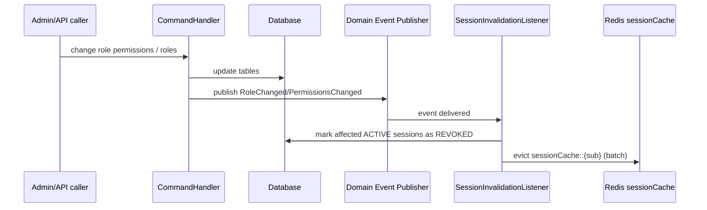

# Session Fetching (Skill Reference)

This document specifies how to implement a **session layer** in `igrp_platform_access_management`:
- A session model persisted in the database (one active session per user at a time).
- A session fetching endpoint returning current session data:
  - user profile (`IGRPUserDTO`)
  - current active role
  - list of roles and departments assigned to the current user
- Cache behavior mirroring the existing permission-check cache patterns.
- Invalidation rules:
  - on session close/timeout (evict user key)
  - on role/permission changes (invalidate sessions for affected users)
- Admin session endpoints (list/filter/kill).

This is written as an agent skill reference: implementers should follow the repository conventions (CQRS handlers + iGRP controllers).

---

## 1) Existing Codebase Context (Relevant Building Blocks)

### Authentication identity source

The authenticated user identity is derived from the SecurityContext:
- `sub` for JWT OAuth2 users, or `username` for M2M token requests: [AuthenticationHelper.java](file:///c:/Users/marcelo.monteiro/IdeaProjects/igrp-platform/projects/igrp_platform_access_management/src/main/java/cv/igrp/platform/access_management/shared/security/AuthenticationHelper.java#L14-L44)

### User modeling (DB)

The core user entity is stored in `t_user`:
- roles are a `ManyToMany` association (via `t_role_users`)
- active role is a `ManyToOne` reference (`active_role_id`)
- external identity is `external_id` (used as “sub” key): [IGRPUserEntity.java](file:///c:/Users/marcelo.monteiro/IdeaProjects/igrp-platform/projects/igrp_platform_access_management/src/main/java/cv/igrp/platform/access_management/shared/infrastructure/persistence/entity/IGRPUserEntity.java#L23-L68)

Associated entities:
- roles: [RoleEntity.java](file:///c:/Users/marcelo.monteiro/IdeaProjects/igrp-platform/projects/igrp_platform_access_management/src/main/java/cv/igrp/platform/access_management/shared/infrastructure/persistence/entity/RoleEntity.java#L27-L97)
- departments: [DepartmentEntity.java](file:///c:/Users/marcelo.monteiro/IdeaProjects/igrp-platform/projects/igrp_platform_access_management/src/main/java/cv/igrp/platform/access_management/shared/infrastructure/persistence/entity/DepartmentEntity.java#L24-L82)

Profile DTO used by the API:
- [IGRPUserDTO.java](file:///c:/Users/marcelo.monteiro/IdeaProjects/igrp-platform/projects/igrp_platform_access_management/src/main/java/cv/igrp/platform/access_management/shared/application/dto/IGRPUserDTO.java#L19-L45)

### Existing permission-check cache patterns (to mirror for sessions)

Permission caching uses:
- `@Cacheable(value="permissionCache", keyGenerator="permissionCacheKeyGenerator")`: [PermissionCacheService.java](file:///c:/Users/marcelo.monteiro/IdeaProjects/igrp-platform/projects/igrp_platform_access_management/src/main/java/cv/igrp/platform/access_management/authorization/domain/service/PermissionCacheService.java#L40-L67)
- Key format: `subject:resource:action`: [PermissionCacheKeyGenerator.java](file:///c:/Users/marcelo.monteiro/IdeaProjects/igrp-platform/projects/igrp_platform_access_management/src/main/java/cv/igrp/platform/access_management/authorization/domain/service/PermissionCacheKeyGenerator.java#L10-L19)
- Redis cache manager with fallback behavior: [CacheConfig.java](file:///c:/Users/marcelo.monteiro/IdeaProjects/igrp-platform/projects/igrp_platform_access_management/src/main/java/cv/igrp/platform/access_management/shared/config/CacheConfig.java#L21-L152)
- Redis key scanning eviction service: [PermissionCacheEvictService.java](file:///c:/Users/marcelo.monteiro/IdeaProjects/igrp-platform/projects/igrp_platform_access_management/src/main/java/cv/igrp/platform/access_management/shared/infrastructure/cache/PermissionCacheEvictService.java#L15-L95)
- Broad invalidation on write endpoints: [CacheEvictionInterceptor.java](file:///c:/Users/marcelo.monteiro/IdeaProjects/igrp-platform/projects/igrp_platform_access_management/src/main/java/cv/igrp/platform/access_management/shared/infrastructure/cache/CacheEvictionInterceptor.java#L21-L55), wired in [WebConfig.java](file:///c:/Users/marcelo.monteiro/IdeaProjects/igrp-platform/projects/igrp_platform_access_management/src/main/java/cv/igrp/platform/access_management/shared/config/WebConfig.java#L8-L25)

---

## 2) Goal: Session Fetching Response Contract

The session fetching endpoint must return:
- `userProfile`: `IGRPUserDTO`
- `currentActiveRole`: `RoleDepartmentDTO` or expanded `RoleDTO`
- `roles`: `List<RoleDTO>` (roles assigned to user)
- `departments`: `List<DepartmentDTO>` (derived from roles’ departments)
- `session`: session metadata (id/status/start/end/expiry)

Recommended DTO shapes (spec-level):

```text
SessionResponseDTO
  - sessionId: UUID
  - status: ACTIVE | CLOSED | EXPIRED | REVOKED
  - startedAt: Instant
  - lastSeenAt: Instant
  - expiresAt: Instant
  - endedAt: Instant?
  - userProfile: IGRPUserDTO
  - currentActiveRole: RoleDepartmentDTO?
  - roles: List<RoleDTO>
  - departments: List<DepartmentDTO>
```

Notes:
- The codebase already exposes role and permission query handlers for the current user; reuse those patterns and repositories.
- “departments” should be computed from the user roles’ `department` relationship to avoid introducing a second membership model.

---

## 3) Session Persistence Model (DB)

### 3.1 Requirements

Mandatory fields:
- status
- session start date
- session end date

Also required for real-world operations:
- last activity timestamp
- expiration timestamp (for timeout)
- user “sub” identifier
- audit/security fields (IP, user-agent hash, reason)

### 3.2 Recommended table design (PostgreSQL)

Use a dedicated table `t_user_session` storing one active session per user.

Design goals:
- Fast read path by `user_external_id` + `status=ACTIVE`
- Fast cleanup by `expires_at`
- Safe concurrency for “init session” (no duplicates)

DDL (reference):

```sql
CREATE TABLE IF NOT EXISTS t_user_session (
  id               BIGSERIAL PRIMARY KEY,
  session_id       UUID NOT NULL,
  user_external_id VARCHAR(255) NOT NULL,

  status           VARCHAR(16) NOT NULL,

  started_at       TIMESTAMPTZ NOT NULL,
  last_seen_at     TIMESTAMPTZ NOT NULL,
  expires_at       TIMESTAMPTZ NOT NULL,
  ended_at         TIMESTAMPTZ NULL,

  client_ip        INET NULL,
  user_agent_hash  VARCHAR(64) NULL,
  device_id        VARCHAR(128) NULL,

  closed_reason    VARCHAR(64) NULL,
  closed_by        VARCHAR(32) NULL,

  created_by       VARCHAR(64) NULL,
  created_date     TIMESTAMPTZ NOT NULL DEFAULT now(),
  last_modified_by VARCHAR(64) NULL,
  last_modified_date TIMESTAMPTZ NOT NULL DEFAULT now()
);

CREATE UNIQUE INDEX IF NOT EXISTS ux_session_session_id
  ON t_user_session(session_id);

CREATE INDEX IF NOT EXISTS ix_session_user_status
  ON t_user_session(user_external_id, status);

CREATE INDEX IF NOT EXISTS ix_session_expires_active
  ON t_user_session(expires_at)
  WHERE status = 'ACTIVE';

-- Enforce one ACTIVE session per user (Postgres partial unique index).
CREATE UNIQUE INDEX IF NOT EXISTS ux_one_active_session_per_user
  ON t_user_session(user_external_id)
  WHERE status = 'ACTIVE';
```

Status values (recommended):
- `ACTIVE`: current valid session
- `CLOSED`: explicitly closed by user/admin or timed out cleanup
- `EXPIRED`: timed out by policy
- `REVOKED`: invalidated due to permission/role change or security action

Security note:
- Do not store raw bearer tokens in DB.
- If binding to a token is required, store a hash of `jti` (if present) or a SHA-256 of the token value (salted) instead of the raw token.

---

## 4) Session Cache Layer (Mirrors Permission Cache)

### 4.1 Cache objective

Cache exactly 1 session per user: the “active current one”.

- Cache name: `sessionCache`
- Cache key: `user_external_id` (the `sub` from [AuthenticationHelper.getSub()](file:///c:/Users/marcelo.monteiro/IdeaProjects/igrp-platform/projects/igrp_platform_access_management/src/main/java/cv/igrp/platform/access_management/shared/security/AuthenticationHelper.java#L25-L44))
- Cache value: `SessionResponseDTO` (or a `SessionCacheEntryDTO` including only session + role/department snapshot)

Recommended key generator:
- `sessionCacheKeyGenerator` returning the subject only (similar to permission cache key generator).

### 4.2 Eviction rules

Evict by user-sub when:
- session is closed (self close)
- session is killed (admin)
- session expires (timeout policy)
- user active role changes
- user role membership changes
- role permissions change for any role the user has
- role/department status becomes inactive/deleted

### 4.3 Redis eviction mechanics

Permission cache uses a scan-based eviction service with prefix `permissionCache::`.

Mirror the same pattern:
- `SessionCacheEvictService` uses prefix `sessionCache::`
- operations:
  - `evictBySubject(sub)`
  - `evictAll()` (emergency only)

For large-scale invalidations (“invalidate all users that have role X”):
- Prefer a DB-driven lookup of impacted users, then call `evictBySubject` in batches.
- Avoid scanning the entire cache when only a subset is affected.

---

## 5) Timeout and Automatic Session Closing

### 5.1 Timeout configuration

Add a property that can be configured via environment variables:

```properties
igrp.session.timeout-seconds=${IGRP_SESSION_TIMEOUT_SECONDS:1800}
```

Semantics:
- Session expires if `now() > expires_at`.
- `refresh` extends `expires_at = now() + timeout`.

### 5.2 How to enforce timeout + cache invalidation safely

Use a dual mechanism:

1) **Read-time enforcement** (always correct):
   - When fetching the active session, if it is expired:
     - mark it `EXPIRED` (or `CLOSED`) and set `ended_at=now()`
     - evict the user cache key
     - return “no active session”

2) **Scheduled cleanup** (performance + correctness):
   - A scheduled job (e.g., every 1–5 minutes) closes expired sessions in bulk:
     - `UPDATE t_user_session SET status='EXPIRED', ended_at=now() WHERE status='ACTIVE' AND expires_at < now()`
     - fetch affected `user_external_id` (or return via `RETURNING user_external_id`) and evict cache keys

Why both:
- scheduled cleanup prevents stale ACTIVE rows from accumulating
- read-time enforcement ensures correctness even if the scheduler lags or is temporarily disabled

Cache TTL optimization:
- Optionally configure Redis TTL for `sessionCache` entries equal to the session timeout.
- Even with TTL, keep DB timeout enforcement (requirement: DB status must become CLOSED/EXPIRED).

---

## 6) API Endpoints Specification

### 6.1 User endpoints (self-service)

All endpoints require OAuth2 JWT authentication (no M2M).

1) Fetch current session + user context
- `GET /api/session`
- response:
  - active session: `200 OK` with `SessionResponseDTO`
  - no active session: `204 No Content` (recommended) or `200 OK` with `active=false`

2) Initialize session
- `POST /api/session/init`
- behavior:
  - closes any currently active session for this user (status CLOSED, reason REPLACED) OR returns existing session (policy decision)
  - creates a new ACTIVE session with computed expiry
  - caches it under the user-sub key

3) Refresh session (keep-alive)
- `POST /api/session/refresh`
- behavior:
  - requires an ACTIVE session; extends `expires_at` and updates `last_seen_at`
  - refresh is idempotent and safe for concurrent calls

4) Close session
- `POST /api/session/close`
- behavior:
  - sets status CLOSED, sets `ended_at=now()`, reason USER_CLOSED
  - evicts cache for that user

Recommended additional (security-hardening):
- `GET /api/session/me` (alias of fetch)
- `POST /api/session/rotate` (optional): closes current and issues new session id (session fixation mitigation)

### 6.2 Admin endpoints

These endpoints should be permission-protected (e.g., dedicated permissions under the existing permission system).

1) List active sessions
- `GET /api/admin/sessions?status=ACTIVE&limit=...&offset=...`

2) Active session for a specific user
- `GET /api/admin/sessions/users/{userExternalId}`

3) Active sessions by department
- `GET /api/admin/sessions/departments/{departmentCode}`
  - derived via users’ roles’ departments

4) Active sessions by role
- `GET /api/admin/sessions/roles/{roleCode}?departmentCode=...`
  - role code uniqueness is department-scoped in DB (`role_department_uk`)

5) Kill a session by sessionId
- `POST /api/admin/sessions/{sessionId}/kill`
  - marks session REVOKED and evicts cache for that session user

6) Kill all sessions for a role (bulk invalidate)
- `POST /api/admin/sessions/roles/{roleCode}/kill?departmentCode=...`
  - closes/ revokes all ACTIVE sessions for users having that role

---

## 7) Invalidation on Role/Permission Changes (Immediate)

Requirement:
> When permission or roles change (active role and any other role/permission for the user) immediately invalidate the sessions for the users that have those roles.

### 7.1 What counts as “change”

User-specific changes (invalidate only that user’s session):
- user active role changes:
  - [SetActiveCurrentUserRoleCommandHandler.java](file:///c:/Users/marcelo.monteiro/IdeaProjects/igrp-platform/projects/igrp_platform_access_management/src/main/java/cv/igrp/platform/access_management/users/application/commands/SetActiveCurrentUserRoleCommandHandler.java#L60-L101)
  - [SetActiveUserRoleCommandHandler.java](file:///c:/Users/marcelo.monteiro/IdeaProjects/igrp-platform/projects/igrp_platform_access_management/src/main/java/cv/igrp/platform/access_management/users/application/commands/SetActiveUserRoleCommandHandler.java#L44-L81)
- user role membership changes:
  - [AddRolesToUserCommandHandler.java](file:///c:/Users/marcelo.monteiro/IdeaProjects/igrp-platform/projects/igrp_platform_access_management/src/main/java/cv/igrp/platform/access_management/users/application/commands/AddRolesToUserCommandHandler.java#L86-L166)
  - [RemoveRolesFromUserCommandHandler.java](file:///c:/Users/marcelo.monteiro/IdeaProjects/igrp-platform/projects/igrp_platform_access_management/src/main/java/cv/igrp/platform/access_management/users/application/commands/RemoveRolesFromUserCommandHandler.java#L59-L155)

Role-level changes (invalidate sessions of all users that have the role):
- role permission additions/removals:
  - [AddPermissionsCommandHandler.java](file:///c:/Users/marcelo.monteiro/IdeaProjects/igrp-platform/projects/igrp_platform_access_management/src/main/java/cv/igrp/platform/access_management/department/application/commands/AddPermissionsCommandHandler.java#L82-L140)
  - [RemovePermissionsCommandHandler.java](file:///c:/Users/marcelo.monteiro/IdeaProjects/igrp-platform/projects/igrp_platform_access_management/src/main/java/cv/igrp/platform/access_management/department/application/commands/RemovePermissionsCommandHandler.java#L77-L98)

Department-level changes (invalidate sessions of users whose roles are in that department):
- department status/structure changes can cascade role changes via domain logic: [UpdateDepartmentCommandHandler.java](file:///c:/Users/marcelo.monteiro/IdeaProjects/igrp-platform/projects/igrp_platform_access_management/src/main/java/cv/igrp/platform/access_management/department/application/commands/UpdateDepartmentCommandHandler.java#L98-L174)

### 7.2 Recommended invalidation strategy (reliable + targeted)

Implement a **SessionInvalidationService** with methods:
- `invalidateUserSessions(Set<String> userExternalIds, String reason)`
  - DB: mark active sessions REVOKED and set ended_at
  - cache: evict `sessionCache::{userExternalId}` keys
- `invalidateSessionsByRole(String departmentCode, String roleCode, String reason)`
  - query DB for users assigned to that role (via `t_role_users` join `t_role` + `t_department`)
  - call `invalidateUserSessions` in batches

Trigger points:
- Publish explicit domain events from command handlers after successful write, then handle invalidation in an `@EventListener`.
- Keep the existing interceptor-style “broad invalidation” only as a safety net; do not rely on it for targeted session invalidation.

Mermaid (event-driven invalidation):



---

## 8) Security Considerations (Industry Standards)

Recommended controls:
- Session endpoints must require a valid JWT (issuer validated by Spring Resource Server):
  - [JwtDecoderConfiguration.java](file:///c:/Users/marcelo.monteiro/IdeaProjects/igrp-platform/projects/igrp_platform_access_management/src/main/java/cv/igrp/platform/access_management/shared/security/JwtDecoderConfiguration.java#L11-L22)
- Do not store raw JWTs; do not log them.
- Bind session to identity claims:
  - `user_external_id = sub`
  - optionally capture `azp`, `client_id`, or `sid` claims if provided by issuer, as metadata fields
- Record IP/user-agent hash to support anomaly detection and admin investigation.
- Prefer `REVOKED` status for security-driven invalidations (role/permission changes, admin kill).
- Use audit logging for session lifecycle:
  - integrate with [SecurityAuditService](file:///c:/Users/marcelo.monteiro/IdeaProjects/igrp-platform/projects/igrp_platform_access_management/src/main/java/cv/igrp/platform/access_management/security_audit/application/service/SecurityAuditService.java#L11-L56)

---

## 9) Implementation Plan (Agent-Oriented Steps)

1) Create session persistence model:
   - JPA entity + repository for `t_user_session`
   - `SessionStatus` enum
2) Create session query/command handlers:
   - fetch current session (read-time expiry enforcement)
   - init, refresh, close
3) Create session cache service mirroring permission cache:
   - `SessionCacheService` with `@Cacheable(value="sessionCache")`
   - key generator `sessionCacheKeyGenerator`
   - `SessionCacheEvictService` with redis scan deletion by `sessionCache::`
4) Add invalidation listeners:
   - invalidate on user active role change
   - invalidate on role membership change
   - invalidate on role permission change (bulk)
5) Add scheduler for expired session closure:
   - bulk update + per-user cache eviction
6) Add controllers:
   - `/api/session/*` (self)
   - `/api/admin/sessions/*` (admin)
7) Update write handlers to publish invalidation events (or directly call invalidation service).

